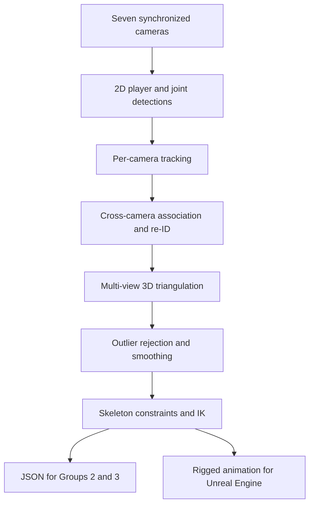

# Quidich Innovation Labs Internship: Complete Information Extraction

## 1. Document Purpose

This document exhaustively extracts and logically reorganizes all information contained in two voice transcriptions:

- the first transcription, recorded on **Friday, 19 June**, before or around the Week 4 mid-semester presentation; and
- the update recorded on **Saturday, 20 June**, after the presentation was completed.

It is intended to become the master context document for a later prompt covering **repository cleaning, professional GitHub preparation, factual verification, and LaTeX mid-semester report writing**. It covers:

- the internship context and timeline;
- work completed during Weeks 1-3;
- work completed or intended to be presented for Week 4;
- the company's broader product context;
- the responsibilities of Groups 1, 2, and 3;
- Group 1's detailed technical mandate;
- the supplied dataset and existing DRS ball-tracking pipeline;
- candidate pose-estimation and tracking methods;
- identified technical problems and proposed solutions;
- the presentation structure, team division, and requested presentation documents;
- inconsistencies, ambiguities, and information still missing from the supplied text.
- the current condition and intended purpose of the pose-estimation benchmarking repository;
- the required repository-cleaning operations;
- the BITS Pilani PS1 mid-semester report requirements and authorship constraints;
- the intended phased execution order for repository work and report writing.

> **Scope note:** The transcriptions refer to a repository, `repository files.md`, `core_tasks.md`, `presentables/full.md`, a `papers` directory, a company Drive clone, scripts, datasets, LaTeX templates, DOCX/XLSX documents, and video renders. These materials were described but were not provided alongside the transcription in this turn. Therefore, this document records every stated detail about them but does not claim to have inspected or verified their contents. Repository evidence must supersede unverified spoken claims during the later execution task.

---

## 2. Internship Overview

### 2.1 Organization and internship type

- The internship is at **Quidich Innovation Labs**. The source spells the name as “quidich Innovation Labs.”
- The second transcription also says “Quidditch Innovation Labs.” The official repository/company spelling must be verified and used consistently; this document retains **Quidich** as the likely intended company name without treating the transcription's spelling as authoritative.
- It is the speaker's **Practice School internship**.
- More specifically, it is **Practice School 1 (PS1)**.
- The student is **Aksh Shah**.
- Aksh Shah is a student at **BITS Pilani, Goa Campus**.
- The speaker has been working there **since May**.
- Quidich Innovation Labs is described as a **sports broadcasting company**.

### 2.2 Duration and current status as of Saturday, 20 June

- The total internship duration is **8 weeks**.
- **Weeks 1-4 have been completed**.
- Week 4 was completed on **Friday, 19 June**.
- The PS1 **mid-semester presentation took place on 19 June** and is now complete.
- The presentation had been scheduled for **4:00 PM** and covered completed and planned work.
- Aksh generated the presentation materials and reports used for that evaluation.
- The work of making those presentation reports and presentation materials is now finished.
- **Phase 0 and Phase 1 were completed on 19 June**, and their data is stated to be present in the repository.
- **Weeks 5-8 remain** and form the next four weeks of work.
- The current date and planning point described by the update is **Saturday, 20 June**.
- The current objective is no longer presentation preparation. It is:
  1. clean, organize, debug, and professionalize the repository;
  2. push the cleaned repository to GitHub;
  3. use the verified, organized repository as the basis for the individual LaTeX mid-semester report;
  4. continue technical work during Weeks 5-8.

### 2.3 Timeline reconciliation and retained inconsistency

The source first describes the main task as work for the **“remaining five weeks,”** but immediately clarifies that Week 4 has completed and **only four weeks remain**. The likely interpretation is that the main task began in Week 4 and spans Weeks 4-8, which is five weeks in total, while only Weeks 5-8 remain after today's presentation.

The second transcription resolves the relative dates:

| Date | Status |
|---|---|
| Friday, 19 June | Week 4 ended; the mid-semester presentation occurred; Phase 0 and Phase 1 were completed |
| Saturday, 20 June | Weeks 1-4 are complete; repository cleaning and LaTeX report preparation become the immediate priorities |
| Weeks 5-8 | Four remaining internship weeks for the next technical work |

---

## 3. High-Level Internship Objective

The broad technical area is **human 3D pose estimation for cricket**, using footage from multiple calibrated cameras.

The intended end-to-end capability is to:

1. detect players and estimate their 2D poses independently in each camera;
2. determine when detections from different cameras refer to the same real-world player;
3. assign a stable identity to each player;
4. assign a cricket role to each identified player;
5. track players across multiple cameras;
6. triangulate corresponding 2D body joints into a 3D human skeleton;
7. clean and smooth the 3D pose so that it does not jitter;
8. export structured 3D data for Groups 2 and 3;
9. export a rigged, smooth animation for rendering in Unreal Engine.

The final output should reproduce the player's movements during a particular cricket event or time interval as a smooth 3D animation.

---

## 4. Work Completed During Weeks 1-3

The second transcription refines the original combined Weeks 1-3 description into two reportable periods:

- **Weeks 1-2:** literature study, understanding pose estimation, and creating the research material captured in `full.md`;
- **Week 3:** continuing the earlier research and creating the complete Pose Estimation Benchmarking GitHub repository.

### 4.1 Initial task situation

- Very little concrete work was assigned during the first three weeks.
- The team knew its work would involve **human 3D pose estimation**, but initially had little clarity about the exact task.
- The team therefore used this period for research, learning, technical comparison, and preparation.

### 4.2 Study of pose estimation

The team:

- read many recent research papers;
- collected as much relevant information about pose estimation as possible;
- learned and developed an understanding of how human 3D pose estimation works;
- studied the relationship between **2D pose estimation** and **3D pose estimation**;
- studied a multi-camera approach in which:
  - multiple cameras are properly calibrated;
  - 2D detections from those cameras are triangulated;
  - the triangulated observations produce 3D pose information.

For the final mid-semester report, this material is intended to appear primarily under **Weeks 1 and 2**.

Additional details for Weeks 1-2 are expected to come from:

- `full.md`, described as a strong showcase of Aksh's work;
- other research papers stored in the repository's `papers` directory;
- Aksh's reading and understanding of those papers;
- further explanatory material added around the contents of `full.md` rather than merely reproducing it without context.

### 4.3 Model database and comparison table

The speaker created a very large table or database of recent pose-estimation models, focusing on models released **after 2020**.

Models explicitly mentioned include:

- RTMPose;
- YOLO Pose;
- RTMO;
- CPNs;
- many additional models not named in the supplied text.

The database records model speed and accuracy. Metrics and supporting information include:

- average precision;
- multiple other accuracy metrics;
- GFLOPs;
- latency;
- multiple other speed-related metrics;
- sources for the collected results.

The team did **not run all these benchmarks itself**. Instead, it researched papers and other published sources that reported the models' speed and accuracy. The word “benchmarked” in the source refers primarily to **collecting and comparing published benchmark results**, rather than independently benchmarking every model.

### 4.4 Desired model trade-off

For real-time 3D pose estimation, the team does not simply want:

- the most accurate model regardless of speed; or
- the fastest model regardless of accuracy.

It wants a **middle ground between speed and accuracy**:

- approximately **300 FPS**, as stated in the source;
- very good accuracy;
- suitability for real-time 3D pose estimation.

The source presents 300 FPS as an approximate target and does not specify whether this is:

- per camera;
- across all seven cameras;
- model-only throughput;
- batched throughput; or
- end-to-end pipeline throughput.

### 4.5 Benchmarking repository

The team created a **GitHub repository** containing scripts required to benchmark the models consistently.

Its purpose is to:

- provide the same scripts and mathematical methods for every comparison;
- make comparisons between models fair and repeatable;
- benchmark future modifications made during the remaining internship weeks;
- compare later work against a consistent baseline.

The updated transcription assigns creation of the full repository primarily to **Week 3**. Week 3 continued the work of Weeks 1-2 and turned it into a reusable Pose Estimation Benchmarking repository. The repository's precise capabilities, contents, and completion level must be established through a detailed scan rather than assumed from the transcription.

### 4.6 Main Week 1-3 presentation artifact

- A file named **`full.md`** exists inside **`presentables`**.
- It is described as the main record of work completed in the first three weeks, possibly also containing some later work.
- The repository itself is also part of what the speaker intends to present as the Weeks 1-3 work.

---

## 5. Company Product Context: Events and Stories

### 5.1 Meaning of an event

An event is a sequence of actions occurring during a cricket match. An example event flow given in the source is:

1. the run or play starts;
2. the bowler bowls the ball;
3. the batter/batsman plays a shot;
4. the ball travels somewhere;
5. the outcome may be:
   - at the boundary;
   - beyond the boundary;
   - caught in a fielder's hands;
   - hitting or entering the stumps;
   - another possible cricket outcome.

The complete process and interpretation of the event is assigned to **Group 3**.

### 5.2 Meaning of a story

- “Stories” are products built around certain events that happen during a cricket match.
- A precise taxonomy of story types is not provided in the source.
- **Group 2** creates stories by combining:
  - Group 1's body and human-pose output; and
  - Group 3's understanding of the complete cricket event.

### 5.3 Dependency between groups

| Group | Main responsibility | Output or dependency |
|---|---|---|
| Group 1 | Player re-identification, role assignment, multi-camera tracking, and clean 3D human pose | Supplies body/pose data and 3D joint-position metrics to downstream groups; also supplies animation-ready output to Unreal Engine |
| Group 2 | Story creation | Uses Group 1's pose output and Group 3's event understanding |
| Group 3 | Recognition or interpretation of the complete cricket event sequence | Supplies event understanding to Group 2 |

The speaker belongs to or is presenting on behalf of **Group 1**. The source explicitly asks that the immediate focus remain on Group 1 rather than the detailed work of Groups 2 and 3.

---

## 6. Physical Capture Setup

- There are **seven cameras** positioned in a particular arrangement around a cricket ground or pitch.
- All seven cameras operate at the same time.
- They point toward players on the field.
- Multiple cameras may observe the same player from different angles.
- The cameras are calibrated.
- The dataset states that the seven cameras are split across **three capture groups**.
- The exact physical camera layout and the membership of each capture group are not described in the source.

---

## 7. Group 1 Mandate

Group 1's stated responsibilities are:

1. **Re-identification (re-ID):** recognize that detections of the same player in different cameras represent one real person.
2. **ID assignment:** give stable identities to visible players.
3. **Role assignment:** assign cricket roles to those identities.
4. **Multi-camera tracking:** track identified players across the seven cameras and over time.
5. **Clean 3D pose:** triangulate and clean body joints to produce a stable 3D skeleton.
6. **Output generation:** provide JSON data to Groups 2 and 3 and rigged animation data to Unreal Engine.

### 7.1 Why re-identification is necessary

- Each camera independently detects people.
- There is initially no common ID attached to a player across camera views.
- Re-ID has not yet been performed at the point described.
- Therefore, if Camera 1 and Camera 2 see the same real player, each camera initially treats that player as a different detected person.
- Group 1 must associate these detections and assign one consistent identity to the same person across cameras.
- The goal is to re-identify as many people visible to the cameras on the field as possible.

### 7.2 Role assignment

After IDs are assigned, Group 1 must assign roles. Explicitly mentioned roles are:

- bowler;
- striker;
- non-striker;
- other cricket roles not specified in the source.

The source says these additional roles will be explained later, but no further role list appears in the supplied text.

### 7.3 Why clean 3D pose is difficult

The difficult part is producing a 3D skeleton that is sufficiently stable and smooth for rendering.

Raw multi-view triangulation can jitter because:

- one 2D keypoint may be noisy;
- a camera view may be missing;
- a body part may be occluded;
- triangulation may generate an outlier;
- different cameras may introduce different forms of noise;
- merging noisy observations can make a 3D joint jump or “pop” between frames.

This causes two downstream problems:

1. **Group 2 consumes Group 1's metrics**, including 3D joint positions, so unstable coordinates can affect story generation or event-related interpretation.
2. **Unreal Engine renders the final graphics**, and visible jitter produces twitching limbs or a twitching skeleton.

---

## 8. Existing DRS Ball-Tracking Pipeline Supplied to the Team

The team has been given a working **seven-camera, calibrated ball-tracking pipeline for DRS**.

### 8.1 Existing ball pipeline operations

The pipeline:

1. detects a target in each camera;
2. triangulates the target into 3D;
3. cleans the 3D track;
4. trims the 3D track;
5. predicts the 3D track;
6. reprojects the result into camera views;
7. exports a 3D file or format for Unreal Engine.

The wording in the source is “exports a 3D file from Unreal for Unreal,” but the surrounding context indicates that the output is intended **for Unreal Engine**.

### 8.2 Why the existing pipeline is important

- Its overall pipeline shape closely matches what Group 1 needs.
- It currently handles **one ball point**.
- Group 1 must extend that idea to:
  - multiple human players;
  - multiple joints for each player;
  - stable identities across cameras;
  - smooth 3D skeletons suitable for Unreal Engine.

### 8.3 Existing data stages

The source describes the following stored data or processing stages:

1. 2D detections for each camera and frame;
2. cleaned or filtered 2D tracks;
3. triangulated 3D frame;
4. cleaned 3D frame;
5. trimmed 3D frame;
6. predicted 3D result;
7. reprojection data, including per-camera pixel error;
8. 3D Unreal export format.

The source calls this the “current dataset,” though some listed items are pipeline outputs or processing stages rather than raw dataset components.

---

## 9. Supplied Human-Pose Dataset and Calibration Information

### 9.1 Image data

- Seven cameras are used.
- They are divided across three capture groups.
- Each delivery contains **600 JPEG frames for every camera**.
- Frames are at **4K resolution**.
- The number of deliveries, frame rate, synchronization method, and total duration are not stated.

### 9.2 Calibration data

The supplied calibration material includes:

- bundle-adjusted intrinsics;
- bundle-adjusted extrinsics;
- camera-calibration configuration;
- pitch-calibration configuration;
- several other calibration metrics that are not named.

The source says “bundled adjusted,” which appears to refer to the standard term **bundle-adjusted**.

### 9.3 Projection matrices

- Each camera has a **3 × 4 projection matrix**.
- A 3D world point can be projected directly into each camera image with this matrix.
- Several 2D observations can be back-projected and triangulated into one 3D point.
- Projection matrices are described as the practical mechanism for cross-camera work.
- The team wants to benchmark or use this route for:
  - player association across cameras;
  - 3D triangulation.

The phrase “a three world point” in the source is interpreted as **a 3D world point**.

---

## 10. Planned Geometry-First Pipeline

The stated approach is **geometry first**:

1. detect people independently in each camera;
2. track people over time within each camera;
3. associate the same people across all seven calibrated cameras;
4. triangulate corresponding body joints into 3D;
5. remove noise in multiple stages;
6. enforce physically plausible skeleton behavior;
7. smooth rotations and motion;
8. export the result as:
   - a JSON contract for Groups 2 and 3; and
   - a rigged animation for Unreal Engine.

---

## 11. Candidate Models and Tracking/Association Routes

### 11.1 Pose-estimation model families planned for testing

The team plans to try strong or “best” variants from:

- RTMPose;
- RTMO;
- DWPose;
- RTMW-L or RTMW-X;
- the Sapiens family;
- YOLO Pose.

Earlier research also explicitly included CPNs.

The source does not define the exact checkpoint, dataset, input resolution, hardware, precision, or evaluation protocol to be used for each model.

### 11.2 Tracking and association methods/routes

The source lists:

- DeepSORT;
- “pipetrack”;
- the projection-matrix route.

These are intended to be tried or compared in pursuit of the best combined **3D re-ID and smooth-pose output**.

> **Terminology ambiguity:** “pipetrack” is reproduced from the source. No exact library, paper, or spelling is provided, so it cannot be identified with certainty from the supplied text alone.

---

## 12. Noise Sources and Their Effects

| Noise or instability source | Stated or implied effect |
|---|---|
| 2D keypoint jitter | Produces unstable input coordinates and moving 3D joints |
| Triangulation outliers | Makes reconstructed 3D joints jump or pop |
| Missing camera views | Reduces triangulation reliability |
| Occlusion | Causes missing or inaccurate keypoints |
| Reprojection error | Indicates inconsistency between reconstructed 3D points and camera observations |
| Bone-length variation | Makes the skeleton physically inconsistent between frames |
| Foot skate | Makes feet slide unnaturally instead of remaining planted |
| Rotation jitter | Produces unstable joint or limb orientation |
| Camera-specific noise | Causes inconsistent observations when views are merged |

Combined effect:

- popping 3D joints;
- twitching limbs;
- a twitching skeleton in Unreal Engine;
- an output that is not visually smooth enough for production rendering;
- potentially unreliable 3D joint-position metrics for Group 2.

---

## 13. Proposed Noise-Removal and Motion-Cleaning Stages

The proposed solution contains the following stages, presented in the source as items A-G.

### A. Confidence gating and RANSAC-based rejection

- Discard or down-weight unreliable 2D detections using confidence scores.
- Reject geometrically inconsistent observations or outliers using RANSAC.

> The source says “ransack array rejection.” This likely refers to **RANSAC outlier rejection**, but the exact intended phrase is not supplied.

### B. Confidence-weighted triangulation

- Use the 3 × 4 projection matrix for each camera.
- Give more reliable camera observations greater influence during triangulation.
- Reduce the effect of low-confidence keypoints.

### C. Reprojection-error rejection

- Project reconstructed 3D joints back into each camera.
- Compare the projected location with the observed 2D location.
- Reject or correct observations whose pixel error is too large.

### D. Temporal smoothing

- Smooth joint trajectories over successive frames.
- Reduce frame-to-frame jitter and sudden jumps.
- The exact temporal filter is not stated.

### E. Skeletal constraints

- Keep bone lengths constant or stable.
- Enforce joint limits.
- Prevent physically implausible skeleton configurations.

### F. Inverse-kinematics retargeting and foot locking

- Use inverse kinematics to produce plausible joint configurations.
- Retarget the reconstructed pose to an animation skeleton or rig.
- Apply foot locking to reduce foot skate.

### G. Quaternion rotation smoothing

- Smooth joint rotations using quaternion interpolation.
- The source says “quaternion slr rotation smoothing,” likely intending **quaternion SLERP (spherical linear interpolation)**.

### Final exports

After cleaning and smoothing, export:

- JSON files used as inputs by Groups 2 and 3;
- an Unreal Engine-compatible output;
- a rigged animation for Unreal Engine.

The exact JSON schema, coordinate system, rig format, and Unreal import format are not specified.

---

## 14. Week 4 Status and Completed Presentation

### 14.1 Task phases and confirmed update

- The repository reportedly contains a file named **`core_tasks.md`**.
- It defines **seven total tasks**.
- The first transcription said the team planned to state that **Phase 0 and Phase 1 were completed during Week 4**.
- The 20 June update confirms that **Phase 0 and Phase 1 were completed on 19 June**, and states that their data is present in the repository.
- The source later says the speaker will present “phases zero to one, zero, one, and two,” creating ambiguity about whether Phase 2 is completed, being introduced, or only being presented as upcoming work.

### 14.2 Current video renders

The speaker has video renders for the presentation. They show:

- successful detections are present;
- the footage or pose output is visibly jittery;
- smoothing still needs work;
- IDs and roles still need to be assigned.

The wording “assign IDs and roles that we shall do today in the presentation” is ambiguous. It may mean:

- the presentation will explain that ID and role assignment is upcoming work; or
- the team intends to demonstrate or work on ID and role assignment that day.

### 14.3 Presentation division among team members

Group 1's seven tasks/phases are divided among three presenters:

| Presenter | Assigned presentation scope |
|---|---|
| Speaker | Phases 0, 1, and 2, according to the later statement |
| Vedant | Phases 3 and 4 |
| Another friend/team member, not named | Remaining phases/tasks |

If the seven phases are numbered 0-6, the unnamed team member would presumably cover Phases 5 and 6, but this numbering is an inference and is not explicitly stated.

### 14.4 Presentation outcome

- The BITS Pilani PS1 mid-semester presentation occurred on 19 June.
- The presentation is complete and no longer the immediate deliverable.
- Aksh generated the reports and other presentation materials.
- Those presentation materials should now be treated as repository evidence and possible report source material, subject to verification.
- The next academic deliverable is the **individual mid-semester LaTeX report**.

---

## 15. Earlier Presentation-Material Request

This section records what was requested in the 19 June transcription. It is retained for provenance, but the presentation itself has now been completed.

The source ultimately requests several pieces of work.

### 15.1 Repository review

The requested assistant is expected to:

- inspect the entire repository;
- understand all work completed so far;
- focus specifically on Group 1;
- inspect the seven tasks defined in `core_tasks.md`;
- inspect the existing Week 1-3 material in `presentables/full.md`;
- understand the video-render results and current implementation state.

### 15.2 Week 1-3 context document

A clear Markdown presentation document is requested to explain:

- what the team learned and researched in Weeks 1-3;
- the model database and literature comparison;
- the speed-versus-accuracy selection objective;
- the benchmarking GitHub repository;
- how this research prepared the team for the main task.

The source also says `presentables/full.md` already represents the main Week 1-3 work, so it is unclear whether this should be rewritten, summarized, or adapted for presentation.

### 15.3 Week 4 document for Phases 0 and 1

A separate Markdown document is requested to explain:

- what the Phase 0 and Phase 1 tasks were;
- what problems those tasks contained;
- what was implemented or completed in Week 4;
- what the video renders demonstrate;
- why the current detections remain jittery;
- what remains to be fixed.

### 15.4 Phase 2 upcoming-work document

Another Markdown document is requested for Phase 2, explaining:

- what the team will do in the upcoming week;
- the intended implementation approach;
- likely problems and solutions;
- how it connects to the later phases and final Group 1 output.

### 15.5 Accessibility requirement

The intended evaluator or professor may not understand all technical terms. Therefore, the documents must:

- use simple, easily understandable language;
- clearly explain the task;
- explain why the task is difficult;
- explain problems already encountered;
- explain solutions already implemented;
- distinguish completed work from planned work;
- demonstrate that meaningful work has been completed;
- demonstrate that there is a credible plan for future work;
- remain suitable for a **graded evaluation**.

### 15.6 Requested workflow

Before executing the larger repository and presentation task, the source asks for:

1. a clear understanding of what has been done;
2. an implementation plan describing everything to be executed;
3. a review of what remains and what still needs to be done.

---

## 16. Evidence and Factual-Verification Rules

### 16.1 Repository evidence must control the final account

Aksh explicitly warns that his spoken statements must **not automatically be treated as facts**. During repository cleaning and report writing, the agent will have access to the repository and must:

- inspect the entire repository;
- inspect every relevant file rather than relying only on filenames;
- compare spoken claims with code, outputs, documentation, data, and version history where available;
- verify what was actually implemented, tested, generated, or merely planned;
- correct or qualify inaccurate claims;
- avoid presenting an intended feature as completed work;
- derive the detailed repository description from the repository itself after the scan.

The transcriptions are planning context and leads for investigation. They are not sufficient evidence for technical claims in the final LaTeX report.

### 16.2 Required status distinctions

Every repository and report claim should be classified, where relevant, as one of:

- completed and repository-verified;
- partially implemented;
- tested and verified;
- present but untested;
- planned future work;
- generated documentation requiring validation;
- company-provided material;
- student-created material;
- ambiguous or unsupported.

### 16.3 Sensitive or unwanted attribution

- The report is an **individual report by Aksh Shah**.
- It must not list the whole group as joint authors merely because some company work is collaborative.
- There must be **no mention anywhere in the repository or LaTeX report that Aksh is the Group 1 leader or group leader**.
- Group collaboration and interdependencies may be explained accurately without assigning Aksh a leadership title.
- AI-generated material must not be passed through uncritically; it must be cleaned, verified, and rewritten into professional, factual documentation.

---

## 17. Repository Identity, Purpose, and Current Condition

### 17.1 Repository identity and purpose

- The repository is Aksh's **Pose Estimation Benchmarking repository**.
- It is intended to be a standard, central place for:
  - benchmarking pose-estimation models;
  - documenting and updating work at Quidich Innovation Labs;
  - preserving consistent scripts, metrics, and mathematical comparison methods;
  - organizing internship research, implementation, data context, outputs, and reports.

### 17.2 Current condition

- The local repository has changed substantially since the last push to the GitHub `main` branch.
- Many files have been added since that push.
- Files are currently scattered and arranged illogically.
- The current structure is described as confusing and unprofessional.
- There may be bugs in code and scripts.
- Generated material exists and must be assessed rather than retained blindly.
- Aksh does not want to perform the cleanup manually and intends to use an AI coding agent, specifically mentioning Claude, for assistance.
- The repository is described as relatively small, so the full effort should be divided into approximately **three or four phases**.
- Time is limited; work must be completed quickly while remaining efficient, correct, and professional.

### 17.3 Repository inventory document

- A file named **`repository files.md`** is said to accompany the repository.
- It reportedly records all files in the repository.
- It should help the agent understand the repository and structure later prompts.
- It is an orientation aid, not a substitute for opening and understanding the relevant files themselves.

---

## 18. Important Repository Areas and Provenance

### 18.1 `presentables/full.md`

- `full.md` is described as a very good showcase of Aksh's early work.
- It is the main source proposed for explaining Weeks 1-2.
- Its details should be extracted, verified, reorganized, and supplemented for the report.

### 18.2 `papers` directory

- The repository contains additional research papers.
- Aksh states that he read and understood them.
- Their relevant contributions should be included in the Weeks 1-2 report narrative.
- The final report must determine from the actual papers what can be accurately claimed and cited.

### 18.3 `drive` directory

- The `drive` directory is a clone of a Google Drive folder shared by the company.
- It contains company-provided task material.
- The following documentation areas are explicitly mentioned:
  - `0001`;
  - `02`;
  - `03`;
  - `archive` documentation folders;
  - other DOCX files;
  - other XLSX files.
- These materials reportedly describe the work assigned by the company.
- Exact names, nesting, and contents must be verified from the repository because the spoken numbering may be abbreviated or imprecise.

### 18.4 Company dataset in `drive`

- The company-provided dataset is stored inside the `drive` directory.
- This is the dataset previously described as the seven-camera calibrated data used for Group 1 work.
- Dataset size, format, licensing, confidentiality, and suitability for GitHub must be checked before any push.

### 18.5 LaTeX files in `drive`

- A **LaTeX files folder** is located inside `drive`.
- It contains detailed instructions and/or templates for the mandatory report format.
- These BITS Pilani-provided materials are the primary authority for report structure and formatting.
- They take priority over the general scientific-writing webpage supplied by Aksh.

### 18.6 Student-created AI-generated folders

Two folders inside `drive` are identified as containing AI-generated work created by Aksh:

- `DOCS` or `docs`;
- `grp_1`.

The transcription gives capitalization ambiguously for `DOCS/docs`; the actual path must be verified.

These folders require special scrutiny:

- identify what is useful and factually supported;
- remove or rewrite low-quality generated content;
- avoid generated filler in the professional repository;
- ensure no unsupported leadership claim survives;
- retain only material that contributes to verified documentation, code understanding, or report preparation.

---

## 19. Repository-Cleaning Requirements

### 19.1 Primary objective

The first major task on 20 June is to **completely clean and reorganize the repository before writing the report**.

The cleaned repository should be:

- logically structured;
- easy to navigate;
- professionally documented;
- robust;
- reproducible where possible;
- free of known bugs relevant to its intended workflows;
- suitable for pushing to GitHub;
- a reliable factual foundation for the LaTeX report.

### 19.2 Required inspection process

The agent should:

1. begin with the repository inventory and filenames for orientation;
2. inspect the entire repository tree;
3. open and understand every relevant file;
4. classify files by purpose, provenance, sensitivity, and current usefulness;
5. identify duplicated, misplaced, obsolete, generated, or misleading material;
6. determine the actual workflows and dependencies from the code;
7. verify completion claims against artifacts and outputs;
8. propose and implement a logical directory structure;
9. preserve important data and user work while reorganizing it;
10. validate the repository after changes.

### 19.3 File and directory organization

- Filenames are expected to provide clues for the initial organization.
- All data and documentation should be sorted into coherent locations.
- Company-provided source material should be distinguishable from student-created work.
- Research papers, benchmarking code, model assets, results, presentation artifacts, report sources, and datasets should have clear ownership and purposes.
- Generated material that does not add factual value should be removed, rewritten, or excluded as appropriate.
- The precise target structure must follow the actual repository contents rather than being invented solely from the transcription.

### 19.4 Bug fixing and robustness

- Inspect all relevant running scripts.
- Identify and fix bugs.
- Ensure core workflows function as documented.
- Make scripts professional and robust.
- Avoid broad claims of correctness unless workflows have actually been tested.
- Preserve platform and hardware differences in environment guidance.

### 19.5 Progress bars for running scripts

All appropriate long-running scripts should use correctly functioning **`tqdm` progress bars** showing, where supported:

- current progress;
- completed versus total work;
- elapsed time;
- estimated remaining time;
- other useful rate information.

Progress bars should be added only where technically appropriate and should be tested rather than inserted mechanically.

### 19.6 Model weights and `.gitignore`

- Downloaded model files are currently ignored by Git.
- Aksh wants the relatively small **`.pt` PyTorch model files** to be stored directly in the GitHub repository so users do not need to download them again.
- `.gitignore` must be updated accordingly.
- Before implementing this request, the cleanup must inventory model sizes and verify:
  - GitHub file-size limits;
  - repository-size impact;
  - model license and redistribution terms;
  - whether Git LFS is required or preferable;
  - whether any model is generated, proprietary, or confidential.
- Company datasets, credentials, caches, large outputs, environments, and sensitive Drive contents must not be pushed merely because the model-weight rule changes.

### 19.7 Environment and PyTorch cleanup

- Different pose-estimation models currently use different Conda environment setups.
- PyTorch and related packages are installed as part of those setups.
- This is considered risky because correct PyTorch builds depend on hardware and software combinations.
- Environment instructions should therefore be cleaned so they do not force an incompatible CUDA, CPU, GPU, or platform-specific PyTorch build.
- The cleaned setup should clearly separate:
  - common dependencies;
  - model-specific dependencies;
  - hardware-specific PyTorch installation choices;
  - optional GPU acceleration;
  - reproducibility constraints.
- Exact changes must be based on the environments and requirements actually present in the repository.

### 19.8 Git and GitHub outcome

After cleanup and validation:

- update `.gitignore` deliberately;
- review all tracked and untracked content;
- ensure sensitive or unsuitable company data is excluded;
- make the repository professional;
- commit the intended changes cleanly;
- push the repository to GitHub.

The transcription asks to “update the GitHub,” but branch, remote, commit strategy, and permissions are not specified and must be determined during execution.

---

## 20. Mid-Semester LaTeX Report Requirements

### 20.1 Academic context

- The report is for **BITS Pilani, Goa Campus, Practice School 1 (PS1)**.
- It is the **mid-semester report** accompanying the already-completed mid-semester presentation.
- The final deliverable is a LaTeX-generated PDF for submission.
- Every person working at the company must prepare an **individual** report.
- This report must identify only **Aksh Shah** as the student author, subject to any mandatory supervisor/company fields in the official template.

### 20.2 Source-of-truth hierarchy for format

Report-format authorities should be applied in this order:

1. the BITS Pilani materials in the repository's `drive/latex files` folder;
2. any other explicit PS1 instructions or templates found in company/university documents;
3. the MIT scientific-paper guidance link as secondary general advice: [Guide to Scientific Writing](https://web.mit.edu/21w732/www/Handouts/scientific-paper.htm).

The MIT link must not override the specific BITS Pilani format.

### 20.3 Report evidence base

The report should be written only after repository cleanup so that:

- code, results, papers, documentation, and outputs are well organized;
- claims can be checked against actual evidence;
- completed and planned work are clearly separated;
- inaccurate spoken recollections are not embedded into the report;
- citations can be traced to the correct papers and documents.

### 20.4 Proposed report chronology

#### Weeks 1-2

Use and expand upon:

- `full.md`;
- the research papers in `papers`;
- Aksh's study and understanding of human pose estimation;
- the post-2020 model comparison;
- speed, accuracy, latency, GFLOPs, and other benchmark metrics;
- the relationship between 2D pose estimation, calibrated cameras, triangulation, and 3D pose estimation.

The narrative should explain what Aksh learned and produced, not simply paste raw Markdown tables.

#### Week 3

Explain:

- continuation of the Weeks 1-2 investigation;
- creation and purpose of the Pose Estimation Benchmarking repository;
- actual scripts, environments, models, metrics, and workflows found during repository inspection;
- how the repository creates a consistent basis for later experiments;
- only those capabilities that can be verified from the repository.

#### Week 4

- Focus the detailed technical discussion on **Group 1**, because that is Aksh's assigned work area.
- Explain Groups 1, 2, and 3 at a high level.
- Explain how the groups are interrelated and how their outputs affect one another.
- Deep-dive only into Group 1's mandate, implementation, Phase 0, and Phase 1.
- Use repository evidence to explain what was completed on 19 June.
- Include relevant detections, renders, observed jitter, data pipeline details, problems, and implemented or pending solutions.
- Do not claim or imply that Aksh is Group 1 leader.

#### Weeks 5-8 future-work section

- Include a small section on the upcoming four weeks.
- Explain planned Group 1 work such as Phase 2 and later phases only after verifying the official task definitions.
- Clearly label it as proposed or future work.
- Connect it to re-ID, role assignment, multi-camera tracking, clean 3D pose, smoothing, JSON output, and Unreal Engine output as supported by project documents.

### 20.5 Writing-quality requirements

The report should:

- be professional and technically accurate;
- follow the mandatory LaTeX structure;
- remain understandable to evaluators who may not know every specialist term;
- define technical terms when they first appear;
- distinguish individual contribution from group context;
- avoid unsupported claims and generated filler;
- avoid any reference to Aksh being group leader;
- include properly verified citations;
- use figures, tables, and results where the official format permits and the repository supplies evidence;
- produce a clean final PDF suitable for submission.

---

## 21. Required Order of Work and Phase Structure

The requested execution order is strict:

1. **Understand and audit the repository.** Use `repository files.md` for orientation, then inspect all relevant files and verify the transcriptions against evidence.
2. **Clean and professionalize the repository.** Reorganize files, fix relevant bugs, improve environments and scripts, add tested progress reporting, handle model weights and `.gitignore`, and validate core workflows.
3. **Prepare GitHub publication.** Review confidentiality and file-size concerns, commit the intended clean state, and push it professionally.
4. **Write and verify the LaTeX report.** Follow the BITS template, write the Weeks 1-4 verified account, add a smaller Weeks 5-8 plan, compile the PDF, and inspect the output.

Because the repository is described as small and time is limited, the total task should preferably be organized into **three or four implementation phases**. A practical four-phase interpretation is:

| Phase | Main outcome |
|---|---|
| 1. Audit | Complete inventory, evidence map, bug list, sensitivity review, and proposed structure |
| 2. Repository cleanup | Reorganized files, corrected documentation, environment cleanup, script fixes, `tqdm`, model-weight policy, and `.gitignore` updates |
| 3. Validation and GitHub | Tested workflows, reviewed diff, professional README/docs, safe commit, and GitHub push |
| 4. LaTeX report | BITS-compliant individual report for Aksh Shah, compiled PDF, visual verification, and final submission artifact |

This phase table is an organization of the stated goals, not evidence that these phases have already been executed.

---

## 22. Chronological Summary

### Weeks 1-3: Research and preparation

- Concrete project details were initially limited.
- The team studied 2D and 3D human pose estimation.
- It read many recent research papers.
- It compiled a large post-2020 model database.
- It compared published speed and accuracy metrics.
- It identified a desired real-time speed/accuracy middle ground, stated as roughly 300 FPS with very good accuracy.
- It created a GitHub repository with consistent benchmarking scripts and mathematics.
- The principal presentation artifact is `presentables/full.md`.

### Week 4: Initial Group 1 implementation and mid-semester presentation

- The main multi-camera cricket pose task became concrete.
- Phase 0 and Phase 1 were reported completed on 19 June, with their data said to be in the repository.
- Seven-camera data and calibration information were available.
- 2D pose detections were established or demonstrated.
- Video renders show detections but also visible jitter.
- Re-ID, ID assignment, role assignment, and robust smoothing remain incomplete or upcoming based on the wording supplied.
- The PS1 mid-semester presentation occurred and was completed on 19 June.
- Aksh produced the associated reports and presentation materials.

### Saturday, 20 June: Repository and report preparation

- The immediate focus shifted from presentation preparation to repository cleanup.
- The repository is to be audited, reorganized, debugged, made robust, and pushed professionally to GitHub.
- The official BITS LaTeX materials must be inspected.
- The individual mid-semester report for Aksh Shah must then be written from verified repository evidence.

### Weeks 5-8: Remaining work

Planned work includes:

- Phase 2 in the upcoming week;
- player tracking within each camera;
- association and re-ID across seven cameras;
- role assignment;
- confidence-weighted multi-view triangulation;
- rejection of outliers and high reprojection errors;
- temporal smoothing;
- constant bone lengths and joint limits;
- inverse-kinematics retargeting;
- foot locking;
- quaternion rotation smoothing;
- JSON export for Groups 2 and 3;
- rigged animation export for Unreal Engine.

The exact mapping of these activities to the seven phases cannot be recovered from the supplied text without `core_tasks.md`.

---

## 23. Completed Work Versus Planned Work

### Clearly stated as completed

- Weeks 1-4 of the internship as of 20 June.
- Weeks 1-3 literature review and learning.
- A large comparison table/database of recent pose models.
- Collection of published speed, accuracy, latency, GFLOPs, and source information.
- Creation of a GitHub benchmarking repository.
- Establishment or demonstration of per-camera 2D pose detections in Week 4.
- Phase 0 and Phase 1, stated as completed on 19 June, pending repository verification of the exact work.
- The PS1 mid-semester presentation on 19 June.
- Creation of its associated presentation reports/materials.
- Video renders that expose current jitter.

### Clearly stated as planned or still required

- Stable re-identification across cameras.
- ID assignment across camera views.
- Cricket-role assignment.
- Multi-camera tracking.
- Clean and smooth 3D pose reconstruction.
- Testing candidate model families.
- Comparing DeepSORT, “pipetrack,” and projection-matrix-based approaches.
- Confidence gating and RANSAC rejection.
- Confidence-weighted triangulation.
- Reprojection-error rejection.
- Temporal smoothing.
- Skeletal constraints.
- Inverse-kinematics retargeting and foot locking.
- Quaternion rotation smoothing.
- JSON exports for Groups 2 and 3.
- rigged animation export for Unreal Engine.
- A Phase 2 document explaining upcoming work.
- Complete repository audit and reorganization.
- Bug fixing and robustness improvements.
- Environment and PyTorch installation cleanup.
- Working `tqdm` progress bars in suitable long-running scripts.
- Deliberate model-weight and `.gitignore` policy changes.
- Professional GitHub update/push.
- Individual BITS-compliant LaTeX mid-semester report and PDF.

### Status that remains ambiguous

- Whether Phase 2 is already partly completed or only planned.
- Whether IDs and roles will be assigned during the presentation day or merely discussed as future work.
- Whether “benchmarking” has included any locally executed model tests beyond creation of benchmarking scripts.
- Exactly which 2D pose model generated the current video renders.
- Whether any human-joint triangulation has already been implemented.
- Whether the stated 300 FPS target is per camera, aggregate, batched, or end to end.

---

## 24. Missing Information Required for a Fully Verified Repository and Report Package

The following information is referenced but absent from the supplied text:

- the repository itself or its URL/path;
- the contents of `core_tasks.md`;
- the contents of `presentables/full.md`;
- the names and definitions of all seven tasks/phases;
- the current code and implementation status of Phases 0 and 1;
- the actual video renders;
- benchmark scripts and benchmark outputs;
- the complete model-comparison table;
- hardware used or intended for inference;
- frame rate and synchronization details for the seven cameras;
- exact camera arrangement and capture-group assignment;
- exact pose skeleton/keypoint convention;
- exact tracking and re-ID evaluation metrics;
- exact smoothing algorithms and parameter choices;
- the JSON output contract;
- the coordinate conventions and units;
- the Unreal Engine skeleton, rig, and export format;
- ground-truth annotations and evaluation protocol;
- precise definition of “stories” and all cricket roles;
- identity of the third presenter;
- exact meaning or spelling of “pipetrack.”
- the contents of `repository files.md`;
- the complete current repository tree and Git status;
- the exact path and capitalization of `full.md`, `DOCS/docs`, `grp_1`, and the LaTeX folder;
- the current GitHub remote, branch state, and changes since the last `main` push;
- all model-weight filenames, sizes, licenses, and redistribution permissions;
- GitHub/LFS suitability for those weights;
- which company Drive files and datasets are confidential or licensed for publication;
- the actual Conda environment files and their hardware-specific PyTorch constraints;
- which scripts are long-running and currently lack useful progress reporting;
- reproducible commands and expected outputs for each workflow;
- the official BITS report template and mandatory section structure;
- individual authorship, supervisor, company mentor, declaration, and signature requirements in that template;
- exact report submission deadline and page/word limits;
- citation style required by the template;
- the final set of Phase 0 and Phase 1 evidence to include in the report.

Without these materials, the source's claims can be organized and explained, but repository-specific completion cannot be independently verified.

---

## 25. Compact Technical System View

---

## 26. Core Technical Outcome Sought

Group 1 must transform noisy, independent 2D detections from seven calibrated cricket cameras into a stable representation of real players. Each player should have:

- one consistent identity across views;
- an assigned cricket role;
- a multi-camera track over time;
- a clean and physically plausible 3D skeleton;
- smooth motion suitable for Unreal Engine;
- structured 3D joint data that Groups 2 and 3 can consume.

The central engineering challenge is not merely detecting poses. It is preserving identity and producing stable, animation-quality 3D motion despite noise, occlusion, missing views, triangulation errors, inconsistent bone lengths, foot skating, and rotation jitter.
