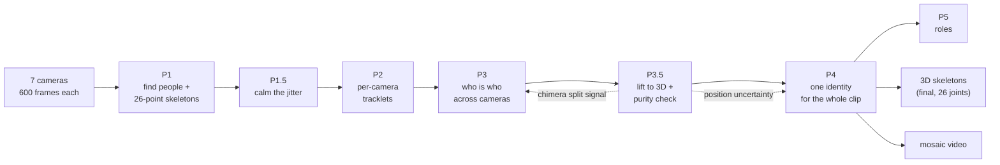
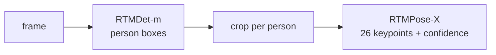
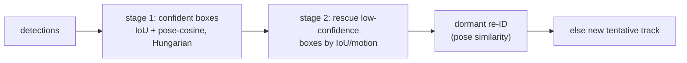
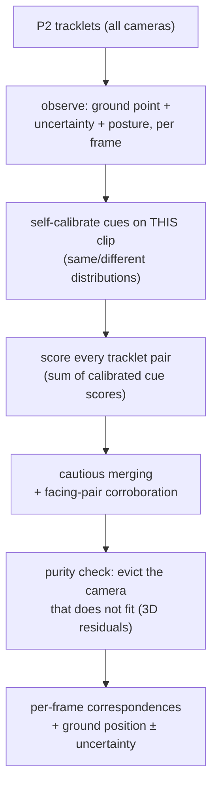
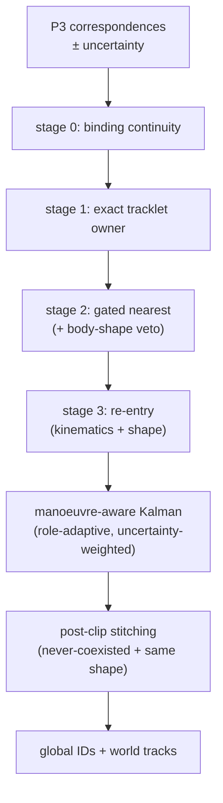

# The Pipeline As It Runs Today — Intuition First
### Every phase, what it does, why it exists (technical appendix at the bottom)

> Written 2026-07-10, mid fix-campaign. This supersedes the per-phase snapshots
> (`phase-*.md`) as the description of the **current** code; those documents remain the
> record of the pre-campaign analysis that motivated the changes. Configuration truth:
> `configs/v6/` (frozen baseline) and `configs/experiments/v7rc__*` (current candidate).

The one-sentence story: **find every player, keep them apart inside each camera, decide who
is who across cameras on the ground plane, lift them to 3D early enough that the 3D can
police the identity decisions, then keep one identity per person for the whole clip.**

---

## P1 — Find the people and their skeletons

**Intuition.** Each frame of each camera is searched for people (a detector draws boxes),
and each box is handed to a pose model that returns a 26-point skeleton — the usual 17
COCO joints *plus head, neck, hip and six foot points (toes and heels)*. The feet matter
enormously here: everything downstream stands on "where does this player touch the
ground", and a heel is a far better answer than a bounding-box bottom.

Everything downstream inherits P1's mistakes: a missed dark umpire simply does not exist
for the rest of the pipeline. That recall limit is a known open item (the planned probe is
tiled high-resolution inference — at 2560×1440 a distant player is ~10 px tall for a
640-px detector input).

## P1.5 — Calm the jitter (opt-in)

**Intuition.** Even for a player standing still, raw keypoints tremble a few pixels per
frame. Rather than let every later stage fight that noise separately, a speed-aware filter
(One-Euro: smooth hard when still, barely at all when sprinting) runs once, at the source.
It links detections across frames only enough to know "same person for smoothing purposes"
(strict IoU micro-tracks that never span an occlusion) so a mistake costs a frame or two of
shared smoothing, never an identity error.

Status: measured −20–34% jitter; whether it stays on by default is being decided as part of
the composed-stack acceptance (it reshapes tracklets in ways later stages feel).

## P2 — Per-camera tracklets

**Intuition.** Within one camera, chain detections over time into tracklets: "this box in
frame *t* is the same person as that box in *t+1*". Matching prefers box overlap plus a
body-pose similarity (colour is useless — both teams wear near-identical kit). A
constant-velocity Kalman filter predicts where each track should be next.

Two recently fixed defects matter for intuition: (1) a player who moves more than his own
box width between frames (the sprinting bowler) used to be *unmatchable* by construction —
the escape gate existed but its result could never pass the acceptance test; now a passed
gate yields a usable motion score. (2) After an occlusion the filter's "how lost am I"
noise term never reset, leaving re-acquired tracks permanently sloppy; it now resets on the
first re-match.

## P3 — Who is who across cameras (the identity core)

**Intuition.** The cameras come in *facing pairs* that look at the same strip of ground
from opposite sides — the worst possible geometry for classic two-view triangulation, and
the reason this phase works on the **calibrated ground plane** instead: project every
player's foot contact into world coordinates and ask "do these two tracklets stand in the
same place, move the same way, look the same shape?"

Decisions are made once per **tracklet pair over the whole delivery**, not per frame — six
hundred noisy frames of evidence beat one. Each cue (ground agreement, appearance, body
posture, motion) is converted into a calibrated "how much more likely is *same person* than
*different people*" score fitted **on this very clip** (players standing far apart teach the
"different" distribution; isolated well-matched pairs teach "same"). A cue that cannot tell
players apart on this footage automatically goes silent instead of guessing — which is
exactly what happens to colour, and (measured this week) to 3D bone proportions.

Merging is deliberately cautious: strong agreement is weak evidence (two players can stand
close), strong disagreement is near-conclusive. A special *corroboration* pass exists just
for the facing pairs, where most cues go silent and genuine matches would otherwise never
reach the merge bar. A *purity* pass (see P3.5) can now also **split** a bad merge — the
historic "merge-only" weakness.

The emitted position per identity-cluster is the point on the ground that best explains
every camera's foot pixel simultaneously (a robust reprojection solve) — and it now carries
an honest **uncertainty ellipse**, large and elongated for a lone grazing camera, tight for
a well-triangulated player.

## P3.5 — Lift to 3D early, and use it (new stage)

**Intuition.** Once P3 says "these views are one player", triangulating a full 3D skeleton
is cheap — and the *reprojection residuals* of that skeleton are a lie detector. If the
cluster really is one person, every camera's 2D pose re-projects onto the 3D skeleton
within a few pixels. If two people were welded together (a *chimera*), exactly one camera's
torso refuses to fit, consistently, frame after frame — which both flags the error **and
names the intruding camera**. This signal is what finally lets the clustering *undo*
mistakes.

The stage also emits per-joint 3D uncertainty (feeding P4's filter) and, optionally,
triangulates **all 26 keypoints** so the feet exist in 3D.

## P4 — One identity for the whole clip

**Intuition.** P3 says who matches whom frame by frame; P4 turns that into *persistent*
identities (`P001…`) that survive occlusion and hand-offs — the colours you see in the
mosaic. A per-player filter with a *manoeuvre-aware* motion model (a bowler is allowed to
accelerate; an umpire is not — roles now estimated online during tracking) tracks each
identity on the ground. Assignment goes strongest-evidence-first: keep your P3 binding;
else keep your exact per-camera tracklet; else nearest-by-uncertainty within a strict gate;
else consider re-entry of a recently lost identity.

Two asymmetries encode hard-won lessons: an **uncertain observation may not capture a track
more easily** (admission gates use conservative fixed noise) but **does count for less once
admitted** (the update uses the measured uncertainty); and a re-entering player must match
the lost identity's *body shape*, not just its predicted position. After the clip, a global
stitcher bridges fragments — permitted a long bridge only when the two fragments provably
never coexisted and their body shapes agree. Ultra-short leftover identities (a 20-frame
"player" in a 12-second clip) are dropped as debris.

The hard invariant, held in every run so far: one camera frame never shows the same
identity twice.

## P5 — Roles, P6 — Final 3D, Render

**Roles**: classify each identity from where it stands and how it runs (the bowler's run-up
is now required to run *with* the bowling direction — it used to be direction-blind). Roles
feed back into P4's motion model online.

**Final 3D**: re-triangulate on the final global identities: full skeletons (optionally 26
joints), occlusion gaps filled only across *real* time gaps (a fixed bug used to let a
player glide across a 300-frame occlusion), and an optional zero-phase smoother for
export-quality trajectories (no lag, unlike the old causal filter).

**Render**: the seven tiles + bird's-eye field + roster, coloured by global identity — the
place where every identity mistake becomes visible as a colour flicker.

---

## Technical appendix

**Ground solve (P3 emit).** `argmin_{x,y} Σ_c w_c ρ_Huber(‖π_c([x,y,h_c]) − foot_c‖)` by
Gauss–Newton IRLS over each member camera's full 3×4 projection; hard inlier refit rejects
one gross outlier foot. Posterior covariance `σ̂²(JᵀWJ)⁻¹` from the final normal matrix
(F9a). Landmark height `h_c` comes from the foot-contact mode: Halpe heel/toe midpoint
(~0.02 m) → ankle (~0.10 m) → bbox-bottom (0), per confidence (F4); single-camera clusters
optionally back-project onto the landmark height plane (C5).

**Cue fusion (P3).** Per tracklet-pair: `total = support · Σ llr_cue`, each
`llr = log N(v|same) − log N(v|diff)` with per-clip fitted Gaussians, positive side clipped
at 1.5 (agreement is weak evidence), veto at −4.5. Merge at ≥2.0; facing-pair corroboration
admits `[1.2, 2.0)` single-cue edges when mutually-best and uncontradicted. Cold-start:
staged anchor-gate relaxation then optional cross-delivery prior (F8).

**Chimera purity (P3.5/F13).** Per cluster-frame RANSAC-DLT skeleton; per-camera mean torso
(shoulders+hips) reprojection residual; suspect when `frac(frames with max residual >
τ_px) ≥ τ_frac` (candidate defaults 30 px / 0.6 after tuning); the max-bias camera's chunks
are surgically evicted pre-refinement with pair LLRs vetoed to −6 so nothing re-welds them.

**Kalman (P4).** Singer acceleration model, state `[x,y,vx,vy,ax,ay]`, `F,Q` via Van Loan;
role-parameterized `(α, σ_a, R)`; Joseph-form updates. F10: per-measurement `R` =
eigen-clamped P3 covariance (floor 0.15 m, ceiling 0.8 m in the current candidate), applied
to the update only; admission gates keep the fixed role `R` (asymmetric — a wide `R`
shrinks the Mahalanobis distance of wrong far candidates). Role switching inflates the
stable velocity/acceleration blocks explicitly (the discrete Lyapunov equation has no
bounded solution at the unit position/velocity eigenvalues — C3).

**Triangulation.** Confidence-weighted DLT + pairwise RANSAC with reprojection gating;
cheirality by sign agreement of the homogeneous scale with the world origin's (convention-
free; the det(M) formula fails on this rig's handedness — F3). Per-joint 3D covariance
`σ̂²(JᵀWJ)⁻¹` at the solution. Native-26 mode stacks Halpe keypoints when every member view
carries them; `pose_3d` stays the COCO-17 slice, `pose_3d_native` carries all 26 (F15).
Occlusion fill gates on true frame gaps when `--dense-fill` (C6); Butterworth `filtfilt`
(zero-phase) as the offline smoother (F7).

**Posture/shape cues.** Billboard posture: 2D keypoints lifted onto a vertical plane at the
ground point — works on facing pairs without triangulation; per-binding pooled aggregates
are emitted to P4 for the assignment veto and stitch key (F6b/F12). Bone-ratio descriptor
(triangulated): self-calibrated per clip and currently **abstains** everywhere (d′<0.5) —
kept as a safe opt-in (F11).

**Flags (current candidate stack `v7rc__*`).** P1.5 `enabled`; P3 `foot_contact_mode: v3`,
`anchor_relax_enabled`, `emit_posture`, `emit_ground_cov`, `graph_lift_feedback`,
`graph_shape_enabled`, `graph_split_enabled` (+ conservative chimera thresholds),
`single_cam_height_emit`; P4 `use_measurement_covariance` (+ asymmetric gating),
`posture_gate_veto_z`, `reentry_posture_max_z`, `online_role_proxy`, `occupancy_bridge`,
`posture_stitch_max_z`; lift `--enable-lift --tri-cheirality --tri-smoother butterworth
--tri-native-skeleton --tri-dense-fill`. Metrics panel and acceptance rules:
[fixes-log.md](fixes-log.md) §Evaluation Standard; open issues and results:
[status-report.md](status-report.md).
