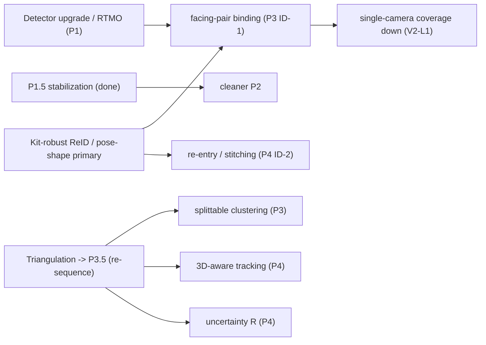

# Fixes roadmap (cross-cutting, priority-ordered)

The per-phase docs list every fix in each phase's own priority order. This page ranks them
**across the whole pipeline** by impact-on-final-quality × confidence, because the biggest wins
span phases (identity is a P2+P3+P4 problem) and several fixes **unlock** others.

## The dependency spine

## Ranked roadmap

| Rank | Fix | Phase(s) | Attacks | Unlocks / depends on | Effort |
|---|---|---|---|---|---|
| **1** | **Kit-robust ReID / promote pose-shape to a *primary* cross-camera & re-entry cue** | P2, P3, P4 | ID-4 (dead colour) → ID-1 (under-merge) → ID-2 (fragmentation) | The keystone: colour is dead, so a body/pose descriptor is the only discriminative identity signal. | Med-High |
| **2** | **Move triangulation to P3.5** (after association, before P4) | P3.5, P3, P4 | ID-5 (chimeras), 2D-only tracking | Unlocks #3 (splittable clustering) and #5 (3D tracking) and #6 (uncertainty R). | Medium |
| **3** | **Splittable clustering** (correlation clustering / multicut, reprojection-gated) | P3 | ID-5 permanent chimeras | Depends on #2 for the split signal. | High |
| **4** | **Distance/uncertainty-dependent Kalman R** | P4 | ID-3 teleports | Best from #2's triangulation covariance; else homography-Jacobian model. | Medium |
| **5** | **Adaptive lost-window + stronger re-ID at re-entry** | P4, P2 | ID-2 fragmentation | Uses #1's descriptor. | Medium |
| **6** | **3D-aware global tracking** (3D Singer KF + 3D pose-shape) | P4 | teleports, chimeras | Depends on #2. | Med-High |
| **7** | **Parallax-adaptive cross-camera cost + gate** | P3 | ID-1 facing-pair under-merge, V2-L1 coverage | Complements #1. | Medium |
| **8** | **Detector upgrade (RTMDet-l/x, RT-DETR, Co-DETR) or RTMO one-stage** | P1 | P1-1 recall (dark umpires) | Reduces the downstream work-arounds; independent. | Medium |
| **9** | **Better P2 motion model (OC-SORT/BoT-SORT + CMC)** | P2 | P2-1 CV-under-manoeuvre, fragmentation | Independent; feeds #5. | Medium |
| **10** | **Single-view → canonical-skeleton PnP lift** | P3.5 | V2-L1 (~39% single-cam get no 3D) | After #2. | Med-High |
| **11** | **Feed roles into P4a dynamics** | P5→P4 | ISSUE-11 role-invariant dynamics | Cheap; needs an online role proxy or P5-before-P4. | Low-Med |
| **12** | **Identity ground truth → MOTA/IDF1/HOTA** | eval | ID-6 (all numbers are proxies) | Makes all of the above measurable; catches overfitting. | Medium |
| **13** | **Airborne z≠0 handling; offline zero-phase 3D smoothing** | P3.5 | V2-L3 | After #2. | Low-Med |
| **14** | **C07 per-camera image size everywhere; render aspect** | P3, render | latent C07 bugs | Independent correctness fix. | Low |
| **15** | **Wire P1.5 into the default flow; cue cold-start robustness; per-camera bbox_thr** | P1.5, P3, P1 | jitter, cold-start, recall | Low-hanging follow-ups. | Low |

## Sequencing advice

- **Do #12 (labels) early and in parallel.** Everything above is proxy-guided today; a few hundred
  labelled frames turn the roadmap from "plausible" into "measured", and guards against overfitting
  to the single 12-second tuning delivery (`implementation_plan.md` risks).
- **#1 and #2 are the two keystones.** #1 (a real identity descriptor) is the highest single-lever
  fix; #2 (re-sequence triangulation) is cheap and unlocks #3/#5/#6/#10. Do both before the rest.
- **Keep every change flag-gated and A/B'd against the frozen baseline** on all 8 deliveries, per
  the repo's own working standard — no "win" without a broad, non-regressing improvement.

Full evidence and citations: the per-phase docs and [references.md](references.md).
