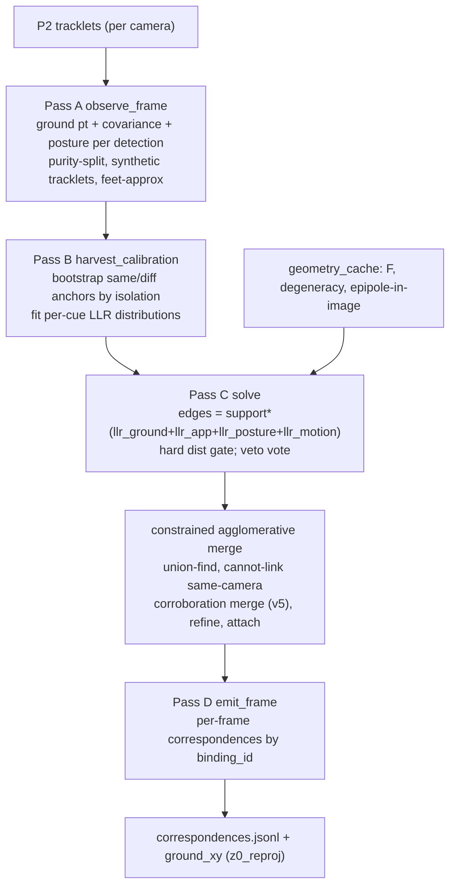

# P3 — cross-camera association (the identity core)

## Role & intuition

P3 answers **"which detection in camera A is the same physical player as which in camera B?"**
— the correspondence problem. It is the heart of identity and, per the repo's own analysis, the
**dominant quality ceiling**. Get it right and the same player carries one identity across all
seven views; get it wrong and you either **under-merge** (one player becomes several IDs) or
**over-merge into a chimera** (two players fused into one).

The structural difficulty is fixed by the camera rig: the co-observing pairs are **facing pairs**
(C1↔C4, C2↔C6, C3↔C5) that look at the same ground strip from opposite sides. These are
**low-parallax / near-collinear**, so epipolar geometry is ill-conditioned and free-space
triangulation is unstable — exactly where association is hardest. P3 therefore works on the
**calibrated z=0 ground plane** and fuses multiple weak cues rather than trusting any one.

## I/O & config

| | |
|---|---|
| **Input** | P2 run; calibration; `configs/03_association.yaml` (+ `_v5`) |
| **Output** | `predictions/*` + `diagnostics/correspondences.jsonl` (per-frame cross-camera cluster membership) + `association_metrics.json` |
| **Core modules** | `src/identity/p3_association/{tracklet_graph,associator,geometry_cache,cue_calibration,appearance}.py`; `pose_estimation/cricket/{geometry,pose_shape}.py` |
| **Facing pairs** | `opposite_camera_pairs: [cam_01,cam_04],[cam_02,cam_06],[cam_03,cam_05]` |

## Flowchart (tracklet-graph mode, the default)

## Methods walkthrough

**Geometry cache & degeneracy — `geometry_cache.py` (`build_geometry_cache:74`).**
Per camera pair it precomputes the fundamental matrix `F = [e2]_× · P2 · pinv(P1)` (so
`x2ᵀ F x1 = 0`), the Sampson distance for epipolar scoring, and a **degeneracy flag**. A pair is
degenerate if the right epipole lies **inside** image b (`_epipole_in_image`, using the *per-camera*
native size — the camera-07 correction) or the baseline is near-collinear around the pitch origin
(`baseline_angle_degen_deg=20°`, checking ~0° and ~180°). Degenerate ⇒ epipolar weight is zeroed
and reallocated to ground proximity — the key adaptation so facing pairs are not scored on an
unreliable Sampson distance.

**Ground solving — `ground_from_reprojection` ([geometry.py:540](../../src/identity/common/geometry.py#L540)).**
The emitted per-player position is the solution of a **z=0-constrained reprojection minimisation**:
`argmin_{x,y} Σ_c w_c · ρ_Huber(‖project_c([x,y,0]) − foot_c‖)`, solved by **Gauss–Newton with
Huber IRLS** (`huber_delta_px=8`), initialised from the median homography back-projection, with a
hard-inlier refit (RANSAC-lite) rejecting a gross outlier foot. Removing depth via the ground
constraint makes it **well-posed exactly on the low-parallax facing pairs** where free
triangulation is degenerate. This `z0_reproj` estimator beat both the historical median and an
inverse-covariance fusion in an A/B on real data (0.176 / 0.248 / **0.145** m — `wip/3d_location_redesign.md` §1a).

**Tracklet graph — `tracklet_graph.py`.** Instead of matching per frame (noisy), it decides
who-is-who once per tracklet-pair over the whole delivery (offline, deterministic), reducing
per-frame noise by √n:
- **Pass A `observe_frame:324`** records, per detection, the ground point, its `ground_covariance`,
  and a **billboard posture** sample; splits a P2 tracklet at kinematically impossible ground
  jumps (`_chunk_for`, so a P2 ID-switch cannot weld two people); and chains persistent *untracked*
  detections into **synthetic tracklets** (the dark umpires P2 never tracked).
- **Pass B `harvest_calibration:447`** bootstraps **same-player** anchors (median ground dist ≤ 1.5 m
  and isolation ≥ 3.0 m) and **different-player** pairs (≥ 3.0 m apart), then fits a per-cue
  log-likelihood-ratio (LLR) distribution.
- **Pass C `solve:738`** builds edges: `total = support · (llr_ground + llr_app + llr_posture +
  llr_motion)`, with the positive side clipped (agreement is weak evidence, disagreement near-
  conclusive), a hard distance gate, and a `_motion_llr` that says "different" when one tracklet
  sprints while the other stands (the bowler-vs-non-striker case). Merge is **union-find single-
  linkage** sorted by LLR, blocked by same-camera temporal overlap (cannot-link) and a veto *vote*.
  v5 adds a **corroboration merge** that admits strong single-cue facing-pair edges when mutually
  unambiguous — the direct fix for facing-pair under-merge.
- **Pass D `emit_frame:1112`** rebuilds per-frame correspondences grouped by persistent
  `binding_id`, so the stream P4 consumes is temporally stable by construction.

**Cue calibration — `cue_calibration.py`.** Each cue's LLR is `log N(v|same) − log N(v|diff)` with
an asymmetric clip; `d_prime` measures separability so a cue that can't separate on *this* footage
abstains (LLR≈0). Appearance is calibrated **per camera-pair** because colour processing differs
per camera on this rig.

**Pose-shape descriptors — `pose_shape.py`.** Two view-invariant identity channels: a
**triangulated bone-ratio descriptor** (11 scale-normalised limb ratios, gated by per-joint
parallax) and a **billboard/ground-anchored monocular posture** (lifts 2D keypoints onto a vertical
plane through the ground point — works on facing pairs without triangulation). Both are currently
**soft** tie-breakers.

## Pros

- **Right domain choice** — solving identity on the cm-accurate ground plane sidesteps the
  facing-pair triangulation degeneracy instead of fighting it.
- **Tracklet-level decisions** — deciding per tracklet-pair over the whole delivery denoises the
  association by √n vs per-frame matching.
- **Principled cue fusion** — LLRs are the correct way to combine heterogeneous weak cues, and the
  asymmetric clip encodes the right prior (agreement weak, disagreement strong).
- **Self-calibrating cues** — a cue that cannot separate on a given delivery *abstains* rather than
  injecting noise (the reason the dead colour cue does not actively harm here).
- **Degeneracy-aware geometry** — zeroing epipolar weight on facing/collinear pairs and using the
  per-camera image size for the epipole test (the C07 fix) is exactly right.
- **z0_reproj** is empirically the best emitter, validated by A/B on real data, not assumed.

## Cons

- **Single-linkage clustering can merge but never split.** Once two tracklets union, no mechanism
  un-merges them — an early wrong merge is permanent and propagates (chimeras).
- **Cross-camera evidence is weak precisely where it's needed** — on the facing pairs, epipolar is
  off, colour is dead, and ground proximity alone cannot separate two players standing near each
  other; the discriminative pose-shape cue is only a *soft* tie-breaker.
- **Cold-start dependence on isolation** — the LLR calibration needs isolated anchors; a crowded
  delivery falls back to hand-tuned default Gaussians, weakening every cue.
- **Config carries a global image size** — `image_w/h = 2560×1440` while C07 is ~3775×960; code
  paths that read the config size (not the per-camera size) mishandle C07.
- **Hard ground gates can split a correct merge** — the tight facing-pair gate (2.5 m) under foot-
  pixel noise can break a true 2-view merge into two IDs (under-merge).

## Issues

- **ID-1 (★★★) Cross-camera under-merge on facing pairs.** X-cam agreement **0.50 on _7**,
  0.77–0.80 on _5/_6/M2 (`wip/id_issues.md` ID-1). Root: low-parallax facing geometry + dead colour
  + tight ground gate. This is the single biggest identity loss.
- **ID-5 (★★) Single-linkage cannot split → permanent chimeras.** Cluster cycle-consistency
  **0.68–0.90** (`wip/3d_location_issues_v2.md` V2-L2): 10–32% of ≥3-view clusters are geometrically
  inconsistent, i.e. two people merged and un-splittable (`wip/id_issues.md` ID-5).
- **ID-4 (★★) Appearance cue statistically dead.** d′ ≈ 0.00–0.09 on 5/8 deliveries
  (`wip/id_issues.md` ID-4) — near-identical kit + desaturation. The 0.20 colour weight is mostly
  noise; the discriminative signal (body proportions) is under-weighted.
- **V2-L1 (★★) ~50% single-camera frames.** Single-cam rate 0.39–0.61 (`wip/3d_location_issues_v2.md`
  V2-L1): only ~61% of player-frames have ≥2 views, so half get no cross-camera correction. Largely
  an association-binding-rate problem.
- **P3-1 (★) C07 global-image-size mismatch in config.** `configs/03_association.yaml` hard-codes
  `image_w/h`; only code that uses the per-camera intrinsic size is correct for C07.
- **P3-2 (★) Cue-calibration cold-start.** `<3` isolated anchors ⇒ default Gaussians, silently
  weakening cues on crowded deliveries.

## Fixes (all, priority-ordered)

| # | Fix | Priority | Reasoning | Expected effect | Effort | Source |
|---|---|---|---|---|---|---|
| 1 | **Promote pose-shape / a learned kit-robust ReID embedding from soft tie-breaker to a *primary* cross-camera cue** where colour is dead and geometry is weak (facing pairs). | ★★★ | Colour d′≈0 and facing-pair epipolar is off, so body proportions are the *only* discriminative signal; making it primary directly attacks ID-1. | Higher facing-pair binding → agreement up, fewer split IDs. | Medium-High | SoccerNet ReID / pose-aligned body features [2404.11335, 2401.09942]; self-supervised multi-view assoc [2401.17617] |
| 2 | **Give the clustering the ability to split** — replace single-linkage with **correlation clustering / graph multicut** (or an iterative refine-split pass) gated on the P3.5 full-skeleton reprojection. | ★★★ | Single-linkage's merge-only nature makes ID-5 chimeras permanent; a splittable objective can undo an early wrong merge; the triangulation reprojection is a clean split signal (see [phase-triangulation-3d.md](phase-triangulation-3d.md)). | 10–32% inconsistent clusters resolvable → fewer chimeras + teleports. | High | correlation-clustering / multicut MOT [Tang et al. 2017]; unified multi-view tracking [2302.03820] |
| 3 | **Parallax-adaptive cross-camera cost + gate** — loosen the ground gate and lean on pose-shape where parallax/geometry is weak; use the per-view ground covariance instead of a hard 2.5 m. | ★★ | A hard gate on noisy facing-pair feet splits correct merges; an uncertainty-aware gate won't. | Fewer facing-pair under-merges without new over-merges. | Medium | uncertainty-aware fusion [Lee & Civera 2008.01258] |
| 4 | **Self-supervised cross-view association** to learn a view-invariant affinity from the unlabelled multi-camera data itself (no identity labels needed). | ★★ | No identity GT exists; self-supervision exploits multi-view consistency to learn what colour/geometry can't give. | Stronger, data-driven affinity on facing pairs. | High | self-supervised multi-view multi-human [2401.17617] |
| 5 | **Fix the C07 image-size handling** — make every config-driven path use the per-camera intrinsic size (already available in code) instead of the global `image_w/h`. | ★ | A latent correctness bug for the one heterogeneous camera. | Correct epipolar/normalisation on C07. | Low | — |
| 6 | **Robustify cue cold-start** — widen the isolation window / borrow a cross-delivery prior when `<3` anchors, instead of silently reverting to default Gaussians. | ★ | Crowded deliveries currently lose their calibrated cues. | More reliable LLRs on hard clips. | Low-Medium | — |
| 7 | **Raise multi-camera binding rate** (jointly with fixes 1–3) to shrink the ~50% single-camera fraction. | ★★ | Half the player-frames get no cross-camera correction today; more binding is the lever. | More triangulable frames → better 3D + identity. | (rolls up 1–3) | — |

Cross-phase: ID-1/ID-5/V2-L1 are the top of the whole-pipeline roadmap —
[fixes-roadmap.md](fixes-roadmap.md).
