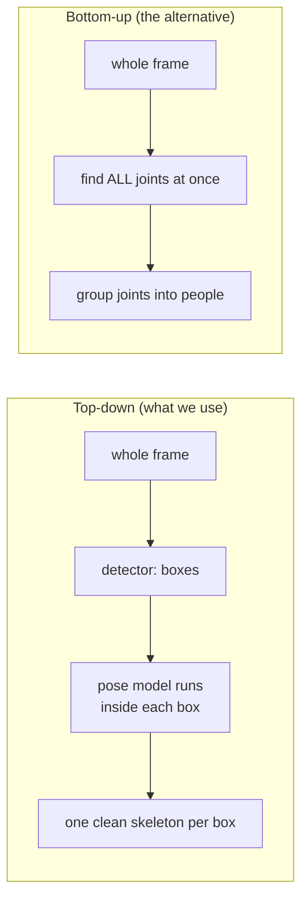
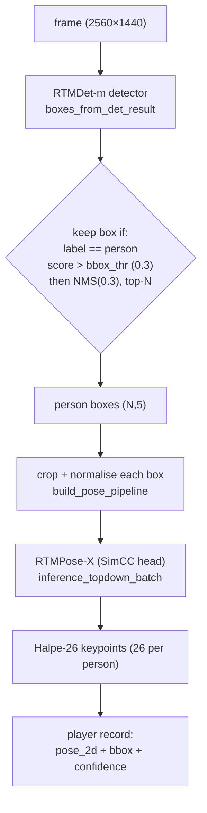

# P1, 2D pose inference

> **Stage P1 (the foundation).** Finds every person in every camera frame and estimates their 2D
> skeleton. Code: `src/core/inference/`. This is the *upstream producer*, not a numbered identity
> stage, and everything after it inherits its mistakes.

---

## 1. What this stage does (and why it matters most)

For each of the 7 cameras, for each video frame, P1 answers two questions:
1. **Where are the people?** (a box around each person)
2. **What pose is each person in?** (the pixel location of 26 body joints, head, shoulders, elbows,
   hips, knees, ankles, feet…)

Its output is a list of people per frame, each with a 2D skeleton, a bounding box, and confidence
scores.

**Why it's the most important stage:** every later stage (tracking, cross-camera matching, 3D) is
built *on top of* these detections. If P1 misses a player, no later stage can invent them; if P1's
joints are noisy, that noise flows all the way to the 3D output. So the two things P1 must get right
are **recall** (did we find *every* player, including the dark, distant umpire?) and **keypoint
precision** (how much do the joints jitter frame-to-frame?). These set the ceiling for the whole
pipeline.

> **In plain words:** P1 is the eyes of the system. If the eyes don't see a player, the brain
> (everything downstream) can't reason about them. Garbage in to garbage out.

---

## 2. The core design choice: "top-down"

P1 is a **top-down** pose estimator: first a **detector** draws a box around each person, then a
separate **pose model** runs *inside each box* to place the joints.

The alternative is **bottom-up**: find *all* joints in the whole image at once, then figure out which
joints belong to which person. Top-down is more accurate per person (the pose model sees a clean,
zoomed-in crop of one person) but slower (it runs once per person) and it is **only as good as the
detector**, if the detector misses someone, that person gets no pose at all.

> **In plain words:** top-down is like handing a cropped photo of *one* player to an expert and
> asking "what pose is this?", very accurate, but you first need someone to point at each player
> (the detector), and if they miss a player, the expert never gets asked about them.

---

## 3. Inputs and outputs

| | |
|---|---|
| **Input** | `data/raw/<dataset>/.../camera<NN>/frame_*.jpg`; pose model from `configs/model_envs.yaml`; a detector config + weights |
| **Output** | per delivery `<D>/00_inference/predictions/<group>__<delivery>__cam_NN.jsonl`, per player: `pose_2d` (Halpe-26, 26 joints incl. feet), `bbox_xywh_px` (the box), `detection_confidence`; plus `run_manifest.json`, `p1_metrics.json` |
| **Key knobs** | `--model-id` (default `rtmpose_x_body8`), `--detector` preset or `--det-config/--det-checkpoint`, `--bbox-thr` (0.3), `--nms-thr` (0.3), `--max-people`, batch/prefetch sizes |
| **Skeleton** | `src/core/keypoints.py` (`HALPE26_KEYPOINTS`); `configs/keypoint_mappings.yaml` |

Both runners (`run_phase1_rtmpose_inference.py` for the repo dataset layout,
`run_phase1_l40s.py` for the remote box's native layout plus tiled detection and batch
sweeps) share their model construction, batched inference, prefetching, and the
per-frame record schema through `src/core/inference/phase1_common.py`; the record
builder there is the single definition of the P1 JSONL line. The L40S runner writes
the per-delivery run-tree layout by default (`--layout flat` restores its historical
single `predictions/` directory).

Reproducibility note: with the L40S runner's default mixed-precision mode (fp16
autocast plus `cudnn.benchmark`), two runs from separate processes can differ by
sub-0.001 detection-confidence wobble on isolated frames (kernel selection is a
timing race); keypoints are unaffected in practice. Pass `--no-amp --no-perf` for
bit-reproducible output; the standard runner has no such modes and is deterministic.

---

## 4. How it works, step by step

### 4a. Detection, `boxes_from_det_result` ([run_phase1_rtmpose_inference.py:488](../../src/core/inference/run_phase1_rtmpose_inference.py#L488))

An **RTMDet-m** detector runs on the frame and proposes boxes. We keep a box only if its class is
`person` **and** its score exceeds `bbox_thr = 0.3`, then remove duplicate boxes with **NMS** and
optionally keep only the top-N by score.

- **RTMDet** ([Lyu et al. 2022](https://arxiv.org/abs/2212.07784)) is a fast, **anchor-free**,
  **one-stage** detector. *One-stage* = it predicts boxes directly in a single pass (no slow
  "propose regions, then classify" second stage). *Anchor-free* = it doesn't rely on a fixed grid of
  pre-set box shapes ("anchors"); it predicts each box's extent directly, which is simpler and copes
  better with unusual sizes.
  > **In plain words:** a quick, single-glance "there's a person here, and here" detector, rather
  > than a slow, careful two-pass one.
- **NMS (Non-Maximum Suppression):** the detector often fires several overlapping boxes on the same
  person; NMS keeps the highest-scoring box and deletes the others that overlap it too much (`nms_thr
  = 0.3` = "if two boxes overlap by >30%, drop the weaker one").
  > **In plain words:** "you've drawn three boxes on the same batsman, keep the best one, bin the
  > rest."
- **`bbox_thr = 0.3`** is the confidence cut-off. Lower it to catch more faint/distant people but also
  more false boxes (crowd, shadows); raise it to cleaner but you miss the dark umpire. It's a single
  global dial trading recall against false positives.

### 4b. Pose, `inference_topdown_batch` ([:531](../../src/core/inference/run_phase1_rtmpose_inference.py#L531))

Each person-box is cropped, resized to a normalised patch (384×288), and fed to **RTMPose-X**, which
outputs the 26 joint locations.

- **RTMPose** ([Jiang et al. 2023](https://arxiv.org/abs/2303.07399)) uses a **SimCC head**. Normally
  a pose model predicts a 2-D *heatmap* per joint (a blurry blob whose peak is the joint) and takes
  the peak, but the peak is quantised to whole pixels. **SimCC** instead treats each joint's **x**
  and **y** as two *1-D classification* problems over finely-binned sub-pixel positions. This is
  cheaper and gives **sub-pixel** accuracy without the heatmap's memory cost.
  > **In plain words:** instead of asking "which pixel blob is the elbow?", SimCC asks two ruler
  > questions, "how far along the x-ruler is the elbow? how far along the y-ruler?", and can point
  > *between* pixel marks, so joints land more precisely.
- **RTMPose-X** is the largest, most accurate variant in the family, trained on the **Body8** dataset
  with the **Halpe-26** skeleton. We deliberately chose the accuracy-first model (the RTMPose mandate: P1
  stays RTMPose, do not switch to YOLO-pose; see [`../methods_log.md`](../methods_log.md) Part E for the
  model/detector study).

### 4c. Skeleton, Halpe-26 ([:586](../../src/core/inference/run_phase1_rtmpose_inference.py#L586), `player_records:622`)

`pose_2d` carries the full **Halpe-26** skeleton: 26 joints where indices **0-16 are the standard
COCO-17** body joints (nose, eyes, shoulders, elbows, wrists, hips, knees, ankles) in COCO order, and
**17-25 add** head, neck, mid-hip, and **6 foot** keypoints (big toe, small toe, heel × 2).

- **Why the feet matter:** the extra foot joints are exactly what the ground-contact / 3D-location
  solver wants, a player's *feet on the ground* is the most reliable anchor for "where on the pitch
  are they standing?".
  > **In plain words:** COCO-17 stops at the ankle; Halpe-26 adds the actual feet, which is what you
  > need to know where someone is *standing*.

Joint names and skeleton edges live in `src/core/keypoints.py`.

### 4d. Speed knobs are accuracy-neutral

Batch size, prefetch, and worker counts change **speed only**, the keypoints they produce are
numerically identical regardless of batching. So you can tune throughput freely without touching
accuracy. (This was hard-won: an earlier GPU-starvation slowdown was traced to cold-disk I/O + thread
oversubscription, fixed with prefetch overlap and thread caps, not a model change.)

---

## 5. Strengths

- **Top-down accuracy**, the pose model sees a clean, normalised per-person crop, giving the best
  off-the-shelf per-joint precision; RTMPose-X is the top of its family.
- **Feet are already computed and kept**, the 6 foot joints the ground solver needs are persisted,
  not discarded.
- **Speed is decoupled from accuracy**, batching/prefetch tuning is numerically invariant.
- **Detector is swappable**, `--det-config/--det-checkpoint` let you drop in a stronger detector
  with no code change.

## 6. Weaknesses

- **Total dependence on the detector.** A missed person = no pose, unrecoverable downstream. The
  `bbox_thr=0.3` gate + RTMDet-m's recall on **dark/distant umpires** is the root cause of a whole
  chain of downstream work-arounds (synthetic tracklets, feet-approximation, see
  [03-association](03-association.md)).
- **No temporal information.** Each frame is processed independently, so joints jitter frame-to-frame
  and P1 has no way to damp it, that is exactly why stage [01 (stabilization)](01-stabilization.md)
  was added.
- **Runtime scales with the number of people** (top-down): ~35 person-crops/frame × 7 cameras.
- **COCO-17 core is body-only**, no hands/face detail (fine for tracking; a limit for fine pose).

---

## 7. Known issues (severity, 1 low to 3 high)

These feed the [known-bugs tracker](../analysis/README.md).

- **P1-1 (severity 3/3) Detector-recall bound.** RTMDet-m @0.3 misses dark/distant/occluded subjects.
  *Evidence:* the association layer contains dedicated machinery, `synthetic tracklets`,
  `apply_feet_approximation`, that exists *only* because the detector never tracked those players.
  Recall lost here is unrecoverable, so this is the single highest-leverage P1 issue.
- **P1-2 (severity 2/3) No 2D temporal stabilization at source.** Off-the-shelf keypoints jitter (~1.6 px mean
  on real frames). Addressed by stage [01](01-stabilization.md).
- **P1-3 (severity 2/3) Detector unbenchmarked for this domain.** RTMDet-m was picked for speed; there is no
  cricket-specific recall/precision measurement justifying it over a stronger detector.
- **P1-4 (severity 1/3) `bbox_thr=0.3` is one global number** trading recall vs false positives across all 7
  cameras and all lighting.
- **P1-5 (severity 1/3) Halpe-26 feet under-used downstream**, `pose_2d` carries the feet, but some identity
  paths still use the legacy bbox-bottom/ankle pixel for ground contact.

---

## 8. Candidate fixes (priority-ordered)

Implementation status (2026-07-17): P1 runs the RTMDet-m plus RTMPose-X (Halpe-26) baseline described
above. The tiled-detection path (a form of fix 1) is implemented (`--tiled-det`) and was measured this
session on the 40-set: it raises cross-camera agreement on all 8 hardest deliveries (mean plus 0.115,
attributable to tiling and not NMS) but raises underlying teleport events (plus 704) at about 3x GPU cost,
so it is two-edged and off by default, pending a human decision. Important constraint: no stronger
detector weights exist on the box (the RTMDet-l/x, RTMO-l, and YOLO model directories are empty
placeholders), so fixes 1 and 2 as model swaps need a download first and are not runnable today. The
recall gap is a scale problem, not a threshold problem (missing distant and dark players score near zero,
not just under the threshold), so fix 3 (adaptive `bbox_thr`) would recover little; tiling, which
re-scales distant subjects to the detector's trained size, is the correctly targeted lever. Feet-as-ground
and SmoothNet remain future. The detector-recall bound is tracked as [BUG-4](../analysis/README.md); the tiling
A/B detail is in [`../methods_log.md`](../methods_log.md) Part A.

| # | Fix | Priority | Why | Effort | Source |
|---|---|---|---|---|---|
| 1 | **Upgrade the detector** to RTMDet-l/x (drop-in) and evaluate **RT-DETR / Co-DETR** for max recall on small/dark subjects; judge by cross-camera coverage + mosaic review (no labels exist). | severity 3/3 | Recall lost here is unrecoverable; directly reduces missing-umpire fragmentation. | Medium; `--det-*` already wired. | RTMDet [2212.07784]; RT-DETR [2304.08069]; Co-DETR [2211.12860] |
| 2 | **Evaluate RTMO (one-stage bottom-up)**, removes the detector bottleneck entirely (74.8 AP / 141 FPS). | severity 2/3 | Attacks P1-1 by eliminating the detector-recall dependency; also faster. | Medium-High; new model path + schema re-validation. | RTMO [2312.07526] |
| 3 | **Per-camera / adaptive `bbox_thr`** (lower where a camera is dark, stronger NMS to control FPs) + multi-scale test-time augmentation for distant people. | severity 2/3 | Cheap recall gains on the hard subjects with no model swap. | Low; CLI/config only. | standard TTA |
| 4 | **Use the Halpe-26 feet** as the primary ground-contact joint everywhere, replacing the bbox-bottom fallback. | severity 2/3 | Feet are already computed; using them tightens the 3D ground solve for free. | Low-Medium; `geometry.py`. | Pose2Sim |
| 5 | **Learned temporal 2D refinement (SmoothNet)** as a complement to stage 01's One-Euro filter for long occlusion-burst jitter. | severity 1/3 | One-Euro is causal/local; SmoothNet fixes long-range bursts it can't. | Medium; offline model. | SmoothNet [2112.13715] |

See the cross-phase priorities in [`roadmap.md`](../roadmap.md).
