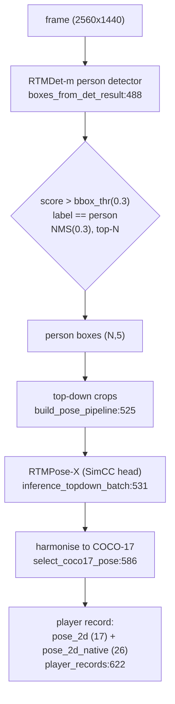

# P1 — 2D pose inference

> **Stage P1 (foundation)** — 2D pose inference. Code: `src/core/inference/`. Upstream producer, not a numbered identity stage.

## Role & intuition

P1 is the foundation: for every camera frame it finds the people and estimates each person's
2D skeleton. Everything downstream (tracking, identity, 3D) inherits P1's errors, so its
**recall** (did we find every player, including the dark/distant umpire?) and **keypoint
noise** (how much do joints jitter?) set the ceiling for the whole pipeline.

It is a **top-down** design: an **RTMDet** person detector produces boxes, then **RTMPose-X**
estimates keypoints inside each box. Top-down maximises per-person accuracy (the pose model
sees a normalised crop) at the cost of runtime scaling with the number of people and total
dependence on the detector — if the detector misses a person, that person has no pose at all.

## I/O & config

| | |
|---|---|
| **Input** | `drive/dataset/.../camera<NN>/frame_*.jpg`; pose model from `configs/model_envs.yaml`; detector config/weights |
| **Output** | `predictions/<group>__<delivery>__cam_NN.jsonl` — per player: `pose_2d` (COCO-17), `pose_2d_native` (Halpe-26, 26 kpts), `bbox_xywh_px`, `detection_confidence`; `run_manifest.json`, `p1_metrics.json` |
| **Key knobs** | `--model-id` (default `rtmpose_x_body8`), `--det-config/--det-checkpoint`, `--bbox-thr` (0.3), `--nms-thr` (0.3), `--max-people`, batch/prefetch |
| **Skeletons** | `configs/keypoint_mappings.yaml` (source → COCO-17) |

## Flowchart

## Methods walkthrough

**Detection — `boxes_from_det_result` ([run_phase1_rtmpose_inference.py:488](../../src/core/inference/run_phase1_rtmpose_inference.py#L488)).**
RTMDet-m (a fast anchor-free one-stage detector, [Lyu et al. 2022, arXiv 2212.07784](https://arxiv.org/abs/2212.07784))
runs per frame; boxes are kept where `label == person` **and** `score > bbox_thr (0.3)`, then
de-duplicated with `nms(bboxes, 0.3)`, optionally truncated to the top-N by score. The
checkpoint is fine-tuned on Objects365 + COCO person, which is why it is used over a generic
COCO-80 detector.

**Pose — `inference_topdown_batch` ([:531](../../src/core/inference/run_phase1_rtmpose_inference.py#L531)).**
Each box becomes a top-down sample through `pose_model.cfg.test_dataloader.dataset.pipeline`,
batched through `pose_model.test_step`. RTMPose ([Jiang et al. 2023, arXiv 2303.07399](https://arxiv.org/abs/2303.07399))
uses a **SimCC** head: it treats keypoint localisation as *coordinate classification* — each
joint's x and y are predicted as 1-D probability distributions over binned sub-pixel locations,
which is cheaper and more robust than 2-D heatmap argmax. RTMPose-**X** is the largest body
variant, trained on Body8 with the **Halpe-26** skeleton (COCO-17 + head/neck/hip + 6 foot
keypoints), 384×288 input — the accuracy-first choice.

**Skeleton harmonisation — `select_coco17_pose` ([:586](../../src/core/inference/run_phase1_rtmpose_inference.py#L586))
and `player_records` ([:622](../../src/core/inference/run_phase1_rtmpose_inference.py#L622)).**
The native skeleton is reduced to COCO-17 via `configs/keypoint_mappings.yaml`; for Halpe-26
the first 17 are already COCO-17, so `pose_2d.keypoints_px == pose_2d_native.keypoints_px[0:17]`
(verified). Both are written per player, so downstream stays on the COCO-17 contract while the
**feet** stay available in `pose_2d_native` for a better ground-contact estimate.

## Pros

- **Top-down accuracy** — the pose model sees a normalised per-person crop, giving the best
  per-joint precision available off-the-shelf, and RTMPose-X is at the top of the RTMPose family.
- **Halpe-26 with feet is already persisted** — the 6 foot keypoints are exactly what the ground
  -contact / z0 solver wants; the pipeline is not throwing them away.
- **Batch/prefetch decoupling** — det/pose batch, io-workers, and prefetch change *speed only,
  never* the keypoints (numerically batch-invariant), so tuning is accuracy-free.
- **Detector fully configurable** — `--det-config/--det-checkpoint` allow a drop-in stronger
  detector with no code change.
- **Fine domain fit for the ground plane** — COCO-17 + feet + confidence per joint is exactly the
  input the cm-accurate calibration needs.

## Cons

- **Total dependence on the detector.** A missed person = no pose. The `bbox_thr=0.3` gate plus
  RTMDet-m's recall on **dark/distant umpires** is the root cause of a chain of downstream
  work-arounds (synthetic tracklets, feet-approximation, bbox-top-as-head — see
  [03-association.md](03-association.md)).
- **No temporal information.** Each frame is independent, so keypoints jitter frame-to-frame;
  P1 has no mechanism to damp it (that is why 01 (stabilization) exists).
- **Runtime scales with people** (top-down) — ~35 crops/frame × 7 cameras is the throughput
  bottleneck; the render, not pose, is usually the wall-clock limiter here.
- **Single global image size assumption in places** — camera 07 is ~3775×960, not 2560×1440;
  any path that reads a global size mishandles it (surfaces in 03, see that doc).
- **COCO-17 is body-only** — no hands/face; fine for tracking, a limit for fine pose.

## Issues

- **P1-1 (★★★) Detector-recall bound.** RTMDet-m @0.3 misses dark/distant/occluded subjects.
  Evidence: the association layer contains dedicated machinery precisely for players the
  detector/pose never tracks — `synthetic tracklets` and `apply_feet_approximation`
  (`src/identity/p3_association/tracklet_graph.py`), and `../diagnosis/09-per-phase-issue-register.md` ID-2 attributes fragmentation
  partly to weak detection of the "dark umpire". This is the single highest-leverage P1 issue
  because recall lost here is unrecoverable downstream.
- **P1-2 (★★) No 2D temporal stabilization at source.** Off-the-shelf keypoints jitter; measured
  mean 2D jitter ~1.6 px on real frames (`stabilization_metrics.json` on the `rtmpose-x` run).
  Addressed by the new 01 (stabilization) stage — see [01-stabilization.md](01-stabilization.md).
- **P1-3 (★★) Detector choice is unbenchmarked for this domain.** RTMDet-m was chosen for speed;
  there is no cricket-specific recall/precision measurement justifying it over stronger detectors.
- **P1-4 (★) `bbox_thr=0.3` is a single global threshold.** It trades recall (dark umpires) against
  false positives (crowd/background) with one number for all cameras and lighting.
- **P1-5 (★) Halpe-26 feet are persisted but under-used.** `pose_2d_native` carries the feet, but
  the identity gate still uses the legacy bbox-bottom/ankle foot pixel in several paths
  (`geometry.py` foot logic), leaving accuracy on the table.

## Fixes (all, priority-ordered)

| # | Fix | Priority | Reasoning | Expected effect | Effort / blast-radius | Source |
|---|---|---|---|---|---|---|
| 1 | **Upgrade the detector** to RTMDet-l/x (drop-in, same ecosystem) and evaluate **RT-DETR** / **Co-DETR** for max recall on small/dark subjects; benchmark recall on hand-labelled umpire/deep-fielder frames. | ★★★ | Recall lost here is unrecoverable; a stronger detector directly reduces the missing-umpire fragmentation. | Fewer synthetic-tracklet work-arounds; higher multi-camera binding. | Medium; weights + one config, `--det-*` already wired. | RTMDet [2212.07784]; RT-DETR [2304.08069]; Co-DETR [2211.12860] |
| 2 | **Evaluate RTMO (one-stage)** as an alternative that removes the detector bottleneck entirely — bottom-up, so recall is not gated by a separate box stage; 74.8 AP / 141 FPS. | ★★ | Directly attacks P1-1 by eliminating the detector-recall dependency; also faster. | Better small-person recall + throughput; needs re-validation of the whole 2D contract. | Medium-High; new model path + schema check. | RTMO [2312.07526], CVPR 2024 |
| 3 | **Confidence-recalibration + per-camera / adaptive `bbox_thr`** (lower where a camera is dark, with stronger NMS to control FPs); optionally test-time augmentation (multi-scale) for distant people. | ★★ | Cheap recall gains on exactly the hard subjects, without a model swap. | +recall on umpires/deep fielders. | Low; CLI/config only. | standard TTA; RTMDet |
| 4 | **Use the Halpe-26 feet** as the primary ground-contact keypoint everywhere (not just `pose_2d_native`), replacing the bbox-bottom fallback. | ★★ | Feet are already computed; using them tightens the z0 ground solve at no inference cost. | Lower ground error on visible-foot players. | Low-Medium; `geometry.py` foot selection. | Pose2Sim foot handling |
| 5 | **Domain-fine-tune the detector** (and optionally the pose model) on a few hundred labelled cricket frames incl. umpires/keepers in pads. | ★ | The kit/pose distribution differs from COCO; fine-tuning is the durable recall fix. | Best long-run recall + fewer pose outliers. | High; labelling + training. | standard transfer learning |
| 6 | **Learned temporal 2D refinement (SmoothNet)** as an alternative/complement to 01 (stabilization)'s One-Euro filter for the long-tail jitter under occlusion. | ★ | One-Euro is causal and local; SmoothNet fixes long-range jitter bursts 01 (stabilization) cannot. | Lower jitter on hard occluded segments. | Medium; offline model. | SmoothNet [2112.13715], ECCV 2022 |

See the cross-phase priorities in [fixes-roadmap.md](../changes_tbd.md).
