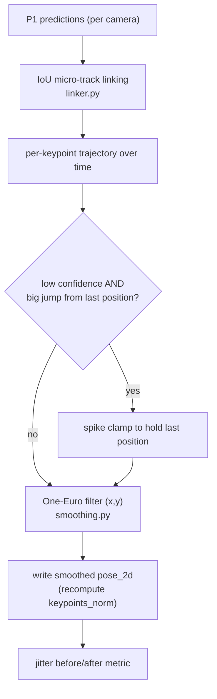

# 01, 2D temporal stabilization

> **Stage 01** (was P1.5), smooths the jittery 2D keypoints *before* anything else uses them.
> Code: `src/identity/p1_stabilization/`, config `configs/01_stabilization.yaml`.

---

## 1. What this stage does (and why)

P1 processes each frame independently, so even a perfectly still player's joints **wobble a pixel or
two every frame**, pure measurement noise. That wobble then poisons everything downstream: tracking
sees fake motion, association gets noisy ground points, triangulation gets noisy rays.

Stage 01 sits **between P1 and 02** and **denoises each keypoint's trajectory over time, once, at the
source**, so every later stage inherits a clean signal instead of re-fighting the same jitter.

> **In plain words:** clean the data once, up front, where it's cheapest, instead of making five
> later stages each cope with the same shaking.

**The subtlety:** to smooth "this joint over time" you must know *which detection in frame t+1 is the
same person as in frame t*, a mini temporal-matching problem. Full identity tracking is 02's job, so
01 does the *bare minimum* matching needed to smooth: short **micro-tracks** that never span a real
occlusion or cross cameras. If it mis-links two people for a frame, the only cost is a frame or two of
slightly-blended smoothing, it can **never** create an identity error.

---

## 2. Inputs and outputs

| | |
|---|---|
| **Input** | a P1 run dir (`predictions/*.jsonl`) |
| **Output** | a stabilized run dir in the *identical* format, a drop-in 02 input (`local_track_id` stays null, schema-valid) + `stabilization_metrics.json` (jitter before/after) |
| **Config** | `configs/01_stabilization.yaml`, all flag-gated; `enabled: false` = a byte-identical passthrough (so A/Bs are clean) |
| **CLI** | `python -m identity.p1_stabilization.run_stabilization --input-run-dir <p1> --output-run-dir <p1b> --delivery-id <D>` |

---

## 3. How it works, step by step



### 3a. Micro-track linking, `link_micro_tracks` ([linker.py:35](../../src/identity/p1_stabilization/linker.py#L35))

Greedy **IoU** matching across consecutive frames (`iou_min=0.3`), bridging up to
`max_gap_frames=2` missed frames.

- **IoU (Intersection-over-Union):** a 0-1 overlap score between two boxes, the area they share
  divided by the area they jointly cover. 1 = identical boxes, 0 = no overlap. "Greedy" = for each box
  in frame t, grab the best-overlapping box in t+1, first-come-first-served.
  > **In plain words:** "the box in this frame that most overlaps a box in the next frame is probably
  > the same person." Good enough for a 2-3 frame smoothing window; not trusted for real identity.

### 3b. One-Euro filter, `OneEuroFilter` ([smoothing.py:26](../../src/identity/p1_stabilization/smoothing.py#L26))

The **One-Euro filter** ([Casiez et al., CHI 2012](https://gery.casiez.net/1euro/)) is a low-pass
filter whose smoothing strength **automatically adapts to how fast the signal is moving**:

```
cutoff = min_cutoff + β · |smoothed velocity|
```

- A **low-pass filter** removes fast wiggles (noise) and keeps slow changes (real motion). Its
  **cutoff frequency** sets where "fast" begins, a low cutoff smooths hard, a high cutoff barely
  smooths.
- One-Euro makes the cutoff *rise with speed*: when a joint is **still**, cutoff is low to heavy
  smoothing kills the jitter; when a joint moves **fast** (a bat swing, a sprint), cutoff rises  to 
  almost no smoothing, so it doesn't lag or smear the real motion.
  > **In plain words:** it smooths hard when nothing's happening (killing the shake) and gets out of
  > the way the instant the player actually moves, so you lose the jitter but not the action. A
  > fixed smoother can't do both: it either leaves jitter or blurs fast moves.
- It is **causal** (uses only past frames), so it works in a live/online setting. One filter runs per
  keypoint per coordinate along a micro-track.

### 3c. Spike clamp ([smoothing.py:78](../../src/identity/p1_stabilization/smoothing.py#L78))

Before filtering, if a keypoint is both **low-confidence** (`< 0.3`) **and** has **jumped
implausibly far** from its last filtered position (beyond `max(max_jump_px, max_jump_bbox_frac ·
bbox_diag)`), it is replaced by the last good position.

> **In plain words:** if the model briefly hallucinates an ankle 200 px away with low confidence,
> don't let that one bad guess yank the whole smoothed trajectory, just hold the last believable
> spot. (Missing joints marked `(0,0)` are passed through untouched.)

### 3d. Jitter metric, `mean_jitter_px` ([smoothing.py:110](../../src/identity/p1_stabilization/smoothing.py#L110))

Mean frame-to-frame movement of confident, valid joints, the before/after number that proves the
stage did something real.

---

## 4. Does smoothing-first hurt the 3D? (measured, no)

A natural worry (raised by a colleague): *if you distort the 2D pixels before triangulating, do you
corrupt the 3D?* We tested it directly (A/B on 8_init):

| | ARM A: stabilize-first (current) | ARM B: triangulate raw, then smooth 3D |
|---|---|---|
| cross-camera agreement | **0.9160** | 0.9114 |
| 3D-joint jitter | **0.0105 m** | 0.0117 m |
| teleports | **258** | 280 |
| reprojection | tied | tied |

**Verdict: keep stabilize-first, it wins on every axis.** Removing per-camera pixel jitter *before*
triangulation prevents 3D "depth-swimming" that a post-hoc 3D smoother can't fully undo. The worry is
not borne out. (Details in [fixes-log](fixes-log.md).)

> **In plain words:** clean each camera's 2D first, *then* combine into 3D, that beats combining
> noisy 2D and trying to clean the 3D afterward. Cleaning early wins.

---

## 5. Strengths

- **Denoises once, benefits every downstream stage**, the right place for a shared cost.
- **Speed-adaptive**, kills rest-jitter without smearing fast motion (unlike a fixed EMA).
- **Causal/online-friendly**, no future frames needed.
- **Safe by construction**, micro-tracks never cross occlusion/cameras; `enabled:false` is a
  byte-identical passthrough. Measured win: mean 2D jitter **1.58 to 1.07 px (−32%)** on real footage.

## 6. Weaknesses

- **IoU-only linking** can briefly mislink in a dense pack of overlapping boxes (bounded, not zero).
- **Causal One-Euro can't repair a *long* jitter burst** under sustained occlusion (a non-causal
  learned model like SmoothNet could).
- **Global constants**, one `min_cutoff/β` for all joints; ankles jitter more than the torso.
- **Adds a stage/pass**, one more run dir and I/O pass.

---

## 7. Known issues (severity, 1 low to 3 high)

- **P15-1 (severity 2/3) Linking is appearance-blind**, pure IoU can mislink in crowds; a cheap pose-cosine
  tiebreaker (already computed elsewhere) would help.
- **P15-2 (severity 1/3) Global smoothing constants**, per-joint / confidence-scaled parameters would smooth
  feet and torso appropriately.
- **P15-3 (severity 1/3) No long-range jitter handling**, the causal filter leaves the occlusion-burst tail.
- **P15-4 (severity 1/3) Not wired into the default delivery flow**, validated but opt-in; the batch driver
  doesn't yet call it before 02.

---

## 8. Fix-implementation status + candidate fixes (priority-ordered)

> **Implementation status (2026-07-16):** stage 01 **is wired into the driver** (`src/main.py`, gated by
> `--enable-stabilization`), it is **opt-in**, not on by default (that's fix #2 / [BUG-8](known-bugs.md)).
> The other listed fixes (pose-cosine tiebreaker, per-joint cutoff, SmoothNet) are **NOT DONE**, future.

| # | Fix | Priority | Why | Effort | Source |
|---|---|---|---|---|---|
| 1 | **Add a pose-cosine tiebreaker to micro-track linking** (reuse `pose_vector`) so IoU ties in a pack are broken by body pose. | severity 2/3 | Removes the main failure mode (crowd mislinks) cheaply. | Low | ByteTrack [2110.06864] |
| 2 | **Wire 01 into the default flow** (batch driver runs it before 02, behind the enable flag) and add its jitter metric to the panel. | severity 2/3 | A validated win delivers nothing until it's actually on. | Low |, |
| 3 | **Per-joint / confidence-scaled `min_cutoff`** (feet vs torso). | severity 1/3 | Different joints have different noise. | Low | One-Euro [Casiez 2012] |
| 4 | **Offer a SmoothNet post-pass** for offline runs to fix long occlusion-burst jitter. | severity 1/3 | Causal One-Euro can't fix long bursts. | Medium | SmoothNet [2112.13715] |
