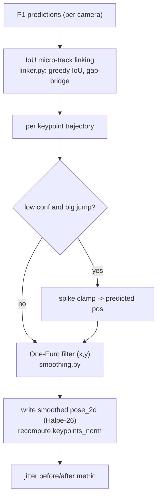

# 01 (stabilization) — 2D temporal stabilization (new)

> **Stage 01** (was P1.5) — code `src/identity/p1_stabilization/`, config `configs/01_stabilization.yaml`.

## Role & intuition

Off-the-shelf 2D keypoints jitter frame-to-frame even when a player is standing still, and that
noise propagates into tracking (spurious motion), association (noisy ground points), and
triangulation (noisy rays). 01 (stabilization) is a new stage inserted **between P1 and 02** that denoises the
2D keypoint trajectories *once, at the source*, so every downstream stage inherits a cleaner
signal instead of re-fighting the same jitter. It is the logical answer to "clean the data
before it helps the next phase."

The central subtlety: smoothing a trajectory needs to know **which detection is the same person
across frames** — i.e. temporal correspondence. Full identity tracking is 02's job, so 01 (stabilization) does
the *minimum* correspondence needed for smoothing — short IoU **micro-tracks** — and never spans a
real occlusion or crosses cameras. A mislink just means two detections are smoothed together for
a frame or two; it cannot create an identity error.

## I/O & config

| | |
|---|---|
| **Input** | a P1 run dir (`predictions/*.jsonl`) |
| **Output** | a stabilized run dir in the identical canonical format — a **drop-in 02 input** (`local_track_id` stays null, schema-valid) + `stabilization_metrics.json` (jitter before/after) |
| **Config** | `configs/01_stabilization.yaml` (all flag-gated; `enabled: false` = byte-identical passthrough) |
| **CLI** | `python -m identity.p1_stabilization.run_stabilization --input-run-dir <p1> --output-run-dir <p1b> --delivery-id <D>` |

## Flowchart

## Methods walkthrough

**Micro-track linking — `link_micro_tracks` ([linker.py:35](../../src/identity/p1_stabilization/linker.py#L35)).**
Greedy IoU association across consecutive frames (`iou_min=0.3`), bridging up to
`max_gap_frames=2` missed frames. This is *not* identity tracking — it is the temporal
correspondence a smoother requires, and by construction it cannot span an occlusion.

**One-Euro filter — `OneEuroFilter` ([smoothing.py:26](../../src/identity/p1_stabilization/smoothing.py#L26)).**
The One-Euro filter ([Casiez, Roussel & Vogel, CHI 2012](https://gery.casiez.net/1euro/)) is a
low-pass filter whose cutoff frequency **rises with the signal speed**:
`cutoff = min_cutoff + β·|ẋ̂|`, where `ẋ̂` is a smoothed derivative. When a joint is still, the
cutoff is low → strong smoothing (kills jitter); when it moves fast, the cutoff rises → little
lag. This is the standard speed/lag trade-off tool for noisy interactive signals and is causal
(online-friendly). One filter runs per keypoint per coordinate along a micro-track.

**Confidence-gated spike clamp ([smoothing.py:78](../../src/identity/p1_stabilization/smoothing.py#L78)).**
Before filtering, a keypoint whose confidence is below `confidence_min (0.3)` **and** whose jump
from the last filtered position exceeds `max(max_jump_px, max_jump_bbox_frac·bbox_diag)` is
replaced by the last filtered position — so a single hallucinated ankle 200 px away cannot drag
the trajectory. Missing/placeholder joints (`(0,0)`) are passed through untouched and do not
advance their filter.

**Jitter metric — `mean_jitter_px` ([smoothing.py:110](../../src/identity/p1_stabilization/smoothing.py#L110)).**
Mean frame-to-frame displacement over confident, valid keypoints — the before/after number that
proves the stage did something.

## Pros

- **Denoises once, benefits every downstream stage** — the correct place for a shared cost.
- **Speed-adaptive** (One-Euro) — removes jitter at rest without smearing fast motion (a bat
  swing / sprint), unlike a fixed EMA.
- **Causal / online-friendly** — no future frames needed, so it does not block a real-time path.
- **Safe by construction** — micro-tracks never cross occlusion/cameras; `enabled:false` is a
  byte-identical passthrough for clean A/B; output is schema-validated and `local_track_id` stays
  null (a true drop-in 02 input).
- **Measured win** — mean 2D jitter **1.58 → 1.07 px (−32%)** on the real `rtmpose-x` delivery-1
  run, and 02 consumes the output cleanly (validated).

## Cons

- **Micro-track linking is IoU-only** — in a dense pack of players with overlapping boxes it can
  briefly link the wrong pair; the effect is bounded (a frame or two of shared smoothing) but not
  zero.
- **One-Euro is local/causal** — it cannot repair a *long* jitter burst under sustained occlusion
  the way a learned, non-causal model (SmoothNet) can.
- **Tuned, not learned** — `min_cutoff/β` are global constants; the optimal smoothing differs by
  joint (ankles jitter more than the torso) and by motion regime.
- **Adds a stage/pass** — one more run dir and I/O pass over the predictions.

## Issues

- **P15-1 (★★) Linking is appearance-blind.** Pure IoU can mislink in crowds; a cheap pose-cosine
  tiebreaker (already computed elsewhere) would make micro-tracks more reliable.
- **P15-2 (★) Global smoothing constants.** One `min_cutoff/β` for all joints under-smooths the
  torso or over-smooths the feet; per-joint (or confidence-scaled) parameters would do better.
- **P15-3 (★) No long-range jitter handling.** The causal filter leaves the occlusion-burst tail
  that SmoothNet targets.
- **P15-4 (★) Not yet wired into the default delivery flow.** The stage exists and is validated but
  is opt-in; the batch driver does not yet call it before 02.

## Fixes (all, priority-ordered)

| # | Fix | Priority | Reasoning | Expected effect | Effort | Source |
|---|---|---|---|---|---|---|
| 1 | **Add a pose-cosine tiebreaker to micro-track linking** (reuse `pose_vector`), so IoU ties in a pack are broken by body pose. | ★★ | Removes the main failure mode (crowd mislinks) cheaply. | Cleaner micro-tracks → better smoothing in packs. | Low | ByteTrack pose/appearance cues [2110.06864] |
| 2 | **Per-joint / confidence-scaled `min_cutoff`** (feet vs torso). | ★ | Different joints have different noise; one constant is suboptimal. | More jitter removed without added lag. | Low | One-Euro [Casiez 2012] |
| 3 | **Offer a SmoothNet post-pass** for offline runs to fix long occlusion-burst jitter. | ★ | Causal One-Euro cannot fix long bursts; SmoothNet is the SOTA plug-in for exactly this. | Lower jitter on hard occluded clips. | Medium | SmoothNet [2112.13715] |
| 4 | **Wire 01 (stabilization) into the default delivery flow** (batch driver runs it before 02, behind the enable flag) and add its jitter metric to the joint panel. | ★★ | A validated win that is not yet on by default delivers nothing until wired. | Realises the −32% jitter gain end-to-end. | Low | — |
