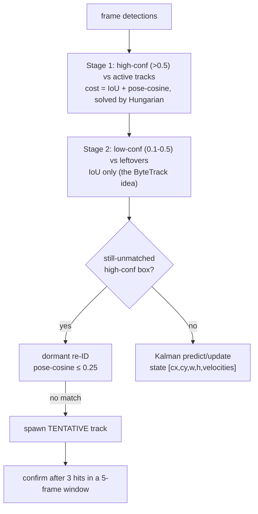

# 02, per-camera tracking

> **Stage 02** (was P2), links per-frame detections into **per-camera tracks**. This is the first
> point where a player gets a *temporal identity* (within one camera). Code:
> `src/identity/p2_tracking/`, config `configs/02_tracking.yaml`.

---

## 1. What this stage does (and why)

P1 gives you a bag of unlabelled people *per frame*. Stage 02 stitches those into **tracklets**, "the
box in frame t is the same person as that box in t+1, **within this one camera**", and stamps each
with a `local_track_id`.

These per-camera tracklets are the strongest identity primitive the rest of the pipeline has.
Crucially, stage 03 decides cross-camera identity **per tracklet-pair, not per detection**, which
averages out per-frame noise by roughly **√n** (n = tracklet length). So 02's whole job is to produce
**clean, un-fragmented, un-swapped** per-camera tracks.

> **In plain words:** 02 turns "a crowd of anonymous boxes each frame" into "player A's path in camera
> 1, player B's path in camera 1, …". The cleaner these paths, the easier everything after it.

*What 02 does **not** do:* it never links across cameras (that's 03) and it can't use other cameras to
resolve an in-camera occlusion. Same-camera identity collisions are impossible by construction.

---

## 2. Inputs and outputs

| | |
|---|---|
| **Input** | a P1 (or 01-stabilized) run + calibration; `configs/02_tracking.yaml` |
| **Output** | `predictions/*` now carrying `local_track_id`; per-camera diagnostics + `tracking_metrics.json` |
| **Core modules** | `src/identity/p2_tracking/{tracker,kalman,track,pose_vector,jsonl_io}.py` |

---

## 3. How it works, step by step

### 3a. The motion model, a constant-velocity Kalman filter ([kalman.py:16](../../src/identity/p2_tracking/kalman.py#L16))

Each track carries a **Kalman filter** that predicts where its box will be next frame.

- A **Kalman filter** is a two-step "predict, then correct" estimator. **Predict:** using the track's
  current position and velocity, guess the next box. **Update:** when a real detection arrives, blend
  it with the prediction, trusting each in proportion to their uncertainty. It also tracks *how
  uncertain* it is (a covariance) and grows that uncertainty when it goes unseen.
  > **In plain words:** the filter is a little "where will this player be next frame?" predictor. It
  > leans on its prediction when detections are missing/noisy, and snaps to the detection when one
  > arrives, weighting whichever it trusts more.
- **Constant-velocity (CV)** = it assumes players keep moving in a straight line at steady speed
  between frames. State is `[cx, cy, w, h, vx, vy, vw, vh]` (box centre, size, and their velocities);
  it measures `[cx, cy, w, h]`.
- **Joseph-form update** is just a numerically-stable formula for the "correct" step that keeps the
  uncertainty matrix valid (symmetric, positive) even after many updates. (Implementation detail, not
  a behaviour change.)
- When a track goes unseen ("dormant"), its process noise is inflated (uncertainty grows) and on
  re-acquisition the filter is `reseed`-ed, keeping velocity.

### 3b. The association, a two-stage ByteTrack match ([tracker.py:180](../../src/identity/p2_tracking/tracker.py#L180))

Matching this frame's detections to existing tracks is done in **two passes**, the
**ByteTrack** idea ([Zhang et al. 2022](https://arxiv.org/abs/2110.06864)):

- **Stage 1, confident boxes:** match high-confidence detections (`>0.5`) to active tracks using a
  cost that blends **IoU** (box overlap) and a **pose-cosine distance** (how different their body
  poses are), weighted `iou_alpha=0.6 / pose_beta=0.4`. The optimal assignment is found by the
  **Hungarian algorithm**.
  - **Hungarian algorithm** (`scipy.linear_sum_assignment`): given a cost table of every
    track×detection pair, it finds the *globally cheapest* one-to-one matching in one shot, better
    than greedily grabbing the nearest, which can paint itself into a corner.
    > **In plain words:** instead of "everyone grab your closest match" (which causes clashes), it
    > solves the whole seating chart at once for the lowest total cost.
- **Stage 2, faint boxes:** the low-confidence detections (`0.1-0.5`) that Stage 1 ignored are given
  a second chance to attach to still-unmatched tracks, by **IoU only**. This is ByteTrack's key trick:
  a faint box that's *exactly where a track predicted* is probably that player briefly fading (a dark
  umpire), so keep it rather than throw it away.
  > **In plain words:** "I'm not confident this blob is a person, but a track predicted someone right
  > here, so it probably is. Keep it."

**The gate** (which matches are even *allowed*): a match must pass IoU-of-predicted-box **or** a
**Mahalanobis χ² gate**, plus a hard distance cap (`gate_max_distance_px=600`) and an optional
calibrated **ground-reachability** check (`ground_vmax_mps=9.0`).

- **Mahalanobis distance / χ² gate:** a distance that accounts for *uncertainty and shape*. Instead of
  raw pixels, it measures "how many standard deviations away is this detection, given the filter's
  uncertainty ellipse?" `chi2_gate=9.21` is the statistical cut-off (the 99% point of a χ²
  distribution with 2 degrees of freedom), beyond it, the match is too unlikely to allow.
  > **In plain words:** "is this detection within the believable bubble around where I predicted?" , 
  > and the bubble is bigger when the filter is less sure.
- **Ground-reachability gate:** using the cm-accurate calibration, reject any match that would require
  a player to move faster than 9 m/s on the actual pitch, physically impossible, so it's a wrong
  match.

### 3c. Dormant re-ID + confirmation

An unmatched high-confidence box first tries a **dormant re-ID** against recently-lost tracks
(pose-cosine ≤ `0.25` with an ambiguity margin) before it's allowed to **spawn a new TENTATIVE
track**, which only becomes a real (CONFIRMED) track after **3 hits in a 5-frame window** (so a
one-frame false detection never mints an identity).

- **Pose-cosine / the pose gallery** (`pose_vector.py`, `track.py`): each track keeps a small gallery
  (size 30, a **medoid** representative) of its recent body-pose vectors. Cosine distance between pose
  vectors is a *shape* cue, it works even though **colour is useless here** (both teams wear
  near-identical kit). A **medoid** is the gallery member most central to the rest (a robust
  "representative pose"), less sensitive to outliers than an average.
  > **In plain words:** since you can't tell players apart by shirt colour, 02 remembers *how each
  > player's body tends to be configured* and re-finds them by pose similarity.

---

## 4. Strengths

- **ByteTrack two-stage** recovers the faint/distant player that barely clears detection to better
  recall-in-tracking.
- **Pose-cosine as the appearance substitute**, a smart choice when colour is dead; uses body
  configuration, which carries signal.
- **Calibrated ground-reachability gate** rejects physically impossible matches using real geometry,
  not just pixels.
- **Hungarian (global) assignment** avoids greedy nearest-neighbour blunders.
- **Dormant re-ID** bridges short gaps without minting a new id.

## 5. Weaknesses

- **Constant-velocity is a poor fit for cricket.** A bowler accelerating, a fielder diving, a batsman
  turning are *non-linear*; CV over-shoots and drops the track in exactly those moments, the
  DanceTrack/SportsMOT lesson. This is the main source of fragmentation that 05 must later stitch.
- **No camera-motion compensation**, if a camera isn't perfectly static, IoU/Kalman gating degrades.
- **Slow re-acquisition**, with colour dead, the only re-ID cue is the pose gallery, which matures
  over many frames, so short-gap re-entries can fail and mint fragments.
- **Global gate constants**, one χ² gate, one distance cap, one dormant window for all cameras,
  lighting, and densities.

---

## 6. Known issues (severity, 1 low to 3 high)

- **02-1 (severity 3/3) CV motion model under manoeuvre.** Non-linear player motion breaks CV gating  to 
  fragmentation that 05 must stitch. *Evidence:* fragmentation proxy 5-19; distinct-ID inflation.
- **02-2 (severity 2/3) Pose-cosine re-ID matures slowly.** With colour dead, short-gap re-entries fail and
  mint fragments.
- **02-3 (severity 2/3) No camera-motion compensation.** Any non-static camera degrades gating.
- **02-4 (severity 1/3) Global gate constants**, no per-camera/density adaptation.
- **02-5 (severity 1/3) Fixed dormant window (60 frames)**, a well-established player lost briefly can still be
  deleted and re-born as a new id.

---

## 7. Fix-implementation status + candidate fixes (priority-ordered)

Implementation status (2026-07-17): fix 1 (OC-SORT) is now implemented as a config-selectable option and
was measured. The others (BoT-SORT CMC, learned ReID, Deep-EIoU, adaptive gates) are still future. The
CV-model fragility is tracked as [BUG-5](known-bugs.md).

OC-SORT (implemented, measured, off by default). Stage 02 accepts `tracker: bytetrack` (default,
byte-identical to the baseline above) or `tracker: ocsort` in `configs/02_tracking.yaml`. The OC-SORT
build keeps the pose-similarity cue and the ground gate and adds three observation-centric mechanisms on
the motion side: OCM (a velocity-direction consistency penalty added to the association cost), ORU (on
recovery after a gap, re-derive the Kalman state along a virtual straight trajectory between the last real
observation and the new one, in `kalman.reupdate_virtual`), and OCR (a second association pass matching
still-unmatched detections against each track's last observation rather than the drifted Kalman
prediction). Keys: `tracker`, `ocm_weight`, `ocm_delta_t`, `ocr_enabled`, `ocr_cost_threshold`,
`oru_enabled`; experiment config `configs/experiments/02_tracking_ocsort.yaml`.

The default `bytetrack` path was verified byte-identical (the control reproduced the baseline exactly on
14_7). The 40-set A/B (vs the byte-identical baseline) reduced the fragmentation proxy `p2_tracks` by 26,
which is exactly what OC-SORT targets, but was net-negative downstream: mean agreement minus 0.0129,
teleports plus 151, collisions 0. The likely cause is that the OCR and ORU recovery reconnects fragments
and, on the low-parallax facing-pair geometry, some reconnections are wrong-player merges. Status:
rejected as implemented, off by default. Possible ablation: disable OCR and keep ORU and OCM. Full detail
in [`../methods_log.md`](../methods_log.md) Part A.

| # | Fix | Priority | Why | Effort | Source |
|---|---|---|---|---|---|
| 1 | **Adopt OC-SORT's observation-centric modules** (momentum + recovery + smoothing) over the plain CV Kalman. | severity 3/3 | Built for non-linear motion + occlusion (SOTA on DanceTrack), exactly cricket's regime. | Medium | OC-SORT [2203.14360] |
| 2 | **Add camera-motion compensation (BoT-SORT CMC)** + its refined Kalman/IoU-ReID. | severity 2/3 | Removes camera-jitter degradation. | Medium | BoT-SORT [2206.14651] |
| 3 | **Learned, kit-robust ReID embedding** as the re-acquisition key (Deep-OC-SORT-style) to replace the slow pose gallery. | severity 2/3 | The dead colour + slow pose gallery is the re-ID weakness; a body ReID net matures instantly per crop. | Medium-High | Deep OC-SORT [2302.11813] |
| 4 | **Sports-tuned association (Deep-EIoU)**, expansion-IoU + deep features for fast, similar-looking athletes. | severity 2/3 | Purpose-built for the cricket-like setting. | Medium | Deep-EIoU [2306.13074] |
| 5 | **Adaptive gates + dormant window** scaled by track maturity and local density. | severity 1/3 | One global constant can't fit all cameras/densities. | Low-Medium | UCMCTrack [2312.08952] |

Cross-phase: 02 fragmentation is the upstream half of the problem 05 tries to stitch, see
[05-global-id](05-global-id.md).
