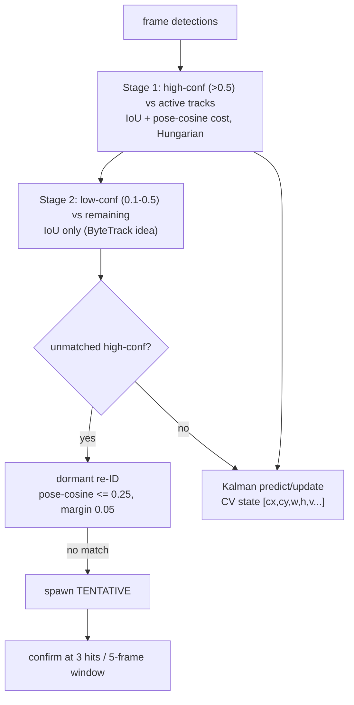

# 02 — per-camera tracking

> **Stage 02** (was P2) — code `src/identity/p2_tracking/`, config `configs/02_tracking.yaml`.

## Role & intuition

02 links per-frame detections into **per-camera tracklets** (`local_track_id`) — the temporally
coherent "this box in frame t is the same person as that box in t+1, *within one camera*". These
tracklets are the strongest identity primitive the rest of the pipeline has: 03 decides identity
per *tracklet-pair* (not per detection), which denoises the association by roughly √n. So 02's
job is to produce clean, un-fragmented, un-swapped per-camera tracks.

## I/O & config

| | |
|---|---|
| **Input** | P1 (or 01 (stabilization)) run; calibration; `configs/02_tracking.yaml` |
| **Output** | `predictions/*` with `local_track_id`; per-camera tracking diagnostics + `tracking_metrics.json` |
| **Core modules** | `src/identity/p2_tracking/{tracker,kalman,track,pose_vector,jsonl_io}.py` |

## Flowchart

## Methods walkthrough

**Motion model — `KalmanBoxTracker` ([kalman.py:16](../../src/identity/p2_tracking/kalman.py#L16)).**
A **constant-velocity (CV)** Kalman filter on the box state `[cx, cy, w, h, vx, vy, vw, vh]`,
measuring `[cx, cy, w, h]`, with a Joseph-form covariance update for numerical stability.
`gating_distance_sq` is the Mahalanobis distance of the box centre; process noise is inflated
while a track is dormant and the filter is `reseed`-ed (keeping velocity) on re-ID.

**Association — `CameraTracker.update` ([tracker.py:180](../../src/identity/p2_tracking/tracker.py#L180)).**
A two-stage, **ByteTrack-style** ([Zhang et al. 2022, arXiv 2110.06864](https://arxiv.org/abs/2110.06864))
match: Stage 1 matches high-confidence detections (`>0.5`) to active tracks with a cost that
blends **IoU** and a **masked weighted-cosine pose distance** (`iou_alpha=0.6`, `pose_beta=0.4`),
solved by the Hungarian algorithm (`scipy.linear_sum_assignment`); Stage 2 rescues low-confidence
boxes (`0.1–0.5`) by IoU only. The gate combines IoU-of-predicted-box **or** a Mahalanobis χ² gate
(`chi2_gate=9.21`), plus a hard distance cap (`gate_max_distance_px=600`) and an optional
calibrated **ground-reachability** gate (`ground_vmax_mps=9.0`). Unmatched high-confidence boxes
try a **dormant re-ID** (pose-cosine ≤ `0.25` with an ambiguity margin) before spawning a
`TENTATIVE` track that confirms at `3` hits within a `5`-frame window.

**Pose descriptor — `pose_vector.py` / `track.py`.** A per-track pose gallery (size 30,
medoid representative) supplies the cosine cue and the dormant re-ID key. This is a *shape* cue
(body configuration), independent of colour.

## Pros

- **ByteTrack two-stage** recovers low-confidence boxes (the dark/distant player that barely
  clears detection), directly improving recall-in-tracking.
- **Pose-cosine as the appearance substitute** — a smart choice given colour is dead on identical
  kit; it uses body configuration, which does carry signal.
- **Calibrated ground-reachability gate** — rejects physically impossible matches using the
  cm-accurate calibration, not just pixels.
- **Hungarian (global) assignment** per frame avoids greedy nearest-neighbour errors.
- **Dormant re-ID** bridges short gaps without minting a new local ID.

## Cons

- **Constant-velocity model** is a poor fit for cricket manoeuvres — a bowler accelerating, a
  fielder diving, a batsman turning are non-linear; CV over-shoots and drops tracks in exactly
  those moments (the DanceTrack/SportsMOT lesson).
- **No camera-motion compensation** — if any camera is not perfectly static, IoU/Kalman gating
  degrades (BoT-SORT's CMC exists for this).
- **This is where the appearance cue's death originates** — 02's colour-independent design is
  correct, but it also means the only re-acquisition signal is pose-cosine, which matures slowly.
- **Gate constants are global** — one `chi2_gate`, one `gate_max_distance_px`, one dormant window
  for all cameras, lighting, and player densities.
- **Per-camera only** — 02 cannot use the other cameras' views to resolve an ambiguous in-camera
  occlusion (that is deferred to 03, later).

## Issues

- **02-1 (★★★) CV motion model under manoeuvre.** Non-linear player motion breaks CV gating,
  causing fragmentation that 05 must later stitch. Evidence: fragmentation proxy 5–19 and
  distinct-ID inflation in `../diagnosis/09-per-phase-issue-register.md` ID-2, which begins as per-camera track breaks.
- **02-2 (★★) Pose-cosine re-ID matures slowly.** With colour dead (`../diagnosis/09-per-phase-issue-register.md` ID-4), the
  only re-acquisition cue is the pose gallery, which needs many frames to become discriminative;
  short-gap re-entries fail and mint fragments.
- **02-3 (★★) No camera-motion compensation.** Any non-static camera degrades IoU/Kalman gating.
- **02-4 (★) Global gate constants.** No per-camera / density adaptation of the χ² gate, distance
  cap, or dormant window.
- **02-5 (★) Fixed dormant window** (60 frames) is not scaled by track maturity or local
  occupancy, so a well-established player lost briefly can still be deleted and re-born.

## Fixes (all, priority-ordered)

| # | Fix | Priority | Reasoning | Expected effect | Effort | Source |
|---|---|---|---|---|---|---|
| 1 | **Adopt OC-SORT's observation-centric modules** (OCM momentum + OCR recovery + OOS smoothing) over the plain CV Kalman. | ★★★ | OC-SORT is designed for non-linear motion + occlusion (SOTA on DanceTrack), exactly cricket's regime; keeps it simple/online. | Fewer per-camera breaks → less downstream fragmentation. | Medium | OC-SORT [2203.14360], CVPR 2023 |
| 2 | **Add camera-motion compensation (BoT-SORT CMC)** + BoT-SORT's refined Kalman/IoU-ReID. | ★★ | Removes camera-jitter degradation; BoT-SORT tops MOT17/20. | More stable gating, fewer ID switches. | Medium | BoT-SORT [2206.14651] |
| 3 | **Adopt a learned, kit-robust ReID embedding** as the re-acquisition key (Deep-OC-SORT-style adaptive appearance) to replace/augment the slow pose gallery. | ★★ | The dead colour cue + slow pose gallery is the re-ID weakness; a body/pose ReID net matures instantly per crop. | Faster, more reliable re-entry → fewer fragments. | Medium-High | Deep OC-SORT [2302.11813]; SoccerNet ReID [2404.11335] |
| 4 | **Sports-tuned association (Deep-EIoU / SportsMOT)** — expansion-IoU + deep features tuned for fast, similar-looking athletes. | ★★ | Purpose-built for the cricket-like sports MOT setting. | Better matching in fast, crowded play. | Medium | Deep-EIoU [2306.13074]; GTA [2411.08216] |
| 5 | **Adaptive gates + adaptive dormant window** scaled by track maturity and local detection density. | ★ | One global constant can't fit all cameras/densities; keep established players alive longer. | Fewer needless deletions/re-births. | Low-Medium | UCMCTrack [2312.08952] |

Cross-phase context: 02 fragmentation is the upstream half of the fragmentation problem 05 tries
to stitch — see [05-global-id.md](05-global-id.md) and [to_do.md](../../wip/to_do.md).
