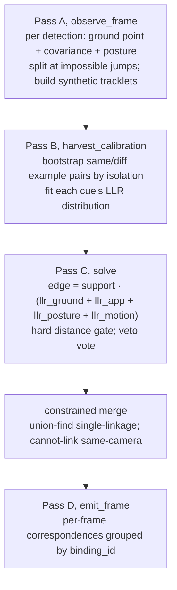

# 03, cross-camera association (the identity core)

> **Stage 03** (was P3), decides **which player in camera A is the same physical person as which
> player in camera B**. This is the heart of identity and, per the repo's own analysis, the
> **dominant quality ceiling** of the whole pipeline. Code: `src/identity/p3_association/`, config
> `configs/03_association.yaml`.

---

## 1. What this stage does (and why it's the hardest)

Each camera now has clean per-camera tracklets (stage 02). But "player A in camera 1" and "player A in
camera 4" are still *separate, unlinked* tracks. Stage 03 solves the **correspondence problem**: match
tracklets *across* cameras so the same physical player carries **one** identity (a `binding_id`) in all
7 views.

Get it right to one player, one identity everywhere. Get it wrong two ways:
- **Under-merge:** one real player becomes several ids (you failed to link their views).
- **Over-merge (a "chimera"):** two different players get fused into one id.

> **In plain words:** seven cameras each see the same ~13 people from different angles. This stage is
> the "these two blobs, from two cameras, are the same human" matcher. It's hard because from opposite
> sides two different players can look almost identical.

**Why it's structurally hard here, the "facing pairs".** The camera rig's co-observing pairs are
**C1-C4, C2-C6, C3-C5**: each pair looks at the same strip of ground **from nearly opposite sides**.
That geometry is **low-parallax**, and it breaks the usual cross-camera math (explained next). So 03
does most of its reasoning on the **calibrated ground plane** and fuses several *weak* cues instead of
trusting any single one.

```
        C1  ──────►  players  ◄──────  C4         (a "facing pair": ~180° apart)
                       ▲ ▲
   two DIFFERENT players standing near each other look
   nearly identical from opposite sides to easy to confuse
```

---

## 2. The geometry you need (epipolar basics + why facing pairs break it)

### Epipolar geometry & the fundamental matrix

Given a point in camera A, its true match in camera B is **not** anywhere, it must lie on a specific
line, the **epipolar line**. The **fundamental matrix `F`** is the 3×3 matrix that encodes this for a
camera pair: for a true match `x₁ - x₂`, `x₂ᵀ F x₁ = 0`. It is precomputed as
`F = [e₂]_× · P₂ · pinv(P₁)` from the calibrated projection matrices.

> **In plain words:** "if the batsman's head is *here* in camera 1, then in camera 4 it must lie
> somewhere along *this line*." F is the rulebook that draws that line. It shrinks the search from a
> whole image to a single line.

### Sampson distance

To score how well two points obey the epipolar rule, we use the **Sampson distance**, a
first-order approximation of "how far is this pair from perfectly satisfying `x₂ᵀ F x₁ = 0`?" Small =
consistent with being the same 3D point; large = probably different points.

> **In plain words:** a cheap "how close to on-the-line is this candidate match?" score.

### Why facing pairs are degenerate (low parallax)

**Parallax** is the apparent shift of a point when you change viewpoint. Two cameras far apart *in
angle* around a subject give big parallax to stable geometry. Two cameras looking from **opposite
sides** (≈180°) are **near-collinear** through the subject to **low parallax**: the epipolar lines
become ill-conditioned, the **epipole can fall inside the image**, and free-space triangulation is
numerically unstable.

- `geometry_cache.py` (`build_geometry_cache:74`) precomputes `F`, the Sampson scorer, and a
  **degeneracy flag** per pair. A pair is flagged degenerate if the epipole lies **inside** image B
  (`_epipole_in_image`, using each camera's *native* size, the C07 correction) or the baseline is
  near-collinear (`baseline_angle_degen_deg=20°`, checking ≈0° and ≈180°). When degenerate, the
  **epipolar weight is zeroed and reallocated to ground proximity**.

> **In plain words:** for the facing pairs, the "are they on the same epipolar line?" test is
> unreliable, so 03 stops trusting it and leans on "are their *feet* at the same spot on the pitch?"
> instead. This single adaptation is what lets facing pairs work at all.

---

## 3. Locating a player on the ground, the `z0_reproj` solve

The emitted per-player position is where their feet touch the pitch. Because the facing-pair geometry
is bad for free 3D triangulation, we instead **constrain the point to the ground (`z = 0`) and solve
for its (x, y)**, `ground_from_reprojection` ([geometry.py:540](../../src/identity/common/geometry.py#L540)):

```
minimise over (x,y):   Σ_cameras  w_c · ρ_Huber( ‖ project_c([x, y, 0]) − foot_c ‖ )
```

- We search for the ground point `[x, y, 0]` whose reprojection into each camera lands closest to that
  camera's observed foot pixel. Solved by **Gauss-Newton** (an iterative least-squares method for
  nonlinear problems) with **Huber IRLS** (see below), started from a median homography back-projection,
  with a hard-inlier refit that rejects one gross-outlier foot.
- **Why constrain to z = 0?** Fixing the height *removes the unstable depth dimension*, the exact
  dimension that facing pairs can't pin down. What's left (x, y on the pitch) is well-posed even on
  the facing pairs.
  > **In plain words:** don't try to find the foot's full 3D position (the up/down part is
  > hopeless on facing pairs). Instead assume feet are on the ground and just ask "*where* on the
  > pitch does a ground point reproject to both cameras' feet?". Much more stable.
- **Huber IRLS (robust averaging):** ordinary least-squares lets one bad measurement dominate (errors
  are squared). The **Huber** loss treats small errors normally but *caps the influence* of big ones;
  **IRLS** (Iteratively Re-weighted Least Squares) implements this by re-running the fit with a bad
  point's weight turned down each iteration.
  > **In plain words:** a smart average that won't let one wildly-wrong camera drag the answer, it
  > notices the outlier and stops trusting it.
- This `z0_reproj` estimator **beat** both a plain median and an inverse-covariance fusion in an A/B on
  real data (0.176 / 0.248 / **0.145** m error). It is the validated choice.

---

## 4. The tracklet graph, deciding identity once per pair, not per frame

Matching per frame is noisy. Instead, 03 builds a **graph** where each node is a tracklet and each edge
scores "are these two tracklets the same player?" over the **whole delivery**, averaging out per-frame
noise by ~√n. `tracklet_graph.py` runs four passes:



- **Pass A `observe_frame:324`** records, per detection, its ground point, ground **covariance** (how
  uncertain the position is), and a **posture** sample. It **splits** a 02 tracklet at kinematically
  impossible ground jumps (so a 02 id-switch can't weld two people together), and chains persistent
  *untracked* detections into **synthetic tracklets**, the dark umpires that 02 never tracked.
- **Pass B `harvest_calibration:447`** auto-labels easy examples to learn from: pairs that are clearly
  **same** (median ground distance ≤ 1.5 m and well-isolated, ≥ 3 m from others) and clearly
  **different** (≥ 3 m apart), then fits each cue's statistics on *this* delivery.
- **Pass C `solve:738`** builds the edges (details below).
- **Pass D `emit_frame:1112`** rebuilds per-frame correspondences grouped by the persistent
  `binding_id`, so the stream stage 05 consumes is temporally stable by construction.

---

## 5. Fusing weak cues, the LLR score (and the cap fix)

Each edge combines **four cues**, each expressed as a **log-likelihood ratio (LLR)**
([tracklet_graph.py:799](../../src/identity/p3_association/tracklet_graph.py#L799)):

```
edge_total = support · ( llr_ground + llr_appearance + llr_posture + llr_motion )
```

- **LLR (log-likelihood ratio):** for a measured value `v`, `LLR = log P(v | same) − log P(v | diff)`.
  Positive means this cue says "same player"; negative means "different"; zero means "no idea".
  > **In plain words:** each cue casts a weighted vote. "Their feet are 0.2 m apart" votes *strongly
  > same*; "they're 8 m apart" votes *strongly different*; a useless cue votes ~0.
- The four cues: **ground** (are their feet at the same pitch spot?), **appearance** (colour, mostly
  dead here), **posture** (3D body configuration), **motion** (are their velocities consistent? one
  sprinting while the other stands means "different").
- **`support`** (0 to 1) scales the whole sum by how many frames the two tracklets actually co-observe , 
  little shared time means weak evidence.
- **Merge threshold:** an edge must reach `graph_llr_merge_threshold = 2.0` to be allowed to merge.

### Asymmetric clipping and the cap

Each cue's **positive** contribution is capped at `graph_llr_positive_cap`, while strong
**disagreement** is *not* capped the same way. This encodes a real prior: *agreement is weak evidence*
(two different players can share a spot, kit, and build), but *strong disagreement is near-conclusive*.

**The cap fix, `graph_llr_positive_cap: 1.5 to 3.5` (the one production change this session).**

On a facing pair, three of the four cues are near-useless for a *true* same-player match (colour dead,
posture symmetric, ground carries up-to-2 m calibration bias), so typically **only ground fires
strongly and the rest sit near 0**. With the old cap = 1.5, ground was throttled to 1.5, the weak cues
couldn't make up the gap, and `support < 1` dragged the total under the 2.0 threshold to **the same
central player was split into two ids** (facing-pair under-merge):

```
true facing-pair match, support ≈ 0.85, cap 1.5:
   0.85 · ( min(ground,1.5)=1.5 + 0.3 + 0.1 + 0.2 ) ≈ 1.79  <  2.0   to NO MERGE  (split id)

same match, cap 3.5:
   0.85 · ( min(ground,3.5)=3.4 + 0.3 + 0.1 + 0.2 ) ≈ 3.40  >  2.0   to MERGE (passes)
```

3.5 was chosen by **sweep**, it's the measured agreement peak; ≥ 4.0 starts *over*-merging different
players. The over-merge guards (a confident-disagreement `veto`, the asymmetric negative clip, and the
same-camera cannot-link) are untouched, so loosening the *positive* cap can't fuse two provably-different
people. **40-delivery result:** agreement 0.853 to **0.883**, central-player under-merge 11% to **6%**,
colocated ghost pairs 5 to **0**, same-camera collisions **0**. (Full walk-through in
[fixes-log](fixes-log.md); the tool that root-caused it is `tools/diagnosis/coverage_audit.py`.)

> **In plain words:** on facing pairs only one clue (feet) is trustworthy, but the old rule refused to
> let one strong clue count for much. Raising that ceiling lets a confident feet-match merge the player
>, without letting a *coincidental* overlap merge two different people, because the "these are clearly
> different" veto still fires.

### Self-calibrating cues, `cue_calibration.py`

Each cue's LLR is fitted from this delivery's data, and **`d′` (d-prime)** measures how well the cue
*separates* same from different. If a cue can't separate on this footage (`d′ ≈ 0`, e.g. colour on
identical kit), it **abstains** (LLR ≈ 0) instead of injecting noise.

> **In plain words:** a cue that can't tell players apart on today's footage politely shuts up rather
> than guessing, which is why the dead colour cue doesn't actively harm us.

### Pose-shape descriptors, `pose_shape.py`

Two view-invariant identity channels: a **triangulated bone-ratio** descriptor (11 scale-normalised
limb-length ratios) and a **billboard posture** (2D keypoints lifted onto a vertical plane through the
ground point, works on facing pairs *without* triangulation). Both are currently only **soft
tie-breakers**, the biggest untapped lever (see fixes).

---

## 6. Merging, union-find single-linkage (merges, can't un-merge)

Edges above threshold are merged by **union-find single-linkage**, sorted strongest-first, blocked by a
**cannot-link** whenever two tracklets are from the *same camera at the same time* (they must be
different people).

- **Union-find** is a data structure that groups items into clusters and can instantly answer "are
  these two in the same cluster?" **Single-linkage** means one strong edge is enough to pull two
  tracklets into the same cluster.
  > **In plain words:** it keeps merging the most-confident "same player" pairs into groups. But it is
  > **merge-only**, once two tracklets are in one cluster there is *no* mechanism to pull them apart.
  > So an early wrong merge is **permanent** and can grow into a chimera. That merge-only limitation is
  > issue **ID-5** below.
- A v5 **corroboration merge** additionally admits a strong single-cue facing-pair edge when it's
  mutually unambiguous, a targeted patch for facing-pair under-merge.

---

## 7. Strengths

- **Right domain choice**, solving identity on the cm-accurate ground plane sidesteps the facing-pair
  triangulation degeneracy instead of fighting it.
- **Tracklet-level decisions** denoise association by ~√n vs per-frame matching.
- **Principled cue fusion**, LLRs are the correct way to combine heterogeneous weak cues; the
  asymmetric clip encodes the right prior.
- **Self-calibrating cues** abstain when useless rather than adding noise.
- **Degeneracy-aware geometry**, zeroing epipolar weight on facing pairs (and the per-camera epipole
  test, the C07 fix) is exactly right.
- **`z0_reproj`** is the empirically-validated best ground estimator.

## 8. Weaknesses

- **Single-linkage can merge but never split**, an early wrong merge is permanent (chimeras). *The*
  structural weakness.
- **Cross-camera evidence is weakest exactly where it's needed** (facing pairs): epipolar off, colour
  dead, ground alone can't separate two nearby players; the discriminative pose-shape cue is only a
  *soft* tie-breaker.
- **Cold-start dependence on isolation**, the cue calibration needs isolated example pairs; a crowded
  delivery falls back to hand-tuned defaults, weakening every cue.
- **Hard ground gates can split a correct merge**, a tight facing-pair gate under foot-pixel noise can
  break a true 2-view merge (under-merge).

---

## 9. Status & fix-implementation (2026-07-16, corrected)

**Correction:** earlier drafts said the pose-shape and splittable fixes "remain open." That was read from
the code dataclass defaults, **the production YAML (`configs/03_association.yaml`) has them ON.** Verified
from run manifests. Real status of the §11 fixes:

| §11 fix | status | production setting | verdict |
|---|---|---|---|
| cap fix (1.5 to 3.5) |  **ENABLED, ACCEPTED** | `graph_llr_positive_cap: 3.5` | 40-conf: agreement 0.853 to 0.883, under-merge 11 to 6%, coloc 5 to 0 |
| #1 pose-shape to primary |  **ENABLED** | `graph_shape_enabled: true` (F11 corroboration round) | **OFF-vs-ON (8_init): INERT** (off = byte-identical). Harmless; likely active on 40-set hard clips, needs 40-hard A/B |
| #2 splittable clustering |  **ENABLED (conservative)** | `graph_split_enabled: true`, torso 30px / frac 0.6 | **OFF-vs-ON (8_init): INERT** (no chimeras in these 8 to split). Real test = chimera-heavy 40-set clips. Sub-threshold residual: [BUG-3](known-bugs.md) |
| #3 parallax-adaptive gate |  **ENABLED** | `graph_facing_gate_scale: 1.3` (widens facing-pair gate) | **OFF-vs-ON (8_init): INERT** (gate not binding after the cap fix). Real test = low-parallax 40-set clips |
| (feeds 05) covariance emit |  **ENABLED** | `emit_ground_cov: true` to 05 `use_measurement_covariance` | see 05 |
| #4 self-supervised cross-view | **NOT DONE** |, | future |
| #5 cue cold-start robustify |  **PARTIAL** | `calibration_mode: auto` (anchor relax + cross-delivery prior) |, |

- **03-1 (C07 image size), VERIFIED NOT A BUG.** `load_image_sizes_from_drive` returns cam_07's true
  3776×960 native size; the `config.image_w/h` default is dead (no consumers). See [known-bugs](known-bugs.md).
- **The OFF-vs-ON A/B (running)** disables `graph_shape_enabled` / `graph_split_enabled` /
  `graph_facing_gate_scale` one at a time on 8_init to measure whether each **earns its place** (does
  turning it off make agreement/teleports/ids worse?). Verdicts land when it completes; the rejected
  tracklet-id lock stays rejected (post-hoc relabel put a wrong-person id).

---

## 10. Known issues (severity, 1 low to 3 high)

- **ID-1 (severity 3/3) Facing-pair under-merge.** Cross-camera agreement as low as 0.50 on `_7`. Root:
  low-parallax geometry + dead colour + tight ground gate. Biggest single identity loss.
- **ID-5 (severity 2/3) Single-linkage can't split to permanent chimeras.** 10-32% of ≥3-view clusters are
  geometrically inconsistent (two people merged, un-splittable).
- **ID-4 (severity 2/3) Appearance cue statistically dead.** `d′ ≈ 0` on 5/8 deliveries (identical kit); the
  discriminative body-proportion signal is under-weighted.
- **V2-L1 (severity 2/3) ~50% single-camera frames**, only ~61% of player-frames have ≥2 views, so half get no
  cross-camera correction. Largely an association-binding-rate problem.
- **03-2 (severity 1/3) Cue-calibration cold-start**, `<3` isolated anchors means default Gaussians, silently
  weakening cues on crowded deliveries.

---

## 11. Candidate fixes (priority-ordered)

| # | Fix | Priority | Why | Effort | Source |
|---|---|---|---|---|---|
| 1 | **Promote pose-shape / a learned kit-robust ReID embedding from soft tie-breaker to a *primary* cross-camera cue** where colour is dead and geometry is weak. | severity 3/3 | Body proportions are the *only* discriminative signal on facing pairs; making it primary directly attacks ID-1. | Medium-High | SoccerNet ReID [2404.11335]; self-supervised assoc [2401.17617] |
| 2 | **Give clustering the ability to split**, replace single-linkage with **correlation clustering / graph multicut**, gated on the 04 full-skeleton reprojection. | severity 3/3 | Merge-only makes ID-5 chimeras permanent; reprojection is a clean split signal (see [04](04-lift.md)). | High | correlation-clustering MOT [Tang 2017] |
| 3 | **Parallax-adaptive cost + gate**, use per-view ground covariance instead of a hard 2.5 m gate. | severity 2/3 | A hard gate on noisy facing-pair feet splits correct merges; an uncertainty-aware one won't. | Medium | uncertainty-aware fusion [2008.01258] |
| 4 | **Self-supervised cross-view association** to learn a view-invariant affinity from the unlabelled multi-camera data. | severity 2/3 | No identity labels exist; multi-view consistency is a free supervisory signal. | High | [2401.17617] |
| 5 | **Robustify cue cold-start**, widen the isolation window / borrow a cross-delivery prior when `<3` anchors. | severity 1/3 | Crowded deliveries currently lose their calibrated cues. | Low-Medium |, |

Cross-phase: ID-1 / ID-5 / V2-L1 are the top of the whole-pipeline roadmap, see
[`wip/open-work.md`](../../wip/open-work.md).
