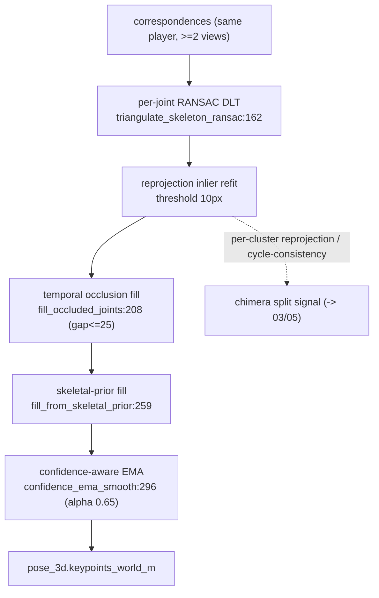

# 04 — 3D lift (triangulation)

> **Stage 04** — the 3D lift, now run **before** global-id (Associate→Triangulate→Track). Code: `src/identity/p4_lift/run_triangulation.py`.

## Role & intuition

This stage turns the multi-view 2D keypoints of one identified player into a single **3D world
skeleton**. It runs at **stage 04, binding-keyed (`--id-source binding`), immediately after
association and *before* global identity** — so its per-cluster reprojection / cycle-consistency is
available as a chimera-purity signal and its 3D is available to identity. The **same module** also
runs a **terminal pass** keyed by `global_player_id` (run-dir `07_lift3d`) after roles, producing
the final Unreal-Engine-facing 3D. The sequencing win is realised, but global identity does **not
yet consume** the 3D (it still tracks on the ground plane) — see [changes_tbd](../changes_tbd.md).

## I/O & config

| | |
|---|---|
| **Input** | binding pass: 03 association run (correspondences + `binding_id`); terminal pass: 05 global-id run; + calibration |
| **Output** | `pose_3d.keypoints_world_m` (+ `pose_3d_native`, Halpe-26) written back into each camera stream; `diagnostics/lift_purity.json` (binding mode); `triangulation_metrics.json` |
| **Core** | `src/identity/p4_lift/run_triangulation.py`; `src/identity/common/triangulation.py` |
| **Knobs** | `--id-source binding\|global`, `--reprojection-threshold-px 10`, `--min-views 2`, `--cheirality`, `--smoother butterworth`, `--native-skeleton`, `--dense-fill` |

## Flowchart

## Methods walkthrough

**Weighted DLT — `triangulate_point_dlt` ([triangulation.py:31](../../src/identity/common/triangulation.py#L31)).**
The classic linear triangulation: for each view stack the two rows `x·P₃−P₁`, `y·P₃−P₂`, weight
each by `√conf`, and solve `A X = 0` by SVD (the 3D point is the smallest right singular vector,
dehomogenised). Confidence weighting is the differentiable-triangulation idea from **Iskakov et al.,
Learnable Triangulation, ICCV 2019** ([arXiv 1905.05754](https://arxiv.org/abs/1905.05754)).

**RANSAC over views — `ransac_triangulate_point:90` / `triangulate_skeleton_ransac:162`.**
Triangulate every camera pair, count inliers by reprojection error ≤ `reprojection_threshold_px`,
keep the best inlier set, and **re-fit** the DLT on inliers. This robustly rejects a single bad
view — the practical robustification recommended by **Lee & Civera 2020**
([arXiv 2008.01258](https://arxiv.org/abs/2008.01258)) and used in markerless sports capture
(**Pose2Sim**, [PMC8512754](https://www.ncbi.nlm.nih.gov/pmc/articles/PMC8512754/)).

**Occlusion / prior fill + smoothing.** `fill_occluded_joints:208` linearly interpolates NaN
joints within a 25-frame gap; `fill_from_skeletal_prior:259` places a never-seen joint from its
parent + a bone vector scaled to the identity's median bone length; `confidence_ema_smooth:296`
applies confidence-weighted temporal EMA (α=0.65). Together these take multi-camera completeness to
100% of ≥2-view frames (per-joint reprojection 2–4 px; `../diagnosis/README.md` R4).

## Pros

- **Right estimator for a calibrated rig** — confidence-weighted DLT + reprojection-RANSAC is the
  field-standard for cm-accurate multi-view capture; it is cheap and needs no training.
- **Robust to one bad view** — the inlier refit rejects a hallucinated joint instead of averaging
  it in.
- **Complete skeletons** — occlusion/prior fill + EMA yield a full, temporally smooth 3D pose on
  every multi-view frame.
- **The reprojection residual is a free purity signal** — a chimera (two people merged) fails
  torso/limb reprojection hard; this is a clean, unused split signal.

## Cons

- **Needs ≥2 views** — the ~39% single-camera frames get *no* 3D pose at all (V2-L1). This is the
  biggest coverage gap.
- **Flat z=0 for the ground point** — an airborne foot (running stride, bowler load, jump) with
  z≫0 is mislocated when forced to the plane (V2-L3; ankle z p95 = 0.56 m).
- **Skeletal-prior fill can fabricate plausible-but-wrong joints** — a never-seen limb placed from
  a prior is a guess, low-confidence but still emitted.
- **Global identity doesn't yet consume the 3D** — the binding-keyed lift now runs *before* 05, but
  05 still tracks on the ground plane and ignores the 3D pose/covariance, so the richest geometric
  signal isn't yet used for identity or chimera-splitting. The sequencing is fixed; the wiring is
  the remaining work (deferred — [changes_tbd](../changes_tbd.md)).

## Issues

- **V2-L1 (★★) Single-camera → no 3D pose.** ~39% of player-frames (`../diagnosis/README.md`
  V2-L1). No triangulation possible with one ray.
- **V2-L3 (★) Flat z=0 airborne error.** Triangulated ankle z p95 0.56 m; the ground point forced
  to z=0 lands beyond the true position at grazing angle.
- **T-1 (★★) The 3D signal is produced before 05 but not consumed by it.** The binding-lift's
  reprojection / cycle-consistency (which would split ID-5 chimeras and enable 3D tracking) is
  emitted, but 05 doesn't yet read it — remaining wiring, no longer a sequencing problem.
- **T-2 (★) Skeletal-prior fabrication risk** for never-seen joints on long single-view stretches.

## Fixes (all, priority-ordered)

| # | Fix | Priority | Reasoning | Expected effect | Effort | Source |
|---|---|---|---|---|---|---|
| 1 | **Feed the binding-lift 3D into 05.** The re-sequencing (04 before 05) is **done**; the remaining step is wiring the per-cluster reprojection / cycle-consistency as a chimera-split signal and the 3D as 05's observation. | ★★★ | The richest geometric signal is now produced before identity is finalised; consuming it unlocks 3D-aware tracking and splittable clustering (ID-5). Needs the standard 8-delivery A/B. | Fewer chimeras; 3D-aware 05; no extra model. | Medium (wiring) | VoxelPose "decide in 3D" [Faster VoxelPose 2207.10955]; Iskakov [1905.05754] |
| 2 | **Single-view → canonical-skeleton lift (PnP)** for the ~39% single-camera frames: fit the identity's canonical 3D skeleton (learned from its multi-view frames) to the lone 2D view at its z0 ground position. | ★★ | Half of coverage is single-camera; a PnP/optimisation lift gives a plausible full 3D pose where triangulation can't. | 3D pose on single-camera frames → far higher completeness. | Medium-High | monocular lift / SMPLify-style fitting; UPose3D [2404.14634] |
| 3 | **Uncertainty-aware triangulation** — propagate 2D keypoint covariance into the DLT weights and emit a per-joint 3D covariance to carry downstream (into 05's Kalman R). | ★★ | Weighting by real uncertainty (not just √conf) is the modern robust-triangulation recipe and gives 05 a principled measurement noise. | Better fusion + anti-teleport R. | Medium | LOSTU [2311.11171]; UPose3D [2404.14634]; Lee & Civera [2008.01258] |
| 4 | **Airborne handling** — take the ground position from the triangulated **pelvis vertical projection** (robust to a raised foot), flag airborne frames (ankle z≫0) and inflate their covariance. | ★ | Removes the z=0 grazing-angle error on jumps/strides. | Correct location for airborne feet. | Low-Medium | Pose2Sim [PMC9002957] |
| 5 | **Offline zero-phase temporal filter (4th-order Butterworth / RTS)** on the whole-delivery 3D trajectory for the non-real-time render path. | ★ | The delivery is offline; a zero-phase low-pass is the sports-capture standard for the smoothest final trajectory. | Smoother final 3D with no lag. | Low | Pose2Sim [PMC8512754] |
| 6 | **Gate skeletal-prior fill** — cap how long a joint may be prior-filled and down-weight/flag it, or prefer the single-view PnP lift (fix 2) over pure priors. | ★ | Avoids emitting fabricated limbs on long single-view stretches. | Fewer wrong emitted joints. | Low | — |

Cross-phase: fix 1 here is the enabler for 03's splittable clustering and 05's 3D tracking —
see [changes_tbd.md](../changes_tbd.md).
