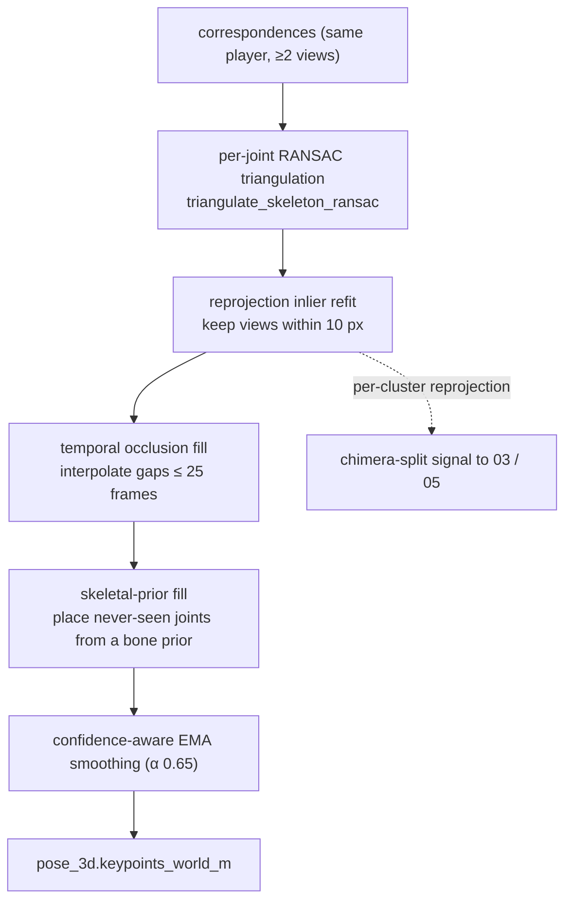

# 04, 3D lift (triangulation)

> **Stage 04**, turns the multi-view 2D keypoints of one identified player into a single **3D world
> skeleton**. Runs *before* global identity (order: Associate to Triangulate to Track). Code:
> `src/identity/p4_lift/run_triangulation.py`, `src/identity/common/triangulation.py`.

---

## 1. What this stage does (and why here)

Stage 03 has told us "these tracklets across cameras are the same player" (a `binding_id`). Stage 04
takes that player's 2D skeleton **as seen from several cameras at the same instant** and reconstructs
their **3D skeleton in world coordinates**, all 26 Halpe joints, in metres, on the actual pitch.

- It runs **binding-keyed** (`--id-source binding`), right after association and **before** global
  identity, so identity can later be built on top of real 3D. It is the pipeline's **single
  triangulation** ("single" = one lift stage, not one point, it fully triangulates all 26 joints).
- It emits `pose_3d` (the 26-joint world skeleton) and `pose_3d_named` (the same skeleton re-expressed
  with the **mid-hip as the root** and every other joint relative to it, a pose descriptor that
  doesn't care *where* on the pitch the player is).

> **In plain words:** several cameras each see a flat 2D shadow of the player. This stage crosses those
> shadows to rebuild the real 3D body, like how your two eyes give you depth, but with up to 7 "eyes".

---

## 2. Inputs and outputs

| | |
|---|---|
| **Input** | a 03 run (predictions + `diagnostics/correspondences.jsonl` with `binding_id`) + calibration |
| **Output** | `pose_3d` + `pose_3d_named` on each camera stream; `diagnostics/{lift3d.jsonl, lift_purity.json, correspondences.jsonl}`; `triangulation_metrics.json` |
| **Knobs** | `--reprojection-threshold-px 10`, `--min-views 2`, `--cheirality`, `--smoother butterworth`, `--dense-fill`; **`--tri-robust-refit`** (1C, default-off); `--id-source` defaults to `binding` |

---

## 3. How it works, step by step

### 3a. Triangulation by weighted DLT, `triangulate_point_dlt` ([triangulation.py:31](../../src/identity/common/triangulation.py#L31))

To find one 3D joint, we combine the *rays* from every camera that saw it.

- Each camera + its 2D observation defines a **ray** in 3D (a line from the camera centre through the
  pixel). The true 3D joint is where those rays meet. Because of noise they don't meet *exactly*, so we
  find the point closest to all of them.
- **DLT (Direct Linear Transform):** stacks two linear equations per camera (`x·P₃ − P₁`, `y·P₃ − P₂`)
  into a matrix `A` and solves `A X = 0` via **SVD** (Singular Value Decomposition), the answer is the
  smallest right singular vector. Each camera's rows are weighted by **√confidence** so a shaky joint
  counts less. (Confidence-weighted DLT is the differentiable-triangulation idea from
  [Iskakov et al., ICCV 2019](https://arxiv.org/abs/1905.05754).)
  > **In plain words:** every camera "points" at the joint; the joint is roughly where all the pointing
  > lines cross. DLT is the linear-algebra way to find that best crossing point, trusting confident
  > cameras more. **SVD** is just the standard tool for solving this kind of "best-fit intersection".

### 3b. Robustness across views, `ransac_triangulate_point:90` / `triangulate_skeleton_ransac:162`

One hallucinated joint in one camera can wreck the crossing point. **RANSAC** guards against it:

- **RANSAC (RANdom SAmple Consensus):** triangulate from small subsets (here, camera pairs), see which
  *other* cameras agree with each candidate (their **reprojection error** ≤ `10 px`), keep the
  candidate with the most agreers ("inliers"), then **re-fit** using only those inliers.
  > **In plain words:** try lots of small juries, find the story most cameras agree with, then throw
  > out the cameras that disagree and recompute. One lying camera gets outvoted instead of averaged in.
- **Reprojection error:** take the 3D estimate, project it *back* into a camera, and measure how far
  that lands from what the camera actually saw. Small = consistent; large = that camera disagrees.
  This is the pipeline's cleanest "is this cluster actually one person?" signal, a **chimera** (two
  people merged) fails torso reprojection badly. (It's a currently-unused split signal for 03/05.)
- **Cheirality** (`--cheirality`): a sanity check that the solved 3D point is **in front of** the
  cameras, not behind them (a mathematical solution can be geometrically impossible).
  > **In plain words:** "cheirality" just means: the point has to be *in front of* the lens, not behind
  > it, reject physically impossible solutions.

### 3c. Robust refit, the 1C option (`--tri-robust-refit`, default-off)

An optional **IRLS-Huber** polish on the inlier re-fit: after RANSAC picks the inliers, down-weight a
*marginal* inlier camera by its pixel residual (the same robust-averaging idea used for the ground
plane in `robust_fuse_ground`). Forces the per-joint reference loop so the fast batched kernels stay
**bit-identical when the flag is off**. Effect is marginal (reproj p95 6.61 to 6.56 px) because RANSAC +
DLT is already robust, kept as an option, not enabled. See [fixes-log](fixes-log.md).

> **In plain words:** a gentle extra "trust the cleaner cameras a bit more" step. Barely moves the
> numbers here because the earlier RANSAC step already did most of that job.

### 3d. Filling gaps + smoothing

- `fill_occluded_joints:208`, linearly interpolates a joint that's briefly missing (gap ≤ 25 frames).
- `fill_from_skeletal_prior:259`, a joint *never* triangulated (e.g. an always-occluded wrist) is
  placed from its parent joint + a bone vector scaled to the player's own median bone length.
  > **In plain words:** if we never saw the wrist, we guess it from the elbow plus a typical forearm
  > length. A plausible fill, but a *guess*, and flagged low-confidence.
- `confidence_ema_smooth:296`, a confidence-weighted temporal **EMA** (Exponential Moving Average,
  α = 0.65): each frame's value is blended with the running average so the 3D doesn't stutter. Together
  these reach 100% joint completeness on ≥2-view frames (per-joint reprojection 2-4 px).

---

## 4. Strengths

- **Right estimator for a calibrated rig**, confidence-weighted DLT + reprojection-RANSAC is the
  field standard for cm-accurate multi-view capture; cheap, no training.
- **Robust to one bad view**, the inlier refit rejects a hallucinated joint instead of averaging it.
- **Complete, smooth skeletons**, occlusion/prior fill + EMA give a full 3D pose on every multi-view
  frame.
- **Reprojection residual is a free purity signal**, a chimera fails it hard (an unused split signal).

## 5. Weaknesses

- **Needs ≥ 2 views**, the ~39% single-camera frames get **no** 3D pose at all. The biggest coverage
  gap.
- **Flat z = 0 ground point**, an airborne foot (running stride, jump) is mislocated when forced to the
  plane (ankle-z p95 = 0.56 m).
- **Skeletal-prior fill can fabricate plausible-but-wrong joints** on long single-view stretches.
- **The 3D isn't consumed by default**, 05 reads 04 and carries the 3D forward, but by default still
  tracks on the 2D ground plane (using the 3D is the flag-gated "decide-in-3D" A/B).

---

## 6. Known issues (severity, 1 low to 3 high)

- **V2-L1 (severity 2/3) Single-camera to no 3D pose.** ~39% of player-frames; no triangulation from one ray.
- **T-1 (severity 2/3) 3D produced but not yet *consumed* by identity.** 05 passes it through but tracks on the
  ground plane; using the reprojection/cycle-consistency split signal + 3D position is the decide-in-3D
  A/B, not a sequencing bug.
- **V2-L3 (severity 1/3) Flat z = 0 airborne error**, the ground point forced to z = 0 lands beyond the true
  position at a grazing angle.
- **T-2 (severity 1/3) Skeletal-prior fabrication risk** for never-seen joints on long single-view stretches.

---

## 7. Fix-implementation status (2026-07-16)

| §8 fix | status | setting | verdict |
|---|---|---|---|
| #3 uncertainty-aware triangulation |  **ENABLED** | 03 `emit_ground_cov: true` emits per-cluster GN covariance | consumed as 05's Kalman R (`use_measurement_covariance`) |
| #1 decide-in-3D |  **PARTIAL** | the covariance path above is the *measurement* half | full 3D tracking (3D KF + 3D re-ID) **NOT DONE** |
| 1C robust IRLS-Huber refit |  **BUILT** (used in candidate stack) | `--tri-robust-refit` | ~neutral (reproj p95 6.61 to 6.56); kept as option |
| #5 offline Butterworth filter |  **AVAILABLE** | `--smoother butterworth` | opt-in for the offline render path |
| #2 single-view PnP lift | **NOT DONE** |, | the ~39% single-camera coverage gap ([BUG-7](known-bugs.md)); 1F sticky-hip was a **rejected** narrower attempt |
| #4 airborne handling | **NOT DONE** |, | z=0 grazing error on jumps |
| #6 gate skeletal-prior fill | **NOT DONE** |, | fabrication risk on long single-view stretches |

## 8. Candidate fixes (priority-ordered)

| # | Fix | Priority | Why | Effort | Source |
|---|---|---|---|---|---|
| 1 | **Decide in 3D**, consume 04's `pelvis_ground_xy` + covariance as 05's measurement, add a 3D pose-shape re-ID, and use reprojection/cycle-consistency as the chimera-split signal. Behind `--track-in-3d`, A/B-gated. | severity 3/3 | The richest geometric signal is produced *before* identity is finalised; consuming it unlocks 3D-aware tracking + splittable clustering (ID-5). | Medium (wiring) | VoxelPose [2207.10955] |
| 2 | **Single-view to canonical-skeleton lift (PnP)** for the ~39% single-camera frames: fit the player's learned canonical 3D skeleton to the lone 2D view at its ground position. | severity 2/3 | Half of coverage is single-camera; a PnP fit gives a plausible full 3D pose where triangulation can't. | Medium-High | UPose3D [2404.14634] |
| 3 | **Uncertainty-aware triangulation**, propagate 2D keypoint covariance into the DLT weights and emit a per-joint 3D covariance for 05's Kalman R. | severity 2/3 | Weighting by real uncertainty (not just √conf) is the modern robust recipe and gives 05 principled measurement noise. | Medium | LOSTU [2311.11171] |
| 4 | **Airborne handling**, take the ground position from the triangulated **pelvis vertical projection** (robust to a raised foot); flag airborne frames and inflate their covariance. | severity 1/3 | Removes the z = 0 grazing-angle error on jumps/strides. | Low-Medium | Pose2Sim |
| 5 | **Gate skeletal-prior fill**, cap how long a joint may be prior-filled and flag it, or prefer the single-view PnP lift. | severity 1/3 | Avoids emitting fabricated limbs on long single-view stretches. | Low |, |

Cross-phase: fix 1 here is the enabler for 03's splittable clustering and 05's 3D tracking, see
[`wip/open-work.md`](../../wip/open-work.md).
