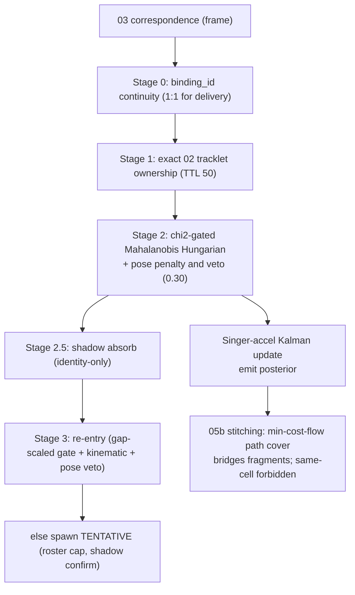

# 05 — global identity + tracklet stitching

> **Stage 05** (was P4) — code `src/identity/p5_global_id/`, config `configs/05_global_id.yaml`.

## Role & intuition

05 turns per-frame cross-camera correspondences into **persistent global identities** (`P001…`)
that survive occlusion, camera hand-offs, and gaps for the whole delivery — the IDs the mosaic
colours by. It is an **online single-hypothesis multi-object tracker on the ground plane**
(05a) followed by an **offline stitching** pass (05b) that bridges fragments the online tracker
left behind. Its hard invariant: two detections in the same camera-frame can never share an ID.

## I/O & config

| | |
|---|---|
| **Input** | 03 run (correspondences + ground points); calibration; `configs/05_global_id.yaml` (+ `_v5`); optional `--ground-truth` |
| **Output** | `predictions/*` with `global_player_id`; `diagnostics/ground_tracks.jsonl`; `id_switch_report.json`; `global_id_metrics.json` |
| **Core** | `src/identity/p5_global_id/{track_manager,stitching}.py`; `src/identity/p5_global_id/ground_kalman.py` |

## Flowchart

## Methods walkthrough

**Motion model — `ground_kalman.py` (Singer model).** A **Singer acceleration model** on the 2D
ground, state `[x, y, vx, vy, ax, ay]`: continuous dynamics `Fc` with `−α` on acceleration
(mean-reverting manoeuvre), discretised via `expm`, with the process-noise `Q_d` computed by the
**Van Loan method** (`_singer_dynamics:39`). Updates are Joseph-form; role-aware `RoleParams`
(α, σ_a, measurement noise) make a bowler agile (α=2, σ_a=3) and an umpire near-static. It emits
the **Kalman posterior** (not the raw foot), so a single bad frame can't teleport the reported
track (`../diagnosis/README.md` R2).

**Online assignment — `TrackManager.update` ([track_manager.py:322](../../src/identity/p5_global_id/track_manager.py#L322)).**
Staged, injective-by-construction (so same-camera collisions are impossible): Stage 0 honours a
tracklet-graph `binding_id` 1:1 for the whole delivery; Stage 1 sticks to an exact `(camera,
local_track_id)` owner (TTL 50 frames so a bad merge heals); Stage 2 is a **χ²-gated Mahalanobis**
Hungarian on ground distance (`chi2_gate_2dof=5.991`) with a **pose penalty and veto** inside the
gate; Stage 2.5 absorbs an unmatched obs from an unseen camera identity-only; Stage 3 revives a
deleted track whose coasted Singer state still explains the obs (gap-scaled Mahalanobis +
kinematic reachability `v_max=9 m/s` + pose veto). A **roster-cap prior** (`expected_roster_max=15`)
makes a new ID need ≥3 m separation once the field is "full", and a **shadow-confirm** keeps a
tentative track invisible until it separates from the confirmed track it shadows.

**Stitching — `stitching.py` (min-cost-flow path cover).** After the delivery, fragmented
confirmed segments are bridged by a **min-cost-flow path cover** — the global-data-association
formulation of **Zhang, Li & Nevatia, CVPR 2008** — with edge cost `w_temporal·gap + w_spatial·dist
+ role_penalty + velocity_continuity + w_pose·pose_dist`, gated by `temporal_gate_frames=120`,
kinematic reachability, a hard pose gate, and role incompatibility. `remap_ids` merges to the
earliest segment ID but **forbids** any merge whose two histories ever share a `(camera, frame)`
cell (the same-person-can't-be-two-places invariant). A final cardinality prior drops IDs spanning
`< min_emit_frames=30`.

## Pros

- **Singer model + role-aware dynamics** is the correct manoeuvre model for players (far better
  than constant-velocity), and the posterior-emit is the decisive anti-teleport lever for the
  *reported* position.
- **Layered assignment** goes strongest-evidence-first (binding → exact tracklet → geometry →
  re-entry), which is robust and interpretable.
- **Hard invariants by construction** — injective per-frame map + the same-cell stitch veto make
  same-camera collisions impossible (0 everywhere).
- **Roster-cap & shadow-confirm priors** encode real cricket structure (~15 people) to resist
  over-segmentation.
- **Min-cost-flow stitching** is the principled global-association method, not a greedy heuristic.

## Cons

- **Fixed, distance-blind measurement noise R.** The Kalman R does not grow with the player's
  distance/grazing from the cameras, so a far, ill-localised foot is trusted as much as a near one
  — the underlying enabler of teleports (the emitted-posterior fix hides the symptom, not the
  mis-assignment).
- **Stitching under-merges** — `stitched_id_switch_proxy = 0` everywhere means 05b is *not*
  bridging the fragments it should; its feasibility gates are too conservative for real gaps.
- **Re-entry leans on weak cues** — with colour dead and pose-shape slow, a re-entering player is
  matched mostly on kinematics, which fails after long occlusions → a fresh ID.
- **2D-only tracking** — 05 tracks on the ground plane; although the 04 lift now produces 3D
  *before* it, 05 does not yet consume that 3D pose, so it lacks the richest disambiguating signal
  ([changes_tbd](../changes_tbd.md)).
- **Many hand-tuned constants** on a single 12-second tuning delivery — real risk of overfitting.

## Issues

- **ID-2 (★★★) Fragmentation / over-segmentation.** 18–25 distinct IDs vs a ~13 roster;
  `stitched_id_switch_proxy=0` ⇒ 05b under-merges (`../diagnosis/09-per-phase-issue-register.md` ID-2).
- **ID-3 (★★) Teleports.** 7–155/clip (M2 155): the χ²-gated assignment admits a wrong nearby
  cluster when the true one is missing a frame (`../diagnosis/09-per-phase-issue-register.md` ID-3).
- **ISSUE-4 (★★) Fixed distance-blind Kalman R** (`ground_kalman.py`, ~0.3–0.4 m): the biggest
  un-pulled anti-teleport lever (`../diagnosis/README.md` ISSUE-4).
- **ID-2b (★) Conservative 05b gates** — temporal 120 / kinematic / occupancy too tight to bridge
  real occlusion gaps.
- **05-1 (★) Overfitting risk** — constants tuned on one short delivery.

## Fixes (all, priority-ordered)

| # | Fix | Priority | Reasoning | Expected effect | Effort | Source |
|---|---|---|---|---|---|---|
| 1 | **Feed a distance/uncertainty-dependent R** into the Singer Kalman (from the 04 (binding lift) triangulation covariance or a homography-Jacobian model) instead of a fixed R. | ★★★ | Distance-blind R is the root enabler of teleports; distance-dependent R is standard in multi-camera sports tracking. | Fewer teleports; correct trust of far/grazing feet. | Medium | ground-plane sports fusion; Lee & Civera [2008.01258] |
| 2 | **Adaptive lost-window + stronger re-ID at re-entry** (mature pose-shape / learned ReID + kinematic prediction), scaled by track maturity and local density. | ★★★ | Fragmentation (ID-2) is re-entry failing; a longer window for established players + a real re-ID key fixes it. | ID count collapses toward the ~13 roster. | Medium | Deep OC-SORT [2302.11813]; GTA sports tracklet association [2411.08216] |
| 3 | **Track in 3D** — once triangulation is 04 (binding lift), run the global tracker on the 3D pose/position (3D Singer KF + 3D pose-shape re-ID) rather than the 2D ground only. | ★★ | The 3D skeleton is the richest disambiguator; using it removes many crowd mis-assignments. | Fewer teleports + chimeras; better re-ID. | Medium-High (depends on triangulation fix 1) | VoxelPose "operate in 3D" [2207.10955] |
| 4 | **Loosen 05b bridging where occupancy proves two segments cannot be simultaneous**, and add a descriptor (pose-shape/ReID) to the stitch cost. | ★★ | 05b under-merges; occupancy + a real descriptor safely bridges more gaps. | More fragments stitched → fewer IDs. | Medium | min-cost-flow assoc [Zhang 2008] |
| 5 | **Cricket roster prior as a hard-ish cap** — penalise minting a new ID when the roster is full and an existing track just went missing nearby; seed from the team sheet. | ★ | Encodes the true ~15-person structure to resist over-segmentation. | Fewer spurious IDs. | Low-Medium | roster/game-state priors [SoccerNet GSR 2404.11335] |
| 6 | **Pose-shape veto *inside* the assignment gate + hysteresis** — don't hand a track to a new tracklet on a single frame; require a body-shape match. | ★ | Tightens exactly the χ²-gate admission that causes teleports. | Fewer single-frame teleports. | Low | — |
| 7 | **Get identity ground truth** (hand-label a few hundred frames on 2–3 deliveries incl. _7/M2) to report real **MOTA/IDF1/HOTA** instead of proxies. | ★★ | Every identity number today is a proxy; without labels, tuning is guesswork. | Measurable identity work; catches overfitting. | Medium (labelling) | CLEAR-MOT / IDF1 / HOTA [Luiten 2009.07736] |

Cross-phase: ID-2/ID-3 sit just under 03's ID-1/ID-5 in the roadmap; several fixes here depend on
the triangulation re-placement — see [fixes-roadmap.md](../changes_tbd.md).
