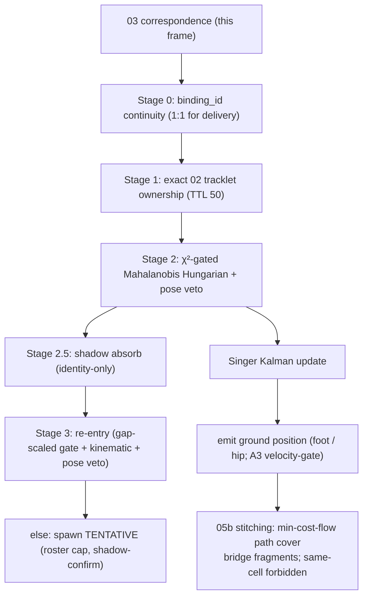

# 05, global identity + tracklet stitching

> **Stage 05** (was P4), turns per-frame cross-camera correspondences into **persistent global
> identities** (`P001…`) that survive occlusion, camera hand-offs, and gaps for the whole delivery , 
> the ids the mosaic colours by. Code: `src/identity/p5_global_id/`, config `configs/05_global_id.yaml`.
>
> Config naming: the YAML sections are `tracking:` (online global-id tracking) and `stitching:`;
> the pre-restructure spellings `p4a:`/`p4b:` are still accepted by the loader, and archived run
> manifests carry the old key names. In code the config classes are `GlobalIdConfig` /
> `GlobalTrackingConfig` / `StitchingConfig`.

---

## 1. What this stage does (and why)

Stage 03 links cameras *per frame*; stage 05 links across *time* into a single lasting identity per
player. It is:
- an **online single-hypothesis tracker on the ground plane** (05a), one best-guess identity per
  detection, decided frame by frame as the delivery plays, then
- an **offline stitching pass** (05b), after the delivery, bridge fragments the online tracker left
  behind (e.g. a player lost behind another for a second and re-acquired as a "new" track).

Its hard invariant: **two detections in the same camera-frame can never share an id** (built into the
assignment, so same-camera collisions are always 0).

> **In plain words:** 03 says "these blobs across cameras are the same person *right now*"; 05 says
> "…and that person is `P007`, the same `P007` as five seconds ago, and I'll keep calling them `P007`
> even when they briefly disappear."

---

## 2. Inputs and outputs

| | |
|---|---|
| **Input** | a 04 lift run (predictions with `pose_3d` + `correspondences.jsonl`, carried from 03) + calibration; `configs/05_global_id.yaml` |
| **Output** | `predictions/*` with `global_player_id`; `diagnostics/ground_tracks.jsonl` (the emitted positions the mosaic draws); `id_switch_report.json`; `global_id_metrics.json` |
| **Core** | `src/identity/p5_global_id/{track_manager,stitching}.py`, `ground_kalman.py` |

---

## 3. How it works

### 3a. The motion model, a Singer acceleration Kalman ([ground_kalman.py](../../src/identity/p5_global_id/ground_kalman.py))

Each global track has a **Kalman filter** (predict-then-correct, as in [02](02-tracking.md)) but a
richer, more realistic motion model:

- The **Singer acceleration model** tracks state `[x, y, vx, vy, ax, ay]`, position, velocity, **and
  acceleration**, where acceleration is *mean-reverting* (a `−α` term pulls it back toward zero). This
  captures a player who *speeds up and slows down* far better than the constant-velocity model of 02.
  > **In plain words:** instead of assuming a player keeps a fixed speed (02's model), this assumes they
  > accelerate and decelerate in bursts and then settle, much closer to how cricketers actually move.
- **`α` (agility)** and **`σ_a` (how violent the accelerations are)** are **role-aware**: a bowler is
  set agile (`α=2, σ_a=3`), an umpire near-static (`α=0.2, σ_a=0.3`). The continuous dynamics are
  discretised with the **Van Loan method** (a standard exact way to turn continuous motion equations
  into the per-frame matrices `F, Q`). Updates use the Joseph form for numerical stability.

### 3b. Layered assignment, `TrackManager.update` ([track_manager.py:322](../../src/identity/p5_global_id/track_manager.py#L322))

Each frame, detections are assigned to global ids **strongest-evidence-first**, and the whole map is
*injective* (one id per detection per frame to collisions impossible):

- **Stage 0, binding continuity:** honour 03's `binding_id` as a 1:1 identity for the whole delivery.
- **Stage 1, exact tracklet ownership:** stick to the exact `(camera, local_track_id)` owner, with a
  TTL of 50 frames so a temporary bad merge can heal.
- **Stage 2, geometry match:** a **χ²-gated Mahalanobis Hungarian** on ground distance
  (`chi2_gate_2dof=5.991`) with a **pose penalty and veto** inside the gate. (Mahalanobis / χ² gate /
  Hungarian are explained in [02](02-tracking.md), "believable-bubble distance" + "optimal one-to-one
  matching".)
- **Stage 2.5, shadow absorb:** attach an unmatched detection from a not-yet-seen camera to an existing
  identity.
- **Stage 3, re-entry:** revive a *deleted* track whose coasted Singer prediction still explains the
  new detection (gap-scaled Mahalanobis + kinematic reachability `v_max=9 m/s` + a pose veto).
- **Else spawn** a new TENTATIVE track, but two priors resist over-segmentation:
  - **Roster-cap prior** (`expected_roster_max=15`): once the field looks "full", a new id must be ≥ 3 m
    from all others to be born (cricket has ~13-15 people, not 25).
  - **Shadow-confirm:** a tentative track stays invisible until it clearly *separates* from the
    confirmed track it was shadowing, so noise next to a real player doesn't mint a twin.
  > **In plain words:** try the strongest clue first (same binding), then the exact same tracklet, then
  > "closest believable player", then "did a lost player just reappear here?", and only invent a brand-
  > new id as a last resort, and even then, don't if the roster's already full and there's a real
  > player right there.

### 3c. Emitting the position + the teleport story

The position drawn on the mosaic is written to `ground_tracks.jsonl`. Three flag-gated options shape it:

- **`emit_ground_source: foot | triangulated_hip` (1A):** emit either the averaged foot-ground estimate
  (default) or the 04-triangulated **hip projected to the ground** (the user's hip-to-ground idea).
  *Metric-neutral* on its own; a default-off option.
- **`drop_partial_singlecam` (IMPACT-2):** DROP a global id that is single-camera across the delivery
  *and* predominantly partial (median < 8 confident joints, a head-only keeper, a cut-off umpire). It
  **drops, never relabels**, so it cannot put an id on the wrong person. 40-delivery: 13 ghost ids
  dropped, agreement held, collisions 0. Default-off pending mosaic sign-off.
- **`emit_velocity_gate` (A3), the teleport fix (40-CONFIRMED).** Walk each id's emitted ground track
  in time and **DROP any frame whose implied speed from the last kept frame exceeds 12 m/s** (a real
  cricketer never exceeds ~11); gap-scaled, re-anchoring after 5 consecutive drops so a genuine
  relocation isn't deleted. **Drop-only, never moves or relabels a position.** 40-delivery: emitted
  teleports **367 to 0**, worst jump **2224 to 11.9 m/s**, distinct-id count and agreement **unchanged**,
  only 0.55% of steps dropped. This is the direct fix for the "haywire ghost markers".
  > **In plain words:** if a marker would have to jump 20 m in one frame (physically impossible), don't
  > draw that frame, the marker briefly pauses instead of teleporting across the field.

**Correction on `emit_kalman_posterior` (ISSUE-5).** This older flag emits the Kalman *posterior*
instead of the raw ground point, and is advertised as *the* teleport guard. An isolated off-vs-on A/B
(foot source, 8_init) shows the emitted track **differs 8/8** with it on, so it **is active** (not a
no-op), **but teleports still persist** (33/8-set, 367/40-set): it is an **active yet ineffective**
guard, because the χ²-gated posterior still follows the mis-associated measurement (permissive gate +
distance-blind `R`). The hard drop-gate **A3** is what actually removes the teleports. See
[known-bugs](known-bugs.md) BUG-1.

### 3d. Stitching, `stitching.py` (min-cost-flow path cover)

After the delivery, fragmented confirmed segments are bridged by a **min-cost-flow path cover**, the
classic global data-association method of [Zhang, Li & Nevatia, CVPR 2008](https://openaccess.thecvf.com/content_cvpr_2008/).

- Think of each track fragment as needing to be "covered" by a path through time; each possible bridge
  (fragment A's end to fragment B's start) has a **cost** = `w_temporal·gap + w_spatial·dist +
  role_penalty + velocity_continuity + w_pose·pose_dist`. **Min-cost flow** finds the *globally*
  cheapest set of bridges that covers all fragments, the principled alternative to greedily joining
  nearest fragments.
  > **In plain words:** after the game, lay out all the broken track pieces and find the cheapest way to
  > join them back into whole-player paths, solved globally, not one greedy join at a time.
- Gated by `temporal_gate_frames=120`, kinematic reachability, a hard pose gate, and role
  compatibility. `remap_ids` merges to the earliest segment id but **forbids** any merge whose two
  histories ever shared a `(camera, frame)` cell (the same-person-can't-be-two-places invariant). A
  final prior drops ids spanning `< min_emit_frames=30`.

---

## 4. Strengths

- **Singer + role-aware dynamics** is the correct manoeuvre model for players (far better than
  constant-velocity).
- **Layered assignment** goes strongest-evidence-first, robust and interpretable.
- **Hard invariants by construction**, the injective per-frame map + same-cell stitch veto make
  same-camera collisions impossible (0 everywhere).
- **Roster-cap & shadow-confirm** encode real cricket structure to resist over-segmentation.
- **Min-cost-flow stitching** is the principled global method, not a greedy heuristic.
- **A3 velocity-gate** eliminates the visible teleports with essentially zero collateral.

## 5. Weaknesses

- **Measurement noise R is covariance-based in production (corrected 2026-07-16).** Earlier drafts called
  R "fixed / distance-blind", that's the *dataclass default*. **Production enables it:**
  `use_measurement_covariance: true` (`r_floor 0.15`, `r_ceiling 0.8`) fed by 03's `emit_ground_cov: true`,
  so the Kalman `R` scales with each cluster's GN ground covariance (a far, ill-localised foot is trusted
  *less*). The fixed per-role `R` is only the flag-off fallback. Whether the covariance-R measurably helps
  is under an OFF-vs-ON A/B (turn it off, measure the loss).
- **Stitching under-merges**, `stitched_id_switch_proxy = 0` everywhere means 05b is *not* bridging
  the fragments it should; its feasibility gates are too conservative.
- **Re-entry leans on weak cues**, with colour dead and pose-shape slow, a re-entering player is matched
  mostly on kinematics, which fails after long occlusions to a fresh id.
- **2D-only by default**, 05 carries the 04 3D forward but doesn't *consume* it (decide-in-3D is
  flag-gated).
- **Many hand-tuned constants** on a single 12-second tuning delivery, real overfitting risk.

---

## 6. Known issues (severity, 1 low to 3 high)

- **ID-2 (severity 3/3) Fragmentation / over-segmentation.** 18-25 distinct ids vs a ~13 roster;
  `stitched_id_switch_proxy=0` means 05b under-merges.
- **ID-3 (severity 2/3) Teleports.** 7-155/clip historically, **now eliminated by A3 (`emit_velocity_gate`)** at
  the emission level; the underlying mis-assignment (below) remains.
- **ISSUE-4, covariance-R is ON in production** (`use_measurement_covariance`), so R is not distance-blind.
  Whether it *measurably helps* is **inconclusive** (OFF-vs-ON: teleports 258 to 269, agreement noise-level) , 
  keep/disable is a human decision, not resolved by the agent.
- **KP-1 (severity 2/3) `emit_kalman_posterior` ineffective as a teleport guard**, on in production, teleports
  persist; see [known-bugs](known-bugs.md).
- **ID-2b (severity 1/3) Conservative 05b gates**, too tight to bridge real occlusion gaps.
- **05-1 (severity 1/3) Overfitting risk**, constants tuned on one short delivery.

---

## 7. Fix-implementation status (2026-07-16, corrected)

**Correction:** most of the "fixes" below are **already enabled in production** (`configs/05_global_id.yaml`) , 
earlier drafts read the code defaults (off) not the YAML (on). Verified from run manifests.

| §7 fix | status | production setting | verdict |
|---|---|---|---|
| #1 distance/uncertainty R |  **ENABLED (in prod)** | `use_measurement_covariance: true` (`r_floor 0.15`, `r_ceiling 0.8`), fed by 03 `emit_ground_cov` | OFF-vs-ON (8_init): off to teleports 258 to 269 (+11), agreement −0.0003 (noise-level). **Marginal / inconclusive on this set, keep/disable is a human decision, not auto-verdicted.** Also = decide-in-3D *measurement* consumption. |
| #2 adaptive lost-window |  **ENABLED (in prod)** | `adaptive_lost_window: true` (`lost_window_max 90`); re-entry gates on | OFF-vs-ON (8_init): off to teleports 258 to 266 (+8), +1 distinct id, agreement −0.0001 (noise-level). **Marginal, decision deferred to human review.** |
| #5 roster-cap prior |  **ENABLED** | `expected_roster_max: 15`, `shadow_confirm_*` | resists over-segmentation |
| #6 pose-veto in gate |  **ENABLED** | `pose_match_weight: 2.0`, `pose_gate_veto_distance: 0.3` | in the χ² assignment gate |
| A3 emitted velocity-gate |  **BUILT, 40-conf** (off in prod, on in candidate stack) | `emit_velocity_gate` | teleports 367 to 0, no ids lost, recommend enable |
| 1A hip emission |  **BUILT, neutral** (off in prod) | `emit_ground_source: triangulated_hip` | ~teleport-neutral; option |
| IMPACT-2 partial-drop |  **BUILT, 40-conf clean** (off in prod) | `drop_partial_singlecam` | 13 ghosts dropped, agreement held; awaiting mosaic verdict |
| `emit_kalman_posterior` |  **ON but INEFFECTIVE** | `emit_kalman_posterior: true` | active (differs 8/8) yet teleports persist, [known-bugs BUG-1](known-bugs.md) |
| #3 track-in-3D (full) | **NOT DONE** |, | needs the 3D KF + 3D re-ID wiring |
| #4 loosen 05b stitching | **NOT DONE** |, | `stitched_id_switch_proxy≈0` (under-merges) |
| #7 identity ground truth | **NOT DONE** |, | all identity metrics are proxies without it |

## 8. Candidate fixes (priority-ordered)

| # | Fix | Priority | Why | Effort | Source |
|---|---|---|---|---|---|
| 1 | **Distance/uncertainty-dependent R** into the Singer Kalman (from 04's triangulation covariance or a homography-Jacobian model) instead of a fixed R. | severity 3/3 | Distance-blind R is the *root* enabler of the mis-assignments; A3 only masks the emitted symptom. | Medium | Lee & Civera [2008.01258] |
| 2 | **Adaptive lost-window + stronger re-ID at re-entry** (mature pose-shape / learned ReID + kinematic prediction), scaled by track maturity and density. | severity 3/3 | Fragmentation (ID-2) is re-entry failing; a longer window + real re-ID key fixes it. | Medium | Deep OC-SORT [2302.11813] |
| 3 | **Track in 3D**, run the tracker on 04's 3D pose/position (3D Singer KF + 3D pose-shape re-ID) rather than the 2D ground only. | severity 2/3 | The 3D skeleton is the richest disambiguator; removes many crowd mis-assignments. | Medium-High | VoxelPose [2207.10955] |
| 4 | **Loosen 05b bridging where occupancy proves two segments can't be simultaneous**, and add a pose/ReID descriptor to the stitch cost. | severity 2/3 | 05b under-merges; occupancy + a real descriptor safely bridges more gaps. | Medium | min-cost-flow [Zhang 2008] |
| 5 | **Fix or retire `emit_kalman_posterior`**, run the isolated off-vs-on A/B; if inert, repair the branch or remove the misleading `true` from the production config. | severity 2/3 | An advertised teleport guard that doesn't guard is a latent trap. | Low |, |
| 6 | **Get identity ground truth** (hand-label a few hundred frames on 2-3 deliveries incl. `_7`/M2) to report real MOTA/IDF1/HOTA instead of proxies. | severity 2/3 | Every identity number today is a proxy; without labels, tuning is guesswork. | Medium (labelling) | HOTA [2009.07736] |

Cross-phase: ID-2 / ID-3 sit just under 03's ID-1 / ID-5; several fixes depend on the 04 triangulation
covariance, see [`wip/open-work.md`](../../wip/open-work.md).
