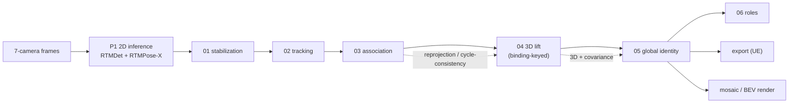

# The pipeline — per-phase reference

Detailed, current documentation of every stage: what it does, how it's implemented now, what's
been tried, and its current measured state. Read [`../architecture.md`](../architecture.md) first
for the shared concepts (rig, calibration, contract, metrics).

Each stage consumes an `--input-run-dir` and writes an `--output-run-dir` (canonical run
directory: `predictions/*.jsonl` + `diagnostics/` + `*_metrics.json`). The whole chain is driven
by `src/main.py` (`python -m main`, phase-select via `--from-stage`/`--until-stage`).

## Stage order

**Associate → Triangulate → Track**: the 3D lift runs *before* global identity so identity can
build on 3D positions.

| # | Stage | Doc | Code | Config |
|---|---|---|---|---|
| P1 | 2D inference (foundation) | [00-inference](00-inference.md) | `src/core/inference/` | model_envs / CLI |
| 01 | stabilization | [01-stabilization](01-stabilization.md) | `src/identity/p1_stabilization/` | `configs/01_stabilization.yaml` |
| 02 | per-camera tracking | [02-tracking](02-tracking.md) | `src/identity/p2_tracking/` | `configs/02_tracking.yaml` |
| 03 | cross-camera association | [03-association](03-association.md) | `src/identity/p3_association/` | `configs/03_association.yaml` |
| 04 | 3D lift (triangulation) | [04-lift](04-lift.md) | `src/identity/p4_lift/` | CLI flags |
| 05 | global identity | [05-global-id](05-global-id.md) | `src/identity/p5_global_id/` | `configs/05_global_id.yaml` |
| 06 | roles | [06-roles](06-roles.md) | `src/identity/p6_roles/` | `configs/06_roles.yaml` |
| — | export + render | [07-export-and-render](07-export-and-render.md) | `src/identity/{export,visualization}/` | CLI flags |

## Flow of identity

`local_track_id` (per camera, **02**) → `binding_id` (cross-camera cluster, **03**) →
`global_player_id` (persistent, **05**) → `role` (**06**). Same-camera collisions are impossible
by construction at every stage.

## Current state (v8.1, 40-delivery production)

Mean cross-camera agreement 0.862 (0.527–0.992), reprojection 3.07–3.56 px, collisions 0,
colocated-id pairs 0 on 38/40. Identity is the dominant ceiling: facing-pair split identity
(**03**) and single-camera coverage (**P1**) are the root drivers; **05** manufactures the
visible emitted teleports (mean-of-fragments emission). The measured breakdown is in
[`../diagnosis/`](../diagnosis/README.md); the prioritized fixes in
[`../changes_tbd.md`](../changes_tbd.md).

## History

The detailed A/B campaign ledger is [`fixes-log.md`](fixes-log.md) (dated historical record);
external references and code anchors are in [`references.md`](references.md); a meeting-ready
debug walkthrough is [`meeting-debug-reference.md`](meeting-debug-reference.md).
