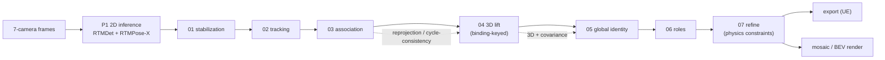

# The pipeline, per-phase reference

Documentation of every stage: what it does, **how the algorithms actually work** (each technical term
is followed by an "In plain words" intuition, written to be followable without a computer-vision
background), what's been tried, and its current measured state. Read
[`../architecture.md`](../architecture.md) first for the shared concepts (rig, calibration, contract,
metrics). The measured analysis of the pipeline's issues is in [`../analysis/`](../analysis/README.md).

Latest (2026-07-17, the combined ledger is [`../methods_log.md`](../methods_log.md)):
- Accepted and on: `graph_llr_positive_cap` 1.5 to 3.5 in [03](03-association.md), the facing-pair
  under-merge fix (40-set agreement 0.853 to 0.883, under-merge 16% to 7%, coloc 5 to 0).
- Pending, off by default: `emit_velocity_gate` (A3) in [05](05-global-id.md), a drop-only emission
  velocity gate that eliminates the ghost-marker teleports (40-set 367 to 0, no IDs lost, agreement
  unchanged); `drop_partial_singlecam` (IMPACT-2). Awaiting a human keep decision and mosaic sign-off.
- New this session, off by default: `tracker: ocsort` in [02](02-tracking.md), net-negative as-is
  (fragmentation down, agreement and teleports worse); tiled detection in [00](00-inference.md), two-edged
  (agreement +0.115 on the 8 hardest, teleports +704). See [`../methods_log.md`](../methods_log.md) Part A.
- The five shipped flags, measured on all 40 for the first time: `graph_shape_enabled` is inert,
  `graph_split_enabled` is a slight drag, and distance-R, the facing gate, and the adaptive lost window
  each suppress real teleport events. Decisions deferred to human review.
- Correction still in force: `emit_kalman_posterior` is on but not an effective teleport guard (teleports
  persist with it on); the effective fix is the A3 emission velocity gate — see [`../methods_log.md`](../methods_log.md).

## What production actually runs (verified from `run_manifest.json`)

Read the YAML, not the dataclass defaults. Many flags are `False` in `config.py` but overridden to `True`
in `configs/*.yaml`, and the shipped pipeline uses the YAML. Always read the YAML, not the dataclass
defaults (reading `config.py` alone has mislabeled enabled features as not done). The
pipeline already runs a rich stack:

| stage | ENABLED in production (`configs/*.yaml`) | NOT enabled (candidate flags, off) |
|---|---|---|
| **03** | cap `3.5`, `graph_shape_enabled`, `graph_split_enabled` (conservative), `graph_facing_gate_scale 1.3`, `emit_ground_cov`, `purity_split`, `posture`, `synthetic_tracklets`, `approx_feet` |, |
| **04** | robust RANSAC+DLT, occlusion/prior fill, EMA; covariance emission | full decide-in-3D tracking; PnP single-view lift |
| **05** | `use_measurement_covariance` (distance-R), `adaptive_lost_window`, `emit_kalman_posterior`*, roster-cap, pose-veto | `emit_ground_source: triangulated_hip` (1A), `drop_partial_singlecam` (IMPACT-2), `emit_velocity_gate` (A3) |

\* on but ineffective (see [`../methods_log.md`](../methods_log.md)). Each stage doc's **"Fix-implementation status"** section
maps every proposed fix to its real state (enabled / candidate / not-done) with verdicts.

Each stage consumes an `--input-run-dir` and writes an `--output-run-dir` (canonical run
directory: `predictions/*.jsonl` + `diagnostics/` + `*_metrics.json`). The whole chain is driven
by `src/main.py` (`python -m main`, phase-select via `--from-stage`/`--until-stage`).

## Stage order

**Associate to Triangulate to Track**: the 3D lift runs *before* global identity so identity can
build on 3D positions.

| # | Stage | Doc | Code | Config |
|---|---|---|---|---|
| P1 | 2D inference (foundation) | [00-inference](00-inference.md) | `src/core/inference/` | model_envs / CLI |
| 01 | stabilization | [01-stabilization](01-stabilization.md) | `src/identity/p1_stabilization/` | `configs/01_stabilization.yaml` |
| 02 | per-camera tracking (ByteTrack default; OC-SORT optional) | [02-tracking](02-tracking.md) | `src/identity/p2_tracking/` | `configs/02_tracking.yaml` |
| 03 | cross-camera association | [03-association](03-association.md) | `src/identity/p3_association/` | `configs/03_association.yaml` |
| 04 | 3D lift (triangulation) | [04-lift](04-lift.md) | `src/identity/p4_lift/` | CLI flags |
| 05 | global identity | [05-global-id](05-global-id.md) | `src/identity/p5_global_id/` | `configs/05_global_id.yaml` |
| 06 | roles | [06-roles](06-roles.md) | `src/identity/p6_roles/` | `configs/06_roles.yaml` |
| 07 | refine (physics-constrained 3D) | [07-refine](07-refine.md) | `src/identity/p7_refine/` | `configs/07_refine.yaml` |
| 08 | export + render | [08-export-and-render](08-export-and-render.md) | `src/identity/{export,visualization}/` | CLI flags |

## Flow of identity

`local_track_id` (per camera, **02**) to `binding_id` (cross-camera cluster, **03**)  to 
`global_player_id` (persistent, **05**) to `role` (**06**). Same-camera collisions are impossible
by construction at every stage.

## Current state (40-delivery)

Cross-camera agreement **0.883** with the cap fix (was 0.853), reprojection 3.07-3.56 px, collisions 0,
colocated-id pairs 0. Emitted teleports **0** with A3 enabled (were up to 155/clip). Identity is still
the dominant ceiling: facing-pair split identity (**03**, partially fixed) and single-camera coverage
(**P1**/**04**) are the root drivers; the teleports A3 removes at emission trace back to id-level
mis-assignments whose *root* levers are the distance-blind Kalman `R` (**05**) and merge-only clustering
(**03**). Measured breakdown in [`../analysis/`](../analysis/README.md); improvement directions in
[`../roadmap.md`](../roadmap.md).

## History and trackers

- [`../methods_log.md`](../methods_log.md): the combined method ledger (every change, its before/after, pros
  and cons, status, and default). Supersedes the former per-stage fixes-log.
- [`../analysis/`](../analysis/README.md): the measured audit + diagnosis of the pipeline's issues.
- [`../roadmap.md`](../roadmap.md): the ranked improvement directions.
- [`references.md`](references.md): external papers and code anchors.
