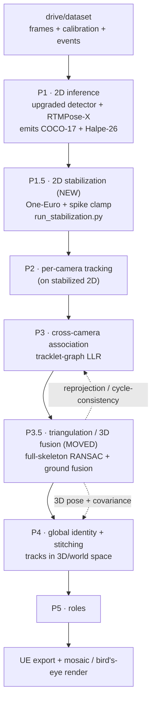

# Phases — current pipeline and proposed re-order

This is deliverable #1: the ordered steps from raw multi-camera video to the mosaic render,
their inputs/outputs, and the scripts involved. It shows both the **current** pipeline (what the
code does today) and a **proposed re-ordered** pipeline that lets each phase better feed the next.

## Inputs (on disk)

- **Frames** — `drive/dataset/bt_0{1,2,3}/<delivery>/camera<NN>/frame_*.jpg`, 7 cameras × ~600
  frames/delivery, 2560×1440 (camera 07 is ~3775×960).
- **Calibration** — `drive/dataset/calibration-data/<match>/calibration_data/{camera,pitch}_calibration_config.json`:
  bundle-adjusted 3×4 projection matrices + pitch geometry. **Centimetre-accurate**
  (ball reprojection p95 ≤ 4.5 px, `wip/methods_log.md`).
- **Events** — `drive/dataset/events-data/<delivery>_V*/`: ball positions for the render.

Every stage reads and writes a **canonical run directory**: `predictions/<capture_group>__<delivery>__cam_NN.jsonl`
+ `diagnostics/` + `run_manifest.json` + a `*_metrics.json`. This is what lets any stage be
inspected or re-run independently.

## Legacy pipeline (v6 order — superseded by the v7 default below)

```mermaid
flowchart TD
  RAW["drive/dataset<br/>frames + calibration + events"]
  P1["P1 · 2D inference<br/>RTMDet detect + RTMPose-X pose<br/>run_phase1_rtmpose_inference.py"]
  P2["P2 · per-camera tracking<br/>CV-Kalman + pose-cosine (ByteTrack-style)<br/>run_per_camera_tracking.py"]
  P3["P3 · cross-camera association<br/>tracklet-graph LLR on the ground plane<br/>run_cross_camera_association.py"]
  P4["P4 · global identity + stitching<br/>online Singer-KF MOT + min-cost-flow<br/>run_global_id.py"]
  P5["P5 · roles<br/>run_role_assignment.py"]
  P6["P6 · 3D lift (terminal)<br/>weighted-DLT + RANSAC triangulation<br/>run_triangulation.py"]
  UE["UE pose packets<br/>export_ue_packets.py"]
  R["Mosaic / bird's-eye render<br/>render_phase1_videos.py"]

  RAW --> P1 --> P2 --> P3 --> P4 --> P5 --> P6 --> UE
  P4 --> R
  P3 -. correspondences.jsonl .-> R
  P5 -. roles.json .-> R
  RAW -. frames + ball .-> R
```

Note: in this legacy order the full **3D triangulation is the last compute stage (P6)** —
it does not feed identity or tracking; P4 tracks purely on the 2D ground plane. This is
exactly what the re-ordering below fixes.

## Re-ordered pipeline (ACCEPTED 2026-07-11; v8.0 detection era since 2026-07-13)

> v8.0 update: P1 detection is now **tiled RTMDet-m + NMS 0.55** (produced on the L40S
> via `run_phase1_l40s.py --tiled-det --nms-thr 0.55`), P2 adds `lowconf_can_spawn:
> false`, P5 runs roles v1.1 + Wave-6 suppression. Driver defaults: the numbered `configs/0N_*.yaml` set.

Two structural changes, both justified below:

1. **P1.5 — 2D temporal stabilization** after P1 (default ON; the v7-rc3 isolation showed
   it is a pure `_5`↔`_7` trade and rc2 with P1.5 has the better worst-clip floor — see
   fixes-log GRAND ANALYSIS CONCLUSION).
2. **Triangulation at P3.5** (default ON): binding-keyed lift right after association
   emits per-joint 3D + covariance and the **chimera purity report** that the
   splittable-clustering pass (F13) consumes; the terminal P6 lift remains for the final
   global-ID-keyed 3D (now with native-26 keypoints, cheirality, frame-aware fills and a
   zero-phase Butterworth by default).

`src/main.py` now defaults to this order with the numbered `configs/0N_*.yaml` set
(tiled-detection stack; `configs/v7/` = the previous identity-stack cut). The legacy
order remains reproducible via `--no-enable-stabilization --no-enable-lift` (the pre-restructure `configs/v6/` legacy set was removed).



### Why this order (professional justification)

| Change | Reason it belongs here | What it fixes |
|---|---|---|
| **P1.5 after P1** | Cleaner 2D is inherited by tracking, association, and triangulation; jitter otherwise propagates and is re-solved everywhere downstream. | 2D jitter at source (measured −32% on real data). |
| **Triangulation as P3.5, not terminal P6** | Triangulation **needs correspondences** (the association result) — it cannot precede P3. Placed right after P3 it (a) exists before P4, so P4 can track in 3D; (b) its per-cluster reprojection / cycle-consistency is exactly the chimera-detection signal the `wip` notes ask for. | Enables 3D-aware tracking; gives a **split** signal for the merge-only clustering (ID-5 / V2-L2). |

**On "triangulate before tracking" (a common instinct):** you cannot fully triangulate a
player in free space before knowing *which* detection in camera A corresponds to camera B —
and that correspondence *is* the association problem. Moreover, free-space triangulation is
ill-conditioned on the low-parallax facing pairs, which is precisely why P3 solves identity on
the calibrated **ground plane** (`z0_reproj`) instead. So the achievable and correct form of
the instinct is: associate → triangulate (P3.5) → **track in 3D** (P4). This is the multi-view
paradigm used by e.g. VoxelPose-style systems, adapted to the fact that our calibration is
excellent and a full learned volumetric net is unnecessary (see
[phase-triangulation-3d.md](phase-triangulation-3d.md)).

## Phase → scripts → I/O map

| Phase | Entry script | Input | Output |
|---|---|---|---|
| P1 | `src/core/inference/run_phase1_rtmpose_inference.py` | frames, `model_envs.yaml` | `predictions/*.jsonl` (COCO-17 + Halpe-26) |
| P1.5 | `src/identity/p1_stabilization/run_stabilization.py` | P1 run | stabilized run (drop-in P2 input) |
| P2 | `src/identity/p2_tracking/run_per_camera_tracking.py` | P1/P1.5 run, calib, `p2_tracking.yaml` | `predictions/*` + `local_track_id` |
| P3 | `src/identity/p3_association/run_cross_camera_association.py` | P2 run, calib, `p3_association.yaml` | `predictions/*` + `diagnostics/correspondences.jsonl` |
| P4 | `src/identity/p5_global_id/run_global_id.py` | P3 run, calib, `p4_global_id.yaml` | `global_player_id`, `diagnostics/ground_tracks.jsonl`, `id_switch_report.json` |
| P5 | `src/identity/p6_roles/run_role_assignment.py` | P4 run, calib | `p5/roles.json` |
| P6 / P3.5 | `src/identity/p4_lift/run_triangulation.py` | P4 run (today) / P3 run (proposed), calib | `pose_3d.keypoints_world_m` |
| export | `src/identity/export/export_ue_packets.py` | triangulated 3D | UE pose packets |
| render | `src/identity/visualization/render_videos.py` | P4 run + P3 corr + P5 roles + frames + calib + ball | `visualizations/videos/<delivery>__all_cameras.mp4` |

Batch driver for P3→P4 across all 8 deliveries: `src/identity/id_pipeline.py`
(caps BLAS threads, prints a joint metric panel, diffs against a frozen baseline).
