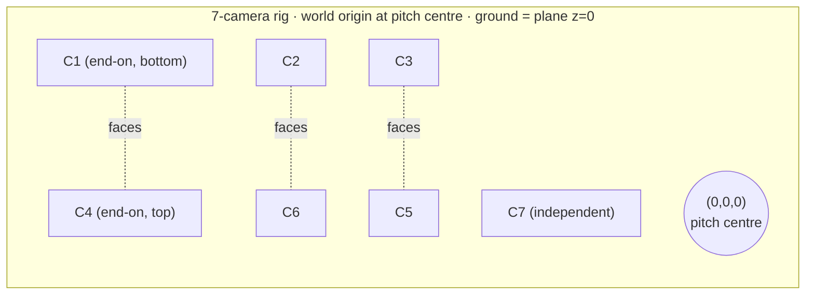
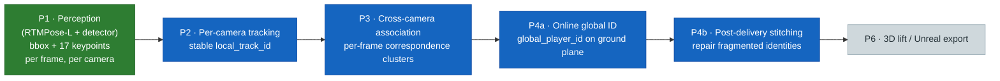
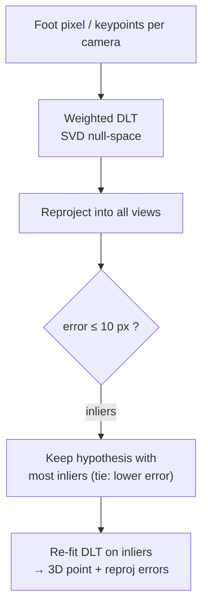
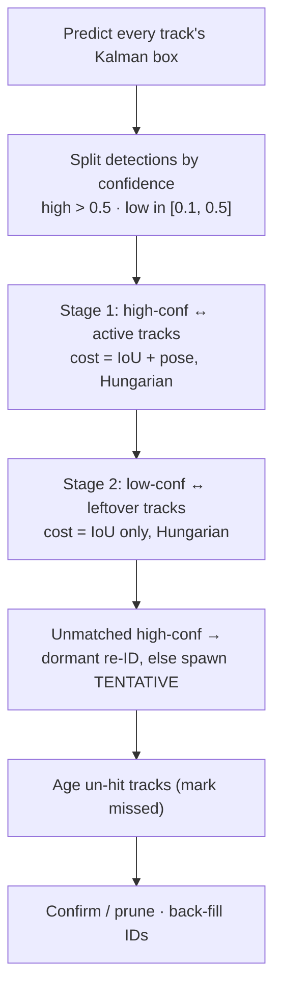
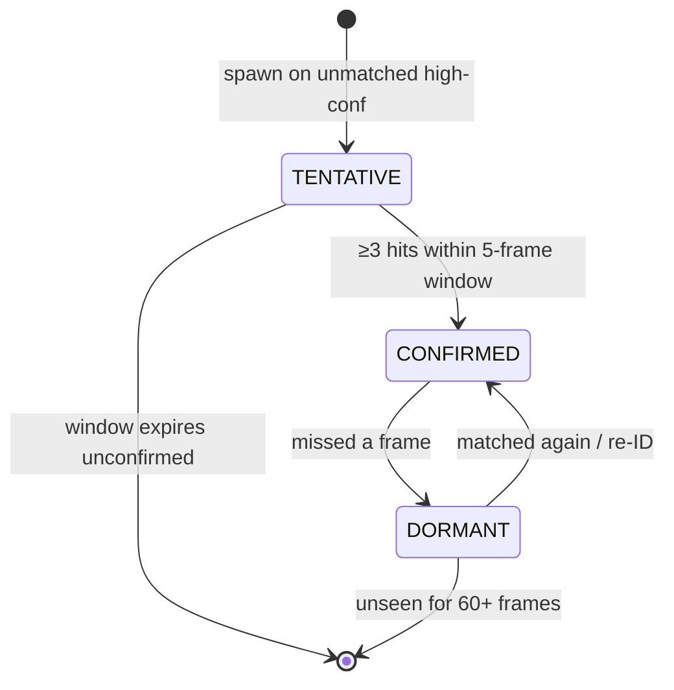
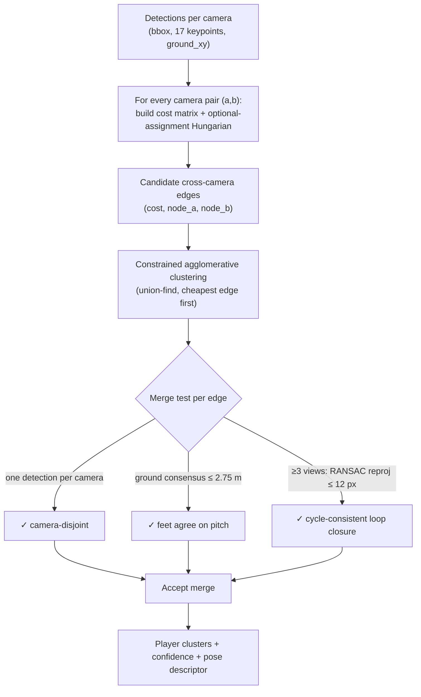
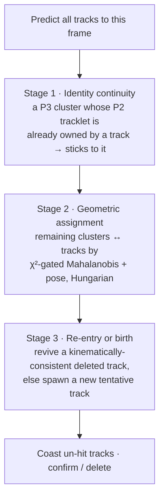
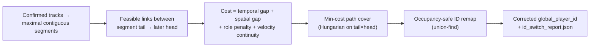
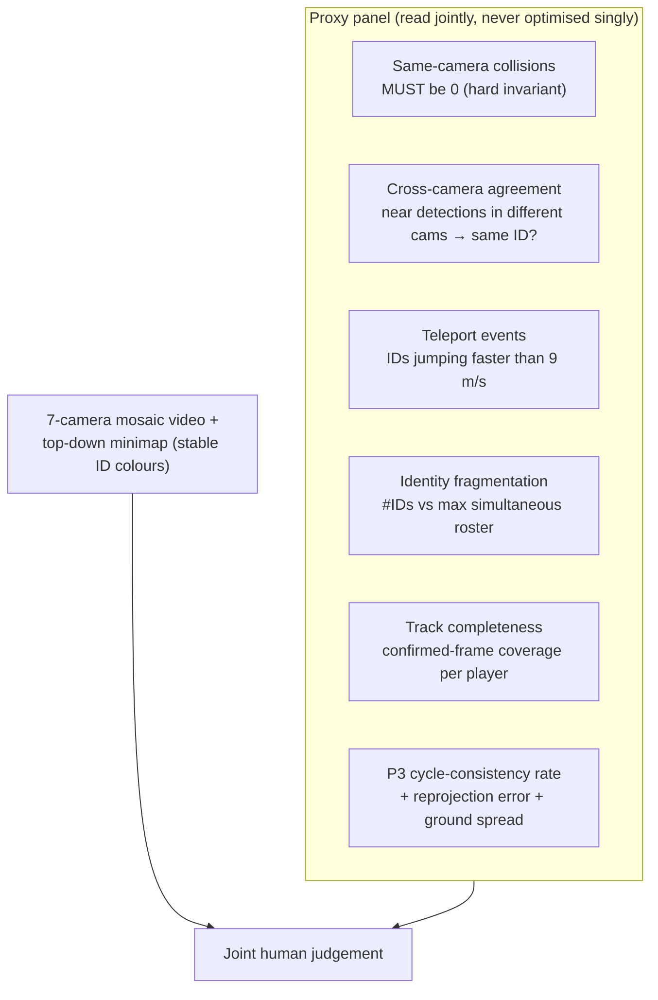

# Cricket Multi‑Camera Player Tracking — Technical Deep Dive (Phases 2 · 3 · 4)

**Project:** Quidich — Group 1 · Cricket Multi‑Camera Pose & Identity Tracking
**Scope of this document:** exactly how the pipeline works *today* — the geometry, the
mathematics, the algorithms (Kalman filters, the Hungarian algorithm, RANSAC
triangulation, epipolar geometry, pose‑shape descriptors), the data flow between stages,
and how we check that it is behaving.

> **Status (honest).** This is a work in progress. The end‑to‑end output is **not yet
> production quality** — identities still fragment and occasionally swap, especially in
> crowded/occluded moments and on the low‑parallax "facing" camera pairs. This document
> describes the *current* design and the *current* known weaknesses. The last section
> lists exactly what we are improving and why. Nothing here is claimed to be finished.

---

## 0. TL;DR — what the system does in one breath

Seven calibrated cameras watch one cricket delivery. For every synchronized frame we
already have, per camera, person boxes + 17‑point 2D skeletons (Phase 1). The tracking
stack then:

1. **P2 — Per‑camera tracking:** gives each player a *stable ID within one camera* over
   time (a "tracklet").
2. **P3 — Cross‑camera association:** at each frame, decides *which detections in
   different cameras are the same physical person*, using calibrated geometry.
3. **P4a — Online global identity:** links those per‑frame cross‑camera clusters
   *through time* into persistent `global_player_id`s, on the ground plane, in real time.
4. **P4b — Post‑delivery stitching:** a short offline pass that repairs broken identity
   chains (a player who was lost and re‑acquired under a new ID).

Everything is anchored to **one shared world coordinate frame** and the **z = 0 ground
plane**, which is what makes "same person across cameras" a geometry question rather than
an appearance‑matching guess (crucial, because both teams wear near‑identical kit).

---

## 1. The physical setup and why it dictates the maths

### 1.1 The camera rig

Seven broadcast cameras (`C1`…`C7`) ring the ground. The calibration defines a **world
frame** with its origin at the pitch centre, `X`/`Y` in the ground plane and `Z` up; the
**ground is the plane `z = 0`**.

**Co‑observing ("facing") pairs — the single most important geometric fact:**

| Facing pair | Relationship |
| --- | --- |
| **C1 ↔ C4** | End‑on cameras down the pitch long axis, looking at each other |
| **C2 ↔ C6** | Look at the *same* ground strip from opposite sides |
| **C3 ↔ C5** | Look at the *same* ground strip from opposite sides |

A facing pair is where a given player is most likely seen by *both* cameras — so these
are exactly the pairs cross‑camera identity depends on. Critically, "facing" is **not**
the same as "diametrically opposite in position." C2 and C5 sit opposite each other but
frame *different* strips, so they rarely co‑observe. We therefore **auto‑derive the
facing pairs from the calibration itself** (`derive_facing_pairs`) rather than trusting a
hand‑edited list — see §3.9.

> The awkward consequence, which drives much of the difficulty: facing pairs are also
> **low‑parallax** pairs (their optical axes are nearly anti‑parallel). Low parallax
> makes triangulation and epipolar tests numerically weak *precisely* where we most need
> them. Almost every design choice below is a response to this tension.

### 1.2 Calibration inputs (the source of truth)

From the bundle‑adjusted calibration on drive we load, per camera:

- **Projection matrix** `P` (3×4), `Bundle_Adjusted_extrinsics.json` — maps a world point
  to pixels: $\lambda\,[u,v,1]^\top = P\,[X,Y,Z,1]^\top$.
- **Intrinsics** `Bundle_Adjusted_intrinsics.json` — used to recover each camera's native
  resolution from the principal point as $(2c_x,\,2c_y)$. The rig is **not uniform**:
  C1–C6 are 2560×1440 but **C7 is ≈3775×960**, which matters for the degeneracy test.

From `P` we derive everything else we need (camera centre, ground homography, fundamental
matrices) — no extra hand‑tuned numbers.

---

## 2. The pipeline at a glance

**Snapshot data contract.** Each phase is a *separate, immutable run directory*. A phase
reads the previous snapshot, preserves everything, and adds its own fields — it never
edits the earlier output in place. That gives reproducible phase boundaries and lets any
stage be inspected or re‑run alone.

| Phase | Adds to each detection | Diagnostics artifact |
| --- | --- | --- |
| P1 | `bbox_xywh_px`, `pose_2d` (COCO‑17 + conf) | — |
| P2 | `local_track_id` | per‑camera tracking counters |
| P3 | `single_camera`, `track_confidence` | `correspondences.jsonl` |
| P4 | `global_player_id`, `track_state` | `ground_tracks.jsonl`, `id_switch_report.json` |

---

## 3. The shared geometry toolbox

These stateless primitives (`pose_estimation/cricket/geometry.py`,
`pose_estimation/triangulation.py`, `pose_estimation/cricket/pose_shape.py`) are the
mathematical bedrock used by every stage. Understand these once and the phases become
easy to read.

### 3.1 Camera centre

The world position of a camera is the **right null‑space** of its projection matrix,
recovered by SVD: the last row of $V^\top$ in $P = U\Sigma V^\top$, dehomogenized.
Used for baseline geometry and parallax.

### 3.2 Pixel → ground homography (the workhorse projection)

Because the ground is `z = 0`, a world ground point is $[X, Y, 0, 1]^\top$, so the `Z`
column of `P` drops out. The map from ground to image is the **3×3 homography**

$$H_{g\to i} = P[:,\,\{0,1,3\}], \qquad H_{i\to g} = H_{g\to i}^{-1}.$$

Any image pixel $[u,v]$ back‑projects to a ground point via
$[X, Y, w]^\top = H_{i\to g}\,[u, v, 1]^\top$, then $(X/w,\; Y/w)$. This single operation
turns a foot pixel into a metric position on the pitch and is the primary cue in both P3
and P4. (`GroundPlaneCalibrator`, `pixel_to_ground_xy`.)

### 3.3 The ground‑contact ("foot") point — carefully

Where a player *touches the ground* is what we project. Two candidates:

- **bbox bottom‑centre** $[x + w/2,\; y + h]$ — robust but coarse.
- the **lower confident ankle** (COCO indices 15/16) — sharper, but pose models
  routinely **hallucinate a raised ankle**, which under long cricket lenses moves the
  ground projection *by metres*.

`ground_contact_pixel` accepts an ankle **only if** it is confident (`≥ 0.6`) and
vertically plausible (within `max(20 px, 0.25·bbox_h)` of the bbox bottom); if both
ankles are plausible and level it averages them; otherwise it falls back to bbox bottom.
This guarding is a direct defence against foot‑projection noise.

### 3.4 Fundamental matrix and epipolar geometry

For a camera pair we compute the **fundamental matrix** algebraically from the two
projection matrices:

$$F = [e_2]_\times\, P_2\, P_1^{+}, \qquad e_2 = P_2\,[C_1, 1]^\top$$

where $P_1^{+}$ is the pseudo‑inverse, $e_2$ the epipole in image 2, and $[e_2]_\times$
its skew‑symmetric cross‑product matrix. $F$ is normalized by its Frobenius norm and
satisfies the epipolar constraint for corresponding points:

$$x_2^\top\, F\, x_1 = 0.$$

We measure how well two keypoints obey this with the **Sampson distance** (a first‑order
geometric approximation of reprojection error, in px²):

$$d_{\text{Sampson}}(x_1, x_2) = \frac{(x_2^\top F x_1)^2}{(Fx_1)_x^2 + (Fx_1)_y^2 + (F^\top x_2)_x^2 + (F^\top x_2)_y^2}.$$

### 3.5 Degeneracy — when epipolar geometry lies

For near‑collinear / facing pairs the epipolar geometry is ill‑conditioned and the
Sampson distance becomes noise. A pair is flagged **degenerate** if any of:

- the **baseline is near‑collinear** with the pitch centre (angle `< 20°` from 0° or
  180°),
- the **right epipole falls inside image 2** (computed with C7's *true* size), or
- it is on an explicit override list.

For degenerate pairs the epipolar weight is set to **0** and that weight is reallocated
to the trustworthy ground cue. (This bug — scoring the facing pairs with a full‑weight
*unreliable* epipolar term — used to cause exactly the under‑merges we care about.)

### 3.6 Parallax and triangulation reliability

The **parallax angle** at a 3D point is the angle between the two camera rays meeting
there. Triangulation is trustworthy only above some parallax, encoded as a ramp:

$$w_{\text{par}}(\theta) = \begin{cases} 0 & \theta \le 10^\circ \\ \dfrac{\theta - 10}{25 - 10} & 10^\circ < \theta < 25^\circ \\ 1 & \theta \ge 25^\circ \end{cases}$$

This is why the pose‑shape descriptor (§3.8) **excludes** body segments seen only across
low‑parallax facing pairs: their depth is noise.

### 3.7 DLT triangulation + RANSAC

**Weighted linear DLT** (`triangulate_point_dlt`): each view contributes two rows,
$w(x\,P[2]-P[0])$ and $w(y\,P[2]-P[1])$, with confidence weight $w=\sqrt{\text{conf}}$;
the stacked system is solved by SVD and the null vector dehomogenized to $[X,Y,Z]$.

**RANSAC around it** (`ransac_triangulate_point`) makes it robust to a bad view: try every
2‑view hypothesis, reproject into all views, keep the hypothesis with the most **inliers**
(reprojection error `≤ 10 px`), break ties by lowest mean error, then **re‑fit** on the
full inlier set. `triangulate_skeleton_ransac` runs this per joint to lift a whole
skeleton.

### 3.8 Pose‑shape descriptor — a kit‑proof identity cue

Ground position cannot separate two identical‑kit players standing close together. A
person's **body proportions** can. From the **triangulated 3D** skeleton we build 11
bone segments (shoulder/hip width, spine, upper‑arm, forearm, thigh, shin, L/R), take
each segment length, and normalize by the **median segment length** to get
**scale‑invariant, view‑invariant ratios** (`limb_proportion_descriptor`).

- Must be 3D, not 2D — 2D bones are foreshortened differently per camera and left/right
  flips on back‑facing views.
- Poor‑parallax segments are dropped (§3.6).
- Comparison (`descriptor_distance`) is the mean absolute ratio difference over shared
  segments, and **abstains** (returns "no opinion") when fewer than 4 segments are
  shared, so it never invents a penalty.
- A track's descriptor is an **EMA** over time (`merge_descriptor`).
- `torso_anthropometric_ok` is a soft sanity check (human shoulder/hip/torso dimensions,
  upright, shoulders above hips) used only to *down‑weight* a likely "chimera" cluster
  that merged two different people — never to hard‑reject.

**This is deliberately a soft tie‑breaker, never a hard gate** — it nudges among
candidates geometry already considers plausible.

### 3.9 Auto‑deriving the facing pairs

`derive_facing_pairs` computes each camera's forward axis (row 3 of `P`, sign‑fixed to
point at the pitch centre) and its ground look‑at point (axis ∩ `z=0`). Two cameras are a
facing candidate if their axes are anti‑parallel (`v_a·v_b < −0.9`); we then greedily pair
by nearest look‑at point. Calibration, not a config file, is the source of truth — an
independent camera like C7 is correctly left unpaired.

---

## 4. Phase 2 — Per‑camera tracking

**Goal:** within *one* camera, link a player's detections across time into one stable
`local_track_id`, surviving movement and brief occlusion. Output tracklets are P3's
input.

**Why it's hard:** (1) per‑frame detection has no memory; (2) identical kits defeat pure
appearance matching; (3) occlusion makes a returning player look brand‑new.

### 4.1 The per‑frame loop (BYTE‑style two‑stage association)

The two‑stage split is the BYTE idea: match confident detections first, then use the
survivors to rescue *low*‑confidence detections (often partial occlusions) that a
single‑threshold tracker would throw away.

### 4.2 The motion model — constant‑velocity Kalman on the box

State is the box centre + size and their velocities:

$$x = [c_x, c_y, w, h, \dot c_x, \dot c_y, \dot w, \dot h]^\top, \qquad z = [c_x, c_y, w, h]^\top.$$

- **Transition** $F$: identity with $F[i, i{+}4]=1$ (constant velocity, $x \mathrel{+}= v$).
- **Measurement** $H = [\,I_4 \mid 0\,]$.
- **Covariance** $P$: initialised $10 I$, velocity block ×1000 (we don't know initial
  speed).
- **Process noise** $Q$: position block scaled by $q$, velocity block by $0.01q$; $q$ is
  **inflated ×1.5 per missed frame** so a coasting track's gate grows.
- **Update** uses the numerically stable **Joseph form** and solves for the gain instead
  of inverting.
- Divergence guard: if $\operatorname{tr}(P_{xy}) > 10^6$ the track is force‑deleted.

### 4.3 The association cost

For a (detection, track) pair:

$$c = \frac{\alpha\,(1 - \text{IoU}) + \beta\,\text{pose\_cost}}{\alpha + \beta}, \qquad \alpha = 0.6,\; \beta = 0.4$$

where IoU is between the detection and the track's *predicted* box, and `pose_cost` is a
**confidence‑weighted cosine distance** between the detection's normalized 2D pose vector
and the track's gallery representative (§4.5). If the poses share fewer than 6 valid
keypoints the pose term abstains and cost is IoU‑only.

**Gating** (before a pair is even allowed): if IoU = 0 the pair survives only if it is
reachable — Mahalanobis gate $\le \chi^2_{2}(9.21)$ *or* within a bbox‑height floor, and
within a hard pixel cap. **Calibrated ground gate:** if both have ground points and they
are farther apart than a physically reachable radius, the pair is hard‑rejected;
otherwise a small ground‑distance term (weight 0.15) is blended in. Reachable radius
grows with the gap: $r = 1.5\text{ m} + (9\text{ m/s} / 50\text{ fps})\cdot\Delta_{\text{frames}}$.

Assignment is solved with the **Hungarian algorithm** (`scipy linear_sum_assignment`) on
the cost matrix, with a large sentinel for forbidden pairs.

### 4.4 Track lifecycle

On confirmation the ID (`{camera}_trk_{id:04d}`) is **retroactively back‑filled** onto the
tentative frames, so the tracklet is complete from birth.

### 4.5 Pose gallery + dormant re‑ID

Each track keeps a rolling gallery (30) of its pose vectors; its representative is the
**medoid** (the member minimizing total cosine distance to the others) — robust to a few
bad poses. When a player reappears after occlusion, `_try_dormant_reid` matches the new
detection against spatially‑reachable **dormant** tracks by pose cosine distance
(`< 0.25`), and **abstains if the top‑two candidates are within 0.05** (ambiguous — better
to spawn fresh than to swap identities). This is our appearance‑free answer to the
identical‑kit problem: *shape*, not colour.

---

## 5. Phase 3 — Cross‑camera association

**Goal:** at each synchronized frame, partition all detections across all cameras into
**clusters, one per physical player**, with at most one detection per camera per cluster.
Output is `correspondences.jsonl` + a per‑cluster geometric `track_confidence`.

The default mode is **multi‑way cycle‑consistent clustering** (`multiway_cycle`). (A
legacy sticky‑anchor "star" matcher, `pairwise_anchor`, is kept only for A/B comparison —
it never reliably closed the B↔C loop and could merge identical‑kit players, which is why
it was replaced.)

### 5.1 Offline precompute (once per delivery)

Build the **geometry cache**: for all camera pairs, the fundamental matrix $F$, the
degeneracy flag (§3.5), and the epipolar/triangulation weights. Camera centres come from
the projection matrices. The facing pairs are re‑derived from calibration (§3.9) and
override any config list.

### 5.2 Per‑frame algorithm

### 5.3 The pairwise cost (per camera pair)

Between detection $i$ in camera $a$ and $j$ in camera $b$:

$$c_{ij} = w_g\frac{d_{\text{ground}}}{\tau_g} \;+\; w_e\min\!\Big(\tfrac{d_{\text{epi}}}{s_e}, 1\Big) \;+\; w_a\,d_{\text{app}} \;-\; b_t\,\text{continuity}$$

- **Ground term** ($w_g = 0.65$): metric foot‑to‑foot distance on the pitch, gated at
  $\tau_g$ — **3.5 m** normally, a *tighter* **2.5 m** for facing pairs. Pairs beyond the
  gate are never considered. This is the **primary cue**.
- **Epipolar term** ($w_e = 0.15$): median Sampson distance over the top‑5 shared
  confident keypoints. **Zeroed for degenerate pairs**, its weight moved to ground.
- **Appearance term** ($w_a = 0.20$): optional colour‑histogram distance (0.5 when
  unavailable).
- **Temporal continuity bonus** ($b_t = 0.25$): `TemporalLinkMemory` counts how many
  recent frames two P2 tracklets have been clustered together (confirmed over 3 frames)
  and discounts their cost — a safe, one‑way, *identity‑free* prior that reduces cluster
  flicker.

**Assignment with an opt‑out.** `solve_optional_assignment` augments the cost matrix so
every detection has a private "no‑match" column at cost `pair_unmatched_cost/2 (0.375)`.
The Hungarian solver can then leave a detection unmatched — essential, because a player
seen by camera *a* may simply be invisible to *b*.

### 5.4 Constrained clustering (turning pairwise edges into player clusters)

Pairwise matches are only *evidence*; the final clusters come from **single‑linkage
union‑find**, adding the **cheapest edge first** and accepting a merge only if all three
constraints hold:

1. **Camera‑disjoint** — the two components share no camera (one detection per camera per
   player).
2. **Ground consensus** — the max pairwise foot‑distance across the merged members is
   `≤ 2.75 m` (they agree on *where* the player is standing).
3. **Cycle consistency (≥3 views)** — RANSAC‑triangulate the foot over the whole
   candidate cluster and require it to reproject into **every** member view within
   `12 px`. This is the loop‑closure check that stops "A matches B, B matches C, but A and
   C are actually different people."

### 5.5 Cluster confidence and the pose descriptor

For a multi‑view cluster the geometric confidence rewards tight ground consensus and more
supporting cameras:

$$\text{conf} = \operatorname{clip}\big(0.45 + 0.35\,g + 0.20\,s,\; 0, 1\big)$$

with $g$ a ground‑consensus term and $s = \min(\text{members},4)/4$. The cluster's
**pose‑shape descriptor** (§3.8) is triangulated and attached; if its torso is
anthropometrically implausible (likely a chimera) the confidence is trimmed by 0.15.
Single‑camera clusters get a low fixed confidence (0.45 tracked / 0.20 untracked) so they
can still be carried into P4 but must prove themselves over time.

---

## 6. Phase 4a — Online global identity

**Goal:** P3 solved *spatial* association per frame. P4a solves *temporal* association —
link those per‑frame world detections into persistent tracks and mint stable
`global_player_id`s, causally (no look‑ahead), on the ground plane.

### 6.1 The motion model — role‑aware Singer Kalman on the pitch

State is the player's ground position, velocity and acceleration in metres:

$$x = [x, y, \dot x, \dot y, \ddot x, \ddot y]^\top, \qquad z = [x, y]^\top.$$

Unlike P2's constant‑velocity box filter, this uses the **Singer acceleration model**: a
person's acceleration decays with a manoeuvre time‑constant $\alpha$, giving realistic
turning. The continuous dynamics

$$\dot x = F_c x + \text{noise}, \qquad F_c = \begin{bmatrix} 0 & I & 0 \\ 0 & 0 & I \\ 0 & 0 & -\alpha I\end{bmatrix}$$

are discretized **exactly**: the transition is the matrix exponential $F_d = e^{F_c\,dt}$
and the discrete process‑noise covariance $Q_d$ comes from the **Van Loan** method (the
block‑exponential trick). Prediction/update are the standard Kalman equations with the
Joseph‑form covariance update.

**Role‑aware dynamics.** $\alpha$, the acceleration‑noise $\sigma_a$, and the measurement
noise are looked up per **role** — a bowler manoeuvres hard, an umpire barely moves:

| Role | α (agility) | σₐ (m/s²) | meas. noise (m) |
| --- | --- | --- | --- |
| bowler | 2.0 | 3.0 | 0.3 |
| striker | 1.5 | 2.5 | 0.3 |
| fielder / unknown | 1.0 | 2.0 | 0.4 |
| wicketkeeper | 0.3 | 0.5 | 0.2 |
| umpire | 0.2 | 0.3 | 0.2 |

(Role wiring from P5 is a dormant hook today; every track currently runs as `unknown`.
Switching role inflates the covariance via the Lyapunov steady state so the filter isn't
briefly over‑confident.)

### 6.2 The three‑stage per‑frame update

- **Stage 1 (strongest evidence).** A P2 `local_track_id` is unique to one physical person
  within a camera, so if a cluster carries a tracklet already owned by exactly one track,
  it sticks — even across a deletion. If the foot projection disagrees with the filter
  (bad ankle), we keep the identity but *don't* corrupt the filter with the bad position.
- **Stage 2 (geometry).** Remaining clusters ↔ remaining tracks. Cost is the **squared
  Mahalanobis distance** of the cluster's ground point under the track's predicted
  covariance, admitted only inside the **$\chi^2_2 = 5.991$ gate**. The **pose‑shape
  distance** is added *inside the gate* as a re‑ranking tie‑breaker (only once a track has
  a mature descriptor and enough shared segments). Solved with the Hungarian algorithm.
- **Stage 3 (re‑entry / birth).** An unmatched cluster first tries to **revive a deleted
  track**: its coasted state must explain the observation within a **gap‑scaled**
  Mahalanobis gate *and* a kinematic reachability check (can't teleport). Otherwise a new
  tentative track is born.

### 6.3 Lifecycle and the collision‑free invariant

A track confirms after 3 hits (and mints its `P###` id), goes **lost** when missed, and is
deleted after a lost window (30 frames; 60 for a bowler). Deleted confirmed tracks wait in
a pool for re‑entry.

**Key correctness property:** because each P3 cluster has ≤1 member per camera *and* is
mapped to exactly one track (Hungarian is 1:1, re‑entry claims distinct deleted tracks,
births are fresh), **two detections in the same camera‑frame can never receive the same
`global_player_id`**. The invariant holds by construction — no post‑hoc collision repair
is needed, and we verify it as a metric (§8).

---

## 7. Phase 4b — Post‑delivery stitching

**Goal:** P4a is causal, so a player lost through a long occlusion and re‑acquired gets a
*new* id — a fragmented identity. Once all 600 frames are in, one cheap offline pass
bridges those fragments.

- **Segments.** Split each confirmed identity into maximal runs of consecutive
  ground‑positioned frames.
- **Feasible links.** A tail→head link is allowed only within a temporal gate (120
  frames) and a kinematic reach (can't cover the distance faster than 9 m/s × slack).
- **Cost** blends temporal gap, spatial gap, a **role‑compatibility penalty** (a bowler
  and a wicketkeeper are physically incompatible identities), and a **velocity‑continuity**
  term — does the link direction agree with the segment's exit velocity?

  $$\text{cost} = w_t\,\Delta t + w_s\,d + \text{role\_penalty} + w_v\tfrac{1-\cos\phi}{2}$$
- **Path cover.** Solved as a Hungarian assignment of segment tails to heads, each tail
  also having a private "start a new trajectory" option so unlinked segments stay
  separate.
- **Occupancy‑safe remap.** Two identities are merged (union‑find, earliest id wins)
  **only if their frame‑occupancy never overlaps** — i.e. they were never both visible in
  the same camera‑frame. This is the invariant that stops stitching from fusing two
  visibly different people into one id.

---

## 8. How we know it is working (validation)

**There is no identity ground truth for this footage.** So we do *not* report a single
accuracy number — every automatic figure is an explicitly labelled **geometry /
fragmentation proxy**, read *together* beside the video, because each single proxy is
gameable by a different failure. (`tracking_metrics.py`.)

- **The one hard number:** `same_camera_identity_collision_frames` must be **0** — a
  duplicate id in one camera‑frame is physically impossible and fails the run.
- **The target symptom** ("different cameras give the same player different IDs") is
  measured by **cross‑camera agreement**, computed from *independent* calibration‑only
  ground projections (bbox bottom → homography), **not** from P3's own clustering — so the
  metric judges the clustering rather than echoing it.
- **Teleport proxy** flags any id that moves faster than a human between frames.
- **Regression guard:** the longest‑lived tracks (empirically the bowler and well‑tracked
  players) are tracked across A/B runs so a change can't quietly regress them.
- **Visual QA** is primary: the mosaic and minimap renders with stable per‑ID colours are
  where a human confirms the proxies aren't lying.
- If labels ever exist, `evaluate_ground_truth` produces standard **MOTA / IDF1** via
  IoU‑matched Hungarian assignment.

---

## 9. Current status — known weaknesses and what we're improving

**The output is not yet good enough.** The honest picture:

| Symptom | Root cause we've identified |
| --- | --- |
| Cross‑camera **under‑merges** (same player, different IDs) | Facing pairs are low‑parallax → weak epipolar geometry *and* the tighter 2.5 m facing gate can itself split a correct merge under foot‑projection noise |
| Identity **flicker / fragmentation** frame‑to‑frame | P3 clusters recomputed per frame; temporal memory is deliberately weak/safe today |
| Occasional **swaps** in scrums | Ground position alone can't separate identical‑kit players standing close; pose cue is soft and abstains when parallax is poor |
| Early **wrong merges never recovered** | P3 uses greedy single‑linkage union‑find, which can merge but never *split* |

**Levers we are working on (ordered by value‑for‑risk, from `wip/to_do.md`):**

1. **Empirical weight/gate tuning** — sweep `ground_weight` / `epipolar_weight` /
   `appearance_weight` and the ground gates against the mosaic. The tight facing‑pair gate
   is a prime suspect for under‑merges.
2. **Stronger, still‑safe P3 temporal memory** — longer confirm window + a
   confirmed‑track *spatial* prior (a position nudge that carries **no** identity label),
   to cut flicker without coupling the stages.
3. **Continuous adaptive lost‑window** — keep well‑tracked players alive across occlusions
   based on confirm‑count and local detection density, replacing the bowler special‑case.
4. **Pose tie‑breaker at P4b stitching** — carry the accumulated pose descriptor into the
   gap decision; use the Kalman's smoothed exit velocity.
5. **A clustering algorithm that can reconsider/split** (correlation clustering / iterative
   refine) so an early wrong merge is recoverable.

Deliberately **deferred as risky:** a hard cross‑camera pose *veto* at P3 merge time — on
the low‑parallax facing pairs it would false‑reject correct merges and (because
single‑linkage never splits) *spawn* fragments. It will only ever return as a soft,
parallax‑adaptive, abstaining penalty.

---

## Appendix — algorithm & parameter quick reference

| Where | Algorithm / maths | Key constants |
| --- | --- | --- |
| Geometry | Ground homography $P[:,\{0,1,3\}]^{-1}$; fundamental matrix $[e_2]_\times P_2 P_1^{+}$; Sampson distance; parallax ramp | parallax 10°→25° |
| Triangulation | Weighted DLT (SVD) + pairwise RANSAC; skeleton per‑joint | reproj inlier ≤ 10 px |
| Pose‑shape | 11 bone‑ratio descriptor, median‑scale normalized; EMA; abstains < 4 shared | min conf 0.3, parallax ≥ 12° |
| **P2** | CV Kalman (8‑state box) · BYTE two‑stage · IoU+pose cosine cost · **Hungarian** · medoid gallery re‑ID | α/β = 0.6/0.4, χ² 9.21, confirm 3/5, dormant 60 |
| **P3** | Per‑pair cost + **optional‑assignment Hungarian** → single‑linkage union‑find with camera‑disjoint + ground‑consensus + **RANSAC cycle‑consistency** | ground gate 3.5 / 2.5 m, cluster gate 2.75 m, cycle reproj 12 px |
| **P4a** | Role‑aware **Singer Kalman** (matrix‑exponential $F_d$, Van Loan $Q_d$) · 3‑stage (identity → **Mahalanobis Hungarian** → re‑entry/birth) | χ² gate 5.991, confirm 3, lost 30/60 |
| **P4b** | Segment extraction · temporal+spatial+role+velocity link cost · **min‑cost path cover (Hungarian)** · occupancy‑safe union‑find remap | temporal gate 120, v_max 9 m/s |
| Validation | Proxy panel (collisions/agreement/teleport/fragmentation/completeness/cycle) + optional MOTA/IDF1 | collisions must = 0 |

*Source files:* `scripts/tracking/*` (P2), `scripts/association/*` (P3),
`scripts/global_id/*` (P4), `pose_estimation/cricket/{geometry,ground_kalman,pose_shape}.py`,
`pose_estimation/triangulation.py`, `pose_estimation/cricket/tracking_metrics.py`.
